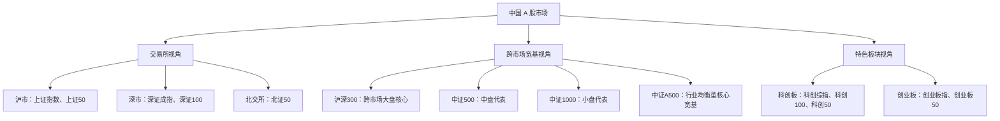

# ***Relationship Diagram of Major A-Share Indices***

## `（一）中国A股主要指数关系图：`
 ```text
                    ┌─────────────────────────────────────┐
                    │           中国A股市场                │
                    └─────────────────────────────────────┘
                                      │
        ┌─────────────────────────────┼─────────────────────────────┐
        ▼                             ▼                             ▼
   ┌───────────┐               ┌────────────┐                  ┌───────────┐
   │✅上证指数 │               │ ✅深证成指  │                 │  ✅北证50 │
   │ (沪市全部) │               │ (深市500只) │                 │  (北交所)  │
   └────┬──────┘               └─────┬──────┘                  └───────────┘
        │                            │
   ┌────┴───────┐               ┌────┴───────┐
   │   上证50   │               │   深证100   │
   │ (沪市50只) │               │ (深市100只) │
   └────┬───────┘               └──────┬─────┘
        │                            │
        └────────────┬───────────────┘
                     ▼
              ┌───────────────┐
              │  🔴沪深300    │◄─────┐
              │ (跨市场300只)  │     │
              └──────┬────────┘     │
                     │              │
              ┌──────┴────────┐     │
              │  🔴中证500    │     │
              │ (中盘301-800) │     │
              └──────┬────────┘     │
                     │              │
              ┌──────┴─────────┐    │
              │  🔴中证1000    │    │
              │ (小盘801-1800) │    │
              └────────────────┘    │
                                    │
              ┌─────────────────────┘
              ▼
        ┌────────────────┐
        │  🔶中证A500    │
        │ (行业均衡500只) │
        └────────────────┘

        ┌─────────────────────────────────────┐
        │            科创板（沪市）            │
        │                 ↓                   │
        │  科创综指（全部）> 科创100 > 科创50   │
        └─────────────────────────────────────┘

        ┌─────────────────────────────────────┐
        │            创业板（深市）            │
        │                 ↓                   │
        │         创业板指 > 创业板50          │
        └─────────────────────────────────────┘
```

## `（二）一图看懂`



> **读图原则：** 三条分支是三种不同的观察视角，不表示严格的成分股包含关系。尤其不要把“上证50 + 深证100”理解成沪深300，也不要把中证A500理解成沪深300的下一级指数。

## `（三）主要指数速查`

### `1. 按交易所观察市场`

| 市场 | 主要指数 | 常用代码 | 原稿中的直观定位 | 更适合的使用场景 |
|---|---|---:|---|---|
| 沪市 | **上证指数** | `000001` | 沪市全部¹ | 看沪市整体涨跌，也是新闻和日常交流中最常出现的指数之一 |
| 沪市 | **上证50** | `000016` | 沪市50只 | 看沪市超大盘、龙头蓝筹风格；对应中金所股指期货 **IH** |
| 深市 | **深证成指** | `399001` | 深市500只 | 看深市整体代表性公司，成长和制造属性通常更突出 |
| 深市 | **深证100** | `399330` | 深市100只 | 看深市大盘核心资产和龙头公司 |
| 北交所 | **北证50** | `899050` | 北交所 | 看北交所代表性公司的整体表现 |

### `2. 按跨市场规模与选样方式观察 A 股`

| 主要指数 | 常用代码 | 原稿中的直观定位 | 更适合的使用场景 |
|---|---:|---|---|
| **沪深300** | `000300` | 跨市场300只 | A 股大盘核心宽基；常用于业绩基准、资产配置、风险对冲；对应股指期货 **IF** |
| **中证500** | `000905` | 中盘301–800¹ | 中盘风格代表；常用于中盘选股、风格比较和风险对冲；对应股指期货 **IC** |
| **中证1000** | `000852` | 小盘801–1800¹ | 小盘风格代表；量化选股和小盘因子研究中很常见；对应股指期货 **IM** |
| **中证A500** | `000510` | 行业均衡500只 | 行业覆盖更均衡、强调行业代表性；适合与沪深300比较选样逻辑和行业暴露 |

> 沪深300、中证500、中证1000可以帮助建立“大盘—中盘—小盘”的直观框架；中证A500不是这条市值阶梯的下一层，而是另一套更强调行业均衡和代表性的选样思路。

### `3. 按特色板块观察市场`

| 板块 | 主要指数 | 常用代码 | 原稿中的直观定位 | 更准确的关系理解 |
|---|---|---:|---|---|
| 科创板 | **科创综指** | `000680` | 全部¹ | 观察符合条件的科创板上市公司证券整体表现 |
| 科创板 | **科创100** | `000698` | 科创100 | 与科创50形成差异化规模覆盖；其选样会剔除科创50样本，二者不是逐级包含关系 |
| 科创板 | **科创50** | `000688` | 科创50 | 科创板中市值大、流动性好的50只代表性证券 |
| 创业板 | **创业板指** | `399006` | 创业板指 | 创业板核心宽基，100只样本股 |
| 创业板 | **创业板50** | `399673` | 创业板50 | 从创业板指数样本股中选取流动性较好的50只股票，因此是创业板指的子集 |

## `（四）量化与金融工作中的最小记忆框架`

| 你想观察什么 | 优先想到的指数 |
|---|---|
| 沪市整体行情 | 上证指数 |
| A 股大盘核心资产 | 沪深300 |
| 中盘风格 | 中证500 |
| 小盘风格 | 中证1000 |
| 行业更均衡的核心宽基 | 中证A500 |
| 沪市超大盘蓝筹 | 上证50 |
| 深市整体与深市龙头 | 深证成指、深证100 |
| 科创板整体与核心公司 | 科创综指、科创50、科创100 |
| 创业板核心公司 | 创业板指、创业板50 |
| 北交所代表性公司 | 北证50 |
| 股指期货与对冲 | IH（上证50）、IF（沪深300）、IC（中证500）、IM（中证1000） |

## `（五）是否还需要增加指数？`

目前建议是：**主图暂时不要继续扩张。** 你现有的指数已经覆盖交易所、规模宽基和特色板块三个最重要维度。以后真正在量化研究里遇到需要，再按用途增加，而不是为了“完整”提前堆满。

最多可以预留两个候选：

1. **中证800（`000906`）——优先级较高**  
   它由沪深300与中证500样本共同构成，能把“大盘 + 中盘”的关系真正连接起来。若以后研究大中盘股票池、风险模型或指数增强，它会很有用。

2. **中证2000（`932000`）——按需增加**  
   它更偏向小微盘风格。如果以后研究小市值因子、微盘策略或风格轮动，再把它放到中证1000之后即可；当前不放入主图，可以避免地图继续膨胀。

此外，**申万一级行业指数**在行业中性化、行业轮动和归因分析中很常见，但更适合作为“行业指数族”单独学习，不建议把几十个行业指数展开塞进这张主图。


## `（六）官方核对入口`

- [上海证券交易所：上证系列指数列表](https://www.sse.com.cn/market/sseindex/indexlist/)
- [上海证券交易所：上证系列指数简介](https://www.sse.com.cn/market/sseindex/overview/)
- [国证指数网](https://www.cnindex.com.cn/)
- [创业板50指数编制方案](https://www.cnindex.com.cn/docs/gz_399673.pdf)
- [中证指数有限公司](https://www.csindex.com.cn/)
- [中国金融期货交易所](https://www.cffex.com.cn/cn/index.html)

---
