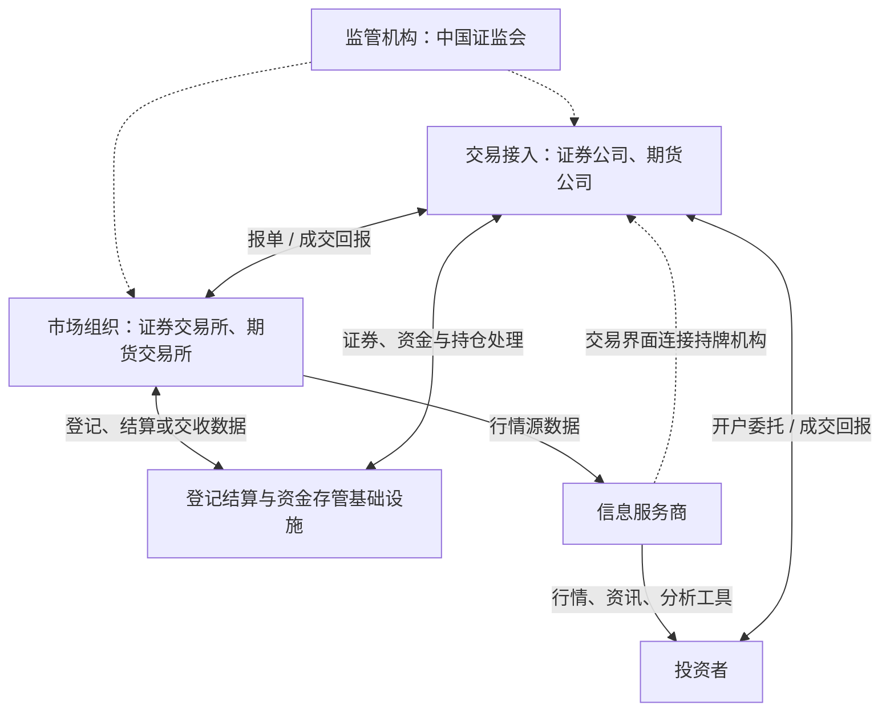
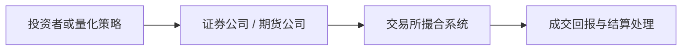
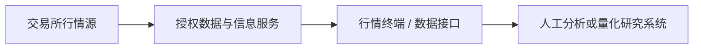

# ***Three‑Tier Core Architecture of China’s Financial Market***

## `（一）中国金融市场三层核心架构：`

```text
┌────────────────────────────────────────────────────────────┐
│  ✅第一层：交易所|证券、期货（"菜市场"）                      │
│  ──────────────────────────                                │
│  上海证券交易所（上交所）                                    │
│  深圳证券交易所（深交所）                                    │
│  北京证券交易所（北交所）                                    │
│  中国金融期货交易所（中金所）                                │
│  上海期货交易所、大连商品交易所、郑州商品交易所...             │
│                                                            │
│  🔶职能：制定规则 + 提供交易场所 + 撮合成交 + 清算结算        │
│  🔶性质：非营利机构（会员制），不直接对散户服务                │
└────────────────────────────────────────────────────────────┘
                              ▲
                              │ 【交易指令】
                              │
┌──────────────────────────────────────────────────────────────┐
│  ✅第二层：券商/期货公司（"摊位/中介"）                         │
│  ───────────────────────────                                 │
│  中信证券、华泰证券、国泰君安、招商证券、东方财富证券...          │
│                                                              │
│  🔶职能：开户 + 接受委托 + 报单到交易所 + 托管资产 + 融资融券    │
│  🔶性质：持牌金融机构，直接服务投资者                           │
│  🔶赚钱：佣金 + 利息 + 承销费 + 资管费                         │
└──────────────────────────────────────────────────────────────┘
                              ▲
                              │ 【行情/数据/资讯】
                              │
┌──────────────────────────────────────────────────────────────┐
│  ✅第三层：信息服务商（"喇叭/显示屏"）                         │
│  ──────────────────────────────────                          │
│  同花顺、东方财富、大智慧、Wind（万得）、Choice...               │
│                                                              │
│  🔶职能：展示行情 + 提供分析工具 + 财经资讯 + 社区交流          │
│  🔶性质：科技公司/软件公司，**本身不能炒股**                    │
│  🔶赚钱：软件订阅费 + 广告 + 导流分成 + 数据服务                │
└──────────────────────────────────────────────────────────────┘
```


## `（二）中国场内证券与期货市场直观地图：`


> **读图原则：** 交易主链是“投资者 → 持牌中介 → 交易所”；信息服务商位于并行的信息链，不是券商的下一级。证券交易与期货交易的结算机制并不完全相同，因此图中将结算基础设施单独表示。

## `（三）核心角色速查：`

### `1. 投资者：交易指令的发起者`

| 项目 | 说明 |
|---|---|
| 主要类型 | 个人投资者、机构投资者、基金、保险资管、私募等 |
| 主要行为 | 获取行情与资讯、形成决策、通过持牌机构下达交易委托 |
| 关键理解 | 投资者通常不能直接接入交易所撮合系统，需要通过证券公司、期货公司或其他合规交易参与者 |
`
### `2. 证券公司与期货公司：交易接入和持牌中介`

| 项目 | 原稿内容与完善说明 |
|---|---|
| 直观比喻 | “摊位 / 中介” |
| 原稿举例 | 中信证券、华泰证券、国泰君安¹、招商证券、东方财富证券等 |
| 核心职能 | 开户、接受委托、处理交易指令、向交易所报单、返回成交结果、融资融券等 |
| 期货侧补充 | 期货交易通常通过期货公司接入；证券公司和期货公司不能简单视为同一种机构 |
| 原稿中的“托管资产” | 暂予保留并等待复核；证券登记存管、客户资金存管和资产托管分别涉及不同持牌机构和基础设施 |
| 直接服务对象 | 投资者及企业客户 |
| 原稿列出的收入 | 佣金、利息、承销费、资管费 |

> 证券经纪业务属于持牌业务。行情软件可以提供交易入口或与证券公司系统连接，但真正接受和处理证券交易指令的主体仍须具备相应业务资格。

### `3. 交易所：组织和监督场内交易`

| 类别 | 原稿机构全部保留 | 主要作用 |
|---|---|---|
| 证券交易所 | 上海证券交易所、深圳证券交易所、北京证券交易所 | 提供证券集中交易场所、设施和服务，制定业务规则，组织和监督交易，实行自律管理 |
| 金融期货交易所 | 中国金融期货交易所 | 组织股指、国债等金融期货与期权交易，并依相应制度开展结算 |
| 商品期货交易所 | 上海期货交易所、大连商品交易所、郑州商品交易所；补充：广州期货交易所 | 组织商品期货与期权交易，并依各自规则开展结算和风险管理 |

交易所的组织形式不能统一概括为“非营利会员制”：不同交易所可能采用会员制或公司制。例如，上交所是会员制法人，而中金所属于公司制交易所。

### `4. 登记结算与资金存管：交易完成后的基础设施`

| 场景 | 最小理解 |
|---|---|
| 证券登记、存管与结算 | 主要涉及中国证券登记结算有限责任公司（中国结算）及其结算参与人 |
| 客户交易结算资金 | 涉及证券公司、存管银行等主体，不能简单理解成由券商自行保管 |
| 期货结算 | 由期货交易所、结算会员、期货公司等按相应制度分层完成；不同交易所制度可能不同 |

> 因此，原稿中的“交易所 = 清算结算”和“券商 = 托管资产”都适合用作极简记忆，但不足以作为严格的业务架构描述。

### `5. 信息服务商：并行的信息与工具入口`

| 项目 | 原稿内容与完善说明 |
|---|---|
| 直观比喻 | “喇叭 / 显示屏” |
| 原稿举例 | 同花顺、东方财富、大智慧、Wind（万得）、Choice等 |
| 核心职能 | 展示行情、提供分析工具、财经资讯、数据终端和社区交流 |
| 机构性质 | 主要是科技、软件或金融数据服务公司；具体集团可能同时拥有其他持牌子公司 |
| 与交易的关系 | 信息平台本身不当然拥有证券经纪资格；其交易按钮通常连接证券公司等持牌机构 |
| 原稿列出的收入 | 软件订阅费、广告、导流分成、数据服务 |

> 东方财富是一个容易混淆的例子：东方财富信息股份有限公司提供互联网财富管理、资讯和数据服务，同时全资控股持牌的东方财富证券。平台、集团和持牌证券子公司需要分开理解。

## `（四）两条最重要的工作链：`

### `【交易执行链】`



### `【行情数据链】`



## `（五）对量化开发最实用的理解：`

| 量化工作 | 对应市场角色 |
|---|---|
| 获取历史行情、财务数据和实时行情 | 交易所数据、授权数据商、信息服务商 |
| 研究、回测、因子计算 | 自建研究系统或量化平台，不直接进入交易所 |
| 生成订单 | 策略系统、组合管理系统、订单管理系统 |
| 实盘报单 | 证券公司或期货公司提供的柜台、API或交易通道 |
| 撮合成交 | 交易所交易系统 |
| 成交后的证券、资金和持仓处理 | 登记结算机构、交易所结算体系、结算参与人、存管银行等 |
| 合规与交易监控 | 监管机构、交易所、证券公司或期货公司共同参与 |

## `（六）是否还需要增加机构？`

目前的建议是：**主图保持现在的规模，不再扩张。** 对日常金融和量化学习，这张图已经包含监管、投资者、交易接入、交易所、结算基础设施和信息服务六个最关键角色。

以后按实际学习方向再单独增加：

1. **公募基金、私募基金、基金托管人**  
   当你研究资管产品结构、基金净值和托管机制时，再单独画“资产管理链”。

2. **银行间市场与外汇交易中心**  
   当你研究债券、利率和外汇时，应另画一张“银行间市场地图”，不建议硬塞进本图。

3. **订单管理系统、交易执行系统与柜台系统**  
   这是量化开发真正会接触的技术层，但属于系统架构，不属于金融机构层，适合以后单独画“量化交易技术链”。


## `（七）官方核对入口：`

- [中国证监会](https://www.csrc.gov.cn/)
- [上海证券交易所：交易所介绍](https://www.sse.com.cn/aboutus/sseintroduction/introduction/)
- [中国证券登记结算有限责任公司](https://www.chinaclear.cn/)
- [中国金融期货交易所：概况](https://www.cffex.com.cn/cn/gk.html)
- [广州期货交易所：2025年自律管理工作报告](https://www.gfex.com.cn/gfex/tzts/202601/8d4c0d886bbc494cbb6ea9e3a1dbaa5a.shtml)
- [证监会：证券经纪业务管理办法说明](https://www.csrc.gov.cn/csrc/c100028/c6987711/content.shtml)
- [证监会：客户交易结算资金管理办法](https://www.csrc.gov.cn/csrc/c106256/c1653953/content.shtml)
- [证监会：同意国泰君安吸收合并海通证券的批复](https://www.csrc.gov.cn/csrc/c106395/c7534421/content.shtml)
- [东方财富证券：关于我们](https://zqhd.eastmoney.com/about.html)
- [同花顺：公司介绍](https://news.10jqka.com.cn/homepage/intro/about-us)

---
