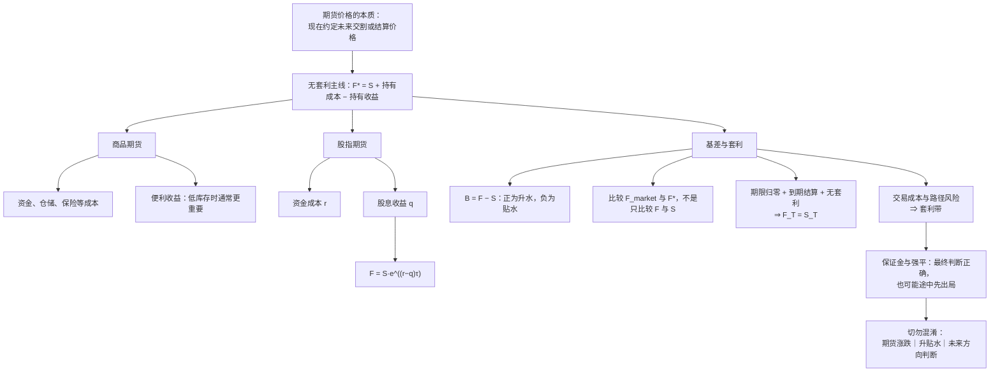

# ***期货定价、升贴水、基差与股指期货关系图谱***

> **中心主线：** 期货不是对未来价格的简单猜测，而是以现货为底座、由持有成本和持有收益塑造期现距离，并由无套利与到期机制持续约束。

$$
\boxed{\text{期货理论价}=\text{现货价格}+\text{持有现货的成本}-\text{持有现货的收益}}
$$

## `（一）期货—现货—升贴水—基差关系图`

```text
┌─────────────────────────────────────────────────────────────────────────────┐
│                         期货—现货定价主线                                     │
│       期货理论价 F* = 现货 S + 持有成本 − 持有收益                             │
└─────────────────────────────────────────────────────────────────────────────┘
                                      │
                   ┌──────────────────┴──────────────────┐
                   ▼                                     ▼
        ┌─────────────────────┐               ┌──────────────────────┐
        │ 现货价格 S：价格底座  │               │  期货价格 F：市场报价 │
        │ 当前买卖标的的价格    │               │  现在约定的未来交割/  │
        │                     │               │  结算价格             │
        └──────────┬──────────┘               └──────────┬───────────┘
                   │                                     │
                   └──────────────────┬──────────────────┘
                                      ▼
                         ┌─────────────────────────┐
                         │ 基差 B = F − S          │
                         │ F > S：升水；F < S：贴水 │
                         └────────────┬────────────┘
                                      │
               ┌──────────────────────┼──────────────────────┐
               ▼                      ▼                      ▼
    ┌────────────────────┐  ┌─────────────────────┐  ┌──────────────────────┐
    │ 商品期货            │  │  股指期货           │  │   三个维度不能混淆     │
    │ 成本：资金、仓储、   │  │  成本：资金成本      │  │  1. 期货自身的涨跌    │
    │ 保险等              │  │  收益：股息收益      │  │  2. 同时点的升贴水    │
    │ 收益：便利收益       │  │  F=S·e^[(r−q)τ]     │  │  3. 对未来走势的判断  │
    └──────────┬──────────┘  └───────────┬─────────┘  └─────────────────────┘
               │                         │
               └───────────┬─────────────┘
                           ▼
              ┌─────────────────────────────────┐
              │  比较市场价 F_market 与理论价 F*  │
              └──────────────┬──────────────────┘
                             │
            ┌────────────────┴────────────────┐
            ▼                                 ▼
┌────────────────────────┐        ┌────────────────────────┐
│ F_market > F*          │        │  F_market < F*         │
│ 现金持有套利：          │        │  反向现金持有套利：      │
│ ✅买现货、❌卖期货     │        │  ✅卖/借现货、❌买期货  │
└────────────┬───────────┘        └────────────┬───────────┘
             └──────────────────┬──────────────┘
                                ▼
                  ┌───────────────────────────┐
                  │ 套利交易压缩错误定价        │
                  │ 临近到期：剩余期限与持有项   │
                  │ 逐步消失；到期 F_T = S_T    │
                  └─────────────┬──────────────┘
                                ▼
                  ┌──────────────────────────┐
                  │ 现实不是理想模型           │
                  │ 成本、滑点、执行、保证金、  │
                  │ 强平、基差和市场冲击风险    │
                  │ ⇒ 套利带 / 无套利区间      │
                  └───────────────────────────┘
```

> **读图原则：** “涨跌”是期货价格在不同时点的纵向变化；“升贴水”是同一时点期货与现货的横向比较；“看涨或看跌”是对未来方向的判断。三者相关，但不是同一个概念。

## `（二）一图看懂`



### 三个维度的最小区分

| 观察维度 | 比较对象 | 回答的问题 | 例子 |
|---|---|---|---|
| **期货涨跌** | 同一合约在不同时点的价格 | 期货自己涨了还是跌了？ | `F_{t+1} > F_t`，期货上涨 |
| **升水/贴水** | 同一时点的期货与现货 | 期货相对现货贵还是便宜？ | `F_t > S_t`，期货升水 |
| **未来方向判断** | 对未来市场状态的判断 | 市场参与者预期未来涨还是跌？ | 属于预期分析，不能仅凭升贴水下结论 |

因此，完全可能出现：**期货今天下跌，但仍相对现货升水；或期货今天上涨，但仍相对现货贴水。**

## `（三）核心概念速查`

### `1. 最基础的几个概念`

| 概念 | 数学/定义 | 最直白解释 |
|---|---|---|
| **现货价格** | `S_t` | 当前时点直接买卖标的的价格，是期货定价的底座。 |
| **期货价格** | `F_t` | 当前时点为未来某日交割或现金结算所约定的价格；它不是未来真实价格的简单预测。 |
| **期货理论价** | `F_t^*` | 按“复制现货持有路径”推导出的无套利参考价格。 |
| **升水（Contango）** | `F_t > S_t` | 同一时点，期货高于现货；首先是相对价格关系，不等于看涨。 |
| **贴水（Backwardation）** | `F_t < S_t` | 同一时点，期货低于现货；首先是相对价格关系，不等于看跌。 |
| **基差** | `B_t = F_t - S_t` | 本图谱统一采用“期货减现货”：`B_t>0` 为升水，`B_t<0` 为贴水。阅读其他资料时应先核对其定义方向。 |
| **无套利定价** | 相同终值的两条路径应有相近成本 | 如果“买现货并持有”和“买期货等待到期”能复制相同结果，它们不能长期存在可锁定的巨大价差。 |
| **套利** | 同时建立相互配合的多条交易腿 | 利用市场价相对理论价的偏离，尽量锁定价差，而不是裸押单边方向。 |
| **套利带/无套利区间** | `F_t^* ± 现实摩擦` | 偏离必须大到足以覆盖手续费、融资、冲击成本等，交易才有意义。小偏离可以长期存在。 |
| **套期保值** | 用相反方向头寸抵消主要风险暴露 | 目标是降低风险，而非保证绝对无损；仍可能有基差、数量、期限和流动性错配。 |
| **保证金** | 只缴纳合约价值的一部分作为履约保障 | 带来资金效率，也放大净值波动和追加保证金压力。 |
| **强平** | 保证金不足且未及时补足时被动平仓 | 即使最终方向判断正确，也可能因中途不利波动先退出。 |

### `2. 商品期货定价骨架`

商品期货的直觉式：

$$
F \approx S+\text{持有成本}-\text{持有收益}
$$

| 构成 | 对理论期货价的方向 | 经济含义 |
|---|---:|---|
| **资金成本** | `+` | 现在买入现货会占用资金；持有至交割日需要承担融资或机会成本。 |
| **仓储成本** | `+` | 仓库、装卸、损耗和库存管理等支出。 |
| **保险及其他成本** | `+` | 为持有实物承担的保险、品质维护等成本。 |
| **便利收益（Convenience Yield）** | `−` | 实际持有现货带来的非现金好处，例如保障生产、及时供货、避免断料；只买期货通常不能立即获得这些好处。 |

#### 为什么便利收益是减号？

持有现货不仅会产生费用，也会带来“随时可用”的价值。这个价值属于现货持有者，相当于持有现货获得了一项收益；因此在比较“现货持有路径”和“期货路径”时，要从持有成本中扣除。便利收益越高，现货相对越有价值，理论期货价就越容易降低，甚至形成贴水。

| 库存环境 | 便利收益的常见状态 | 直觉上的期现影响 |
|---|---|---|
| **库存充足** | 通常较低 | 立即拿到一单位现货并不稀缺；资金、仓储等成本更可能占主导，升水更容易出现。 |
| **库存紧张** | 通常较高 | 现货能保障生产与交付，立即可用的价值上升；现货更贵，贴水更容易出现。 |

> 这是常见方向，不是机械定律。商品的季节性、交割规则、质量与地点差异、融资条件等也会改变期现结构。

### `3. 股指期货定价骨架`

股指本身不是需要入库的实物，因此没有商品式的仓储、保险和便利收益。其核心关系是：

$$
\text{股指期货}=\text{现货指数}+\text{资金成本}-\text{股息收益}
$$

连续复利下的标准形式：

$$
F_t=S_t e^{(r-q)(T-t)}
$$

| 符号 | 含义 | 对定价的作用 |
|---|---|---|
| `S_t` | 时点 `t` 的现货指数水平 | 定价底座；实务复制通常通过一篮子成分股或高度跟踪的现货工具实现。 |
| `F_t` | 时点 `t`、到期日为 `T` 的股指期货价格 | 市场实际交易的期货报价。 |
| `r` | 与剩余期限匹配的无风险或融资利率 | 持有股票组合占用资金，`r` 越高，其他条件相同时理论期货价越高。 |
| `q` | 剩余期限内的连续股息收益率 | 现货股票组合能收到股息，而期货多头不能直接收到，因此 `q` 作为持有现货收益被扣除。 |
| `T-t` | 距离到期的剩余期限 | 决定资金成本和股息收益累计多久；期限归零时，这些累计项一并归零。 |

#### 为什么公式里没有“预期涨跌”？

这个公式比较的是两条在到期日获得相同标的暴露的路径：

1. 今天买入并持有现货股票组合；
2. 今天建立期货多头，并在到期时按合约结算。

如果未来指数上涨或下跌，两条路径都承受相应的标的价格变化。比较两条路径的相对成本时，这部分共同的未来价格风险被抵消，剩下的是资金成本、股息收益和期限。因此，公式表达的是**无套利相对定价关系**，不是对未来方向的预测模型。

> 市场预期仍会影响现货与期货的交易报价，但它不能作为一个独立的“预期涨跌项”随意加进无套利公式；若报价偏离复制关系过远，套利交易会对其形成约束。

### `4. 基差、收敛与套利`

本图谱统一定义：

$$
B_t=F_t-S_t
$$

到期收敛：

$$
t\to T \Rightarrow F_t\to S_t,\qquad B_t\to 0
$$

基差收敛来自三个相互配合的力量：

| 力量 | 解释 |
|---|---|
| **剩余期限消失** | `T-t` 趋近于零，尚未发生的资金成本、股息、仓储和便利收益等累计影响逐渐消失。 |
| **到期交割/结算机制** | 到期合约必须锚定同一标的或规定的结算价格；否则期货合约将无法履行其经济含义。 |
| **无套利约束** | 若到期前仍有足够大的错误价差，套利者会买入便宜的一边、卖出昂贵的一边，推动两者靠拢。 |

真正的套利判断是：

$$
F_{\text{market}}\quad \text{vs.}\quad F^*
$$

而不是只看 `F` 是否高于 `S`。

| 市场状态 | 典型交易骨架 | 为什么可能获利 |
|---|---|---|
| `F_market > F*` | **现金持有套利（Cash-and-Carry）**：买入现货，卖出期货 | 期货相对复制成本过贵；到期用现货腿与期货腿的收敛锁定偏离。 |
| `F_market < F*` | **反向现金持有套利（Reverse Cash-and-Carry）**：卖出/借入现货，买入期货 | 期货相对复制成本过便宜；但卖空、借券或库存可得性常构成现实约束。 |

两条腿的目的，是尽量抵消**标的本身的涨跌风险**，把收益来源集中到**市场价相对理论价的偏离**。这正是两条不同的轴：

- 轴一：标的价格整体涨跌；
- 轴二：期现价差/基差变化。

## `（四）今天最重要的认知纠偏`

| 常见误区 | 正确认识 |
|---|---|
| **1. 升水 = 看涨，贴水 = 看跌** | 升贴水首先描述同一时点的期现相对价格。看涨看跌是方向判断，不能直接画等号。 |
| **2. 期货价格上涨 = 升水** | 上涨比较期货自身的前后价格；升水比较同一时点的期货与现货。期货可以上涨但仍贴水，也可以下跌但仍升水。 |
| **3. 做空把期货砸下来，所以才贴水** | 卖压可能影响报价，但贴水是否合理要结合股息、便利收益、融资、供需、期限和无套利边界判断。单凭“空头多”不能解释全部定价。 |
| **4. 期货价格就是市场对未来现货价格的预测** | 期货含有预期信息，但还受现货、资金成本、持有收益、交易摩擦和套利约束。它不是未来现货价格的无偏、机械预测值。 |
| **5. 高库存主要因为仓储成本高，所以才升水** | 高库存时便利收益通常下降，现货的稀缺价值变弱；当资金、仓储等正向成本占主导时更容易升水。重点不是“库存高必然使仓储费高”。 |
| **6. 套保意味着完全没有风险** | 套保降低主要方向暴露，但仍可能存在基差、期限、数量、流动性、模型和操作风险。 |
| **7. 有现货 + 空期货就一定不会出问题** | 组合终值可能较稳定，但期货腿每日盯市；中途保证金压力、追加保证金和强平仍可能让策略无法持有到收敛。 |
| **8. 无套利机会等于人人都能轻松捡钱** | 可交易偏离通常很小且消失很快；资金、速度、融券/库存、手续费、滑点、市场冲击和风控能力决定它是否真能落袋。 |
| **9. 公式没有预期涨跌，所以预期完全不重要** | 预期会影响交易行为和当前报价；只是比较可复制路径时，共同的未来标的风险相互抵消，不能再单列一个任意的预期项。 |
| **10. 到期收敛只因为套利者足够聪明** | 套利是约束之一；更根本的是剩余期限归零和交割/现金结算规则把合约锚定到标的。 |

## `（五）最小记忆框架`

> **一句话总纲：现货决定底座，持有成本与持有收益决定期现距离，套利机制约束偏离，到期机制使基差收敛。**

| 你想理解什么 | 先想到什么 |
|---|---|
| **期货价格本质** | 现在约定的未来交割/结算价格；不是未来真实价格的简单预测。 |
| **统一定价主线** | `期货理论价 = 现货 + 持有成本 − 持有收益`。 |
| **升贴水** | 同时点横向比较：`F>S` 升水，`F<S` 贴水；不等同于看涨看跌。 |
| **期货涨跌** | 不同时点纵向比较期货自身价格；与升贴水是不同维度。 |
| **商品期货** | 资金、仓储、保险等是加项；便利收益是减项。 |
| **便利收益** | “现货现在就在手里”的生产与交付价值；库存越紧张，通常越重要。 |
| **股指期货** | `F_t=S_t e^{(r-q)(T-t)}`：资金成本减股息收益。 |
| **公式没有预期涨跌** | 两条复制路径共同承担未来指数涨跌，比较相对成本时该风险被抵消。 |
| **基差** | 本图谱用 `B=F-S`；它刻画期现距离，不等于标的方向。 |
| **基差收敛** | 期限归零 + 到期结算 + 无套利约束，使 `F_T=S_T`。 |
| **套利** | 比较 `F_market` 与 `F*`；买便宜的一边、卖昂贵的一边，并管理两条腿。 |
| **套保** | 降低主要风险暴露，不等于消灭全部风险。 |
| **套利带** | 偏离只有超过全部现实成本与风险补偿后才值得交易。 |
| **强平风险** | 保证金路径会造成“最后看对，但中间先死”。 |

### 复习时只保留五句话

1. **期货不是未来现货价格的简单预测。**
2. **涨跌看期货自己的时间变化；升贴水看同一时点期货与现货谁贵。**
3. **商品看持有成本与便利收益；股指看资金成本与股息收益。**
4. **套利比较市场期货价与理论期货价，而不是机械比较期货和现货。**
5. **现货决定底座，套利约束偏离，到期把期现距离压向零。**

## `（六）进阶但必要的现实理解`

### `1. 理论无套利 ≠ 现实绝对无风险`

理论模型通常假设可以及时成交、低成本融资、自由卖空、准确复制现货并持续持有。现实中这些条件都可能不成立，所以所谓“无风险套利”更接近**在严格条件下风险较低、收益较可锁定的套利**。

### `2. 期货与现货的价格暴露相似，但资金路径不同`

现货通常需要支付较多本金；期货以保证金参与，并每日盯市、逐日结算。即使两者最终经济暴露相近，中途现金流路径也可能完全不同。

### `3. 保证金会制造路径风险`

策略可能在到期时理论盈利，却在收敛前经历不利的基差扩张。若无法追加保证金，就可能被强平。因此，“最终价值正确”不等于“有能力活到最终”。

### `4. 套利机会必须覆盖全部摩擦`

| 现实限制 | 对套利的影响 |
|---|---|
| 手续费、税费与融资成本 | 直接吞噬理论价差。 |
| 买卖价差与滑点 | 理论报价未必是可成交价格。 |
| 两条腿执行不同步 | 一条成交、另一条未成交时会短暂暴露方向风险。 |
| 市场冲击 | 交易规模越大，越可能把价格推向不利方向。 |
| 保证金与强平 | 策略可能在收敛前因现金流不足被迫退出。 |
| 借券、库存与交割约束 | 反向套利可能无法获得所需现货，或不能低成本卖空。 |
| 基差与模型风险 | 理论价中的利率、股息、便利收益等是估计值，基差也可能先扩大后收敛。 |

因此，真实市场中的判断顺序应当是：

```text
市场期货价与理论价的偏离
        ↓
减去全部可观测交易成本
        ↓
评估融资、保证金、执行、流动性与模型风险
        ↓
只有剩余空间足够，才可能成为可执行套利
```

### `5. 两条轴必须分开管理`

| 风险轴 | 核心问题 | 典型管理方式 |
|---|---|---|
| **标的本身价格风险** | 市场整体上涨或下跌会造成什么影响？ | 通过方向相反、风险暴露匹配的期现两腿尽量抵消。 |
| **期现价差/基差风险** | 两腿之间的相对价格是否按预期收敛？ | 管理期限、数量、跟踪误差、保证金和退出条件。 |

套利与套保的关键，不是“市场从此不涨不跌”，而是把原本主要押注标的方向的风险，转换为更可控但并未消失的相对价值与执行风险。

## `（七）是否还要继续扩张这张图谱？`

目前建议：**主图暂时不要继续扩张。**

这张图谱已经覆盖本主题最重要的完整闭环：

- 期货价格的本质；
- 升水、贴水与涨跌的区别；
- 商品期货的持有成本与便利收益；
- 股指期货的资金成本与股息收益；
- 基差、到期收敛与无套利定价；
- 套利、套保、保证金、强平和现实摩擦。

暂时不建议继续塞入以下体系：

- 期权定价与希腊字母；
- 隐含波动率与波动率微笑；
- 统计套利、ETF 套利和高频执行体系；
- 利率、外汇及完整衍生品定价树；
- 机构生态、策略规模与行业格局。

以后真正遇到研究需要时，可以分别增设《期限结构与展期收益》《股指期货套保与 Beta 对冲》《期现套利执行与风控》专题，而不破坏本图谱的主线。

## `（八）可核对的补充入口`

- [中国金融期货交易所：投资基础知识](https://www.cffex.com.cn/cn/tzjczs.html)
- [中国金融期货交易所：沪深300股指期货合约](https://www.cffex.com.cn/cn/hs300.html)
- [中国金融期货交易所：交易所规则](https://www.cffex.com.cn/cn/jysgz.html)
- [中国金融期货交易所：入市及风险指南](https://www.cffex.com.cn/cn/rsjfxzn.html)
- [中证指数有限公司](https://www.csindex.com.cn/)
- [中国期货业协会：考试资料与《期货及衍生品基础》入口](https://www.cfachina.org/servicesupport/examination/qualificationexamination/examinationmaterial/)

> **核对提示：** 交易规则、保证金比例、合约参数和结算安排可能调整；涉及实务时，应以交易所当日正式规则、合约细则及期货公司通知为准。

---

> **最终锚点：期货不是脱离现货独立存在的未来猜测。现货给出底座，持有成本与收益形成理论距离，套利把过度偏离拉回，到期机制最终令 `F_T=S_T`；而现实中的保证金、执行和基差路径，决定理论机会能否真正转化为收益。**
