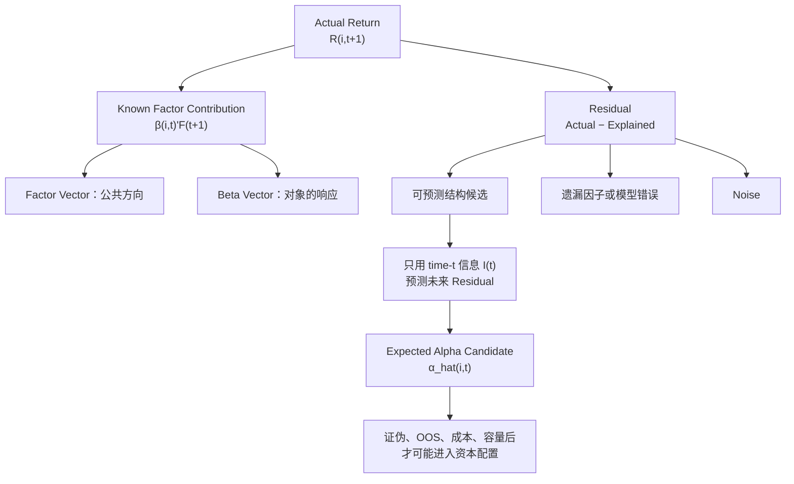

# ***Alpha、Beta、Factor 与 Residual 关系图谱***

> **中心问题：** 一只股票的收益中，哪些属于当前模型已知的公共结构，哪些只是尚未解释的剩余，而真正可研究的 Alpha 位于哪里？

$$
\boxed{
R_{i,t+1}
=
\boldsymbol\beta_{i,t}^{\top}\mathbf F_{t+1}
+
Residual_{i,t+1}
}
$$

$$
\boxed{
Residual
\neq
Alpha;
\qquad
\hat\alpha_{i,t}
=
E[Residual_{i,t+1}\mid I_t]
}
$$

> 第二个公式是研究目标的骨架，不是“算出条件均值就自动获得真实 Alpha”。模型设定、时间信息边界和样本外验证仍决定该预测是否可信。

## `（一）Actual Return—Factor—Residual—Expected Alpha 主关系图`

```text
┌──────────────────────────────────────────────────────────────────────────────┐
│                    一只股票下一期的实际收益 R(i,t+1)                           │
└───────────────────────────────────┬──────────────────────────────────────────┘
                                    │
                 ┌──────────────────┴──────────────────┐
                 ▼                                     ▼
┌─────────────────────────────────┐     ┌──────────────────────────────────────┐
│ 当前模型可解释的公共结构          │     │ Residual：残差 / 未解释剩余           │
│ β(i,t)'F(t+1)                   │     │ Actual Return − Explained Return     │
│ = Σ β(ik,t) × F(k,t+1)          │     └──────────────────┬───────────────────┘
└────────────────┬────────────────┘                        │
                 │                          ┌──────────────┼───────────────┐
      ┌──────────┼──────────┐               ▼              ▼               ▼
      ▼          ▼          ▼       ┌───────────────┐ ┌───────────────┐ ┌───────────────┐
  Market      Industry   Style/...  │潜在可预测结构  │ │ 遗漏结构/因子  │ │ Noise/模型误差 │
  Factor      Factor     Factor     │Potential Alpha│ │ Omitted Factor│ │ 随机与设定误差 │
      │          │          │       └───────┬───────┘ └───────────────┘ └───────────────┘
      └──────────┴──────────┘               │
                 │                          ▼
                 ▼              ┌──────────────────────────────────────┐
        Beta Vector             │  站在 t 时点，只使用 I(t) 中合法信息    │
  对各公共方向的暴露/响应         │  预测未来 Residual 的条件期望          │
                                │  α_hat(i,t)=E[Residual(i,t+1)|I(t)]  │
                                └──────────────────┬───────────────────┘
                                                   ▼
                                ┌──────────────────────────────────────┐
                                │  仍须证伪、OOS、成本与容量检验          │
                                │  才可能成为可使用的 Expected Alpha     │
                                └──────────────────────────────────────┘

Factor Space 扩展：
原 Residual ──发现稳定公共结构──> 新 Factor Exposure + 更小的新 Residual
```

> **读图原则：** Factor Model 先回答“当前模型已经解释了什么”；Residual 只是“还没解释什么”；Alpha Research 才继续问“其中有没有能被事前信息稳定预测、且可交易的增量结构”。

## `（二）Mermaid 一图看懂`



## `（三）理论层级与核心概念速查`

### `1. 先分清哪些是标准理论，哪些是项目工作表达`

| 层级 | 内容 | 本图中的位置 |
|---|---|---|
| **Standard Theory** | 单因子/多因子模型、Factor Exposure、Beta、Residual、OLS、遗漏变量、条件期望 | 提供正式统计与资产定价骨架。 |
| **AlphaResearchOS Working Model** | “Factor 是当前公共解释坐标轴”“Residual is a question, not an answer” | 用于统一研究语言；不是新金融定理。 |
| **Research Implication** | 用当时信息预测未来 Residual，并通过证伪与样本外检验 | 将理论对象接入 AlphaResearchOS 的研究流程。 |

### `2. 核心概念`

| 概念 | 正式/工作定义 | 最直白解释 | 关键边界 |
|---|---|---|---|
| **Factor（因子）** | 模型中用于解释一组资产共同变化的系统性变量或组合收益 | 当前模型承认的一条公共变化方向 | Factor Space 是模型解释空间，不是世界全部真相。 |
| **Factor Vector** | $\mathbf F_t=(F_{1,t},\ldots,F_{K,t})^\top$ | 把市场、行业、规模、价值、动量等公共方向排成一列 | 不同模型会选择不同坐标轴。 |
| **Beta（贝塔）** | 对某个 Factor 的暴露或响应系数 $\beta_{ik}$ | 因子动 1 单位，对象平均响应多少 | Beta 是对象与因子之间的关系属性，不是永久标签。 |
| **Beta Vector** | $\boldsymbol\beta_i=(\beta_{i1},\ldots,\beta_{iK})^\top$ | 一只股票对所有已知公共方向的“响应说明书” | 暴露会随时间、样本和估计方法变化。 |
| **Factor Contribution** | $\boldsymbol\beta_i^\top\mathbf F=\sum_k\beta_{ik}F_k$ | 每条公共方向的实际变动乘以该股票对它的响应，再相加 | 它是模型解释值，不是确定性的因果分解。 |
| **Residual（残差/未解释剩余）** | 实际收益减去当前模型的拟合/解释部分 | 当前模型解释完后还剩什么 | **Residual 不等于 Alpha。** |
| **Noise（噪声/随机扰动）** | 在给定模型与信息集下不可稳定预测的扰动 | 发生了，但目前找不到可重复规律的部分 | “噪声”是相对当前信息与模型而言，不代表永远不可解释。 |
| **Omitted Factor** | 未纳入模型、却能系统解释收益的公共结构 | 模型漏掉的一条坐标轴 | 它可能让历史 Residual 或截距看起来像 Alpha。 |
| **Expected Alpha** | 对未来风险调整剩余收益中可预测部分的估计 | 今天能否对“明天解释完风险后还剩多少”做稳定预测 | 预测值不是保证收益，也不是对象永久属性。 |
| **Information Set** | $I_t$：截至 $t$ 时真实可获得的信息集合 | 站在当时，研究者真的知道什么 | 修订后数据、未来公告和错误时间戳不能进入。 |

## `（四）核心公式骨架：每个公式到底在算什么`

### `1. 单因子收益分解`

$$
R_{i,t}=\alpha_i+\beta_iF_t+\varepsilon_{i,t}
$$

| 符号 | 含义 |
|---|---|
| $R_{i,t}$ | 股票 $i$ 在时间 $t$ 的收益；若 $F_t$ 使用超额收益，左侧也应使用一致口径的超额收益。 |
| $F_t$ | 当前模型中的单个 Factor，例如市场超额收益。 |
| $\beta_i$ | 股票对该 Factor 的平均响应。 |
| $\alpha_i$ | 在此样本与模型设定下估计的截距；它是历史统计量，不自动等于未来可交易 Alpha。 |
| $\varepsilon_{i,t}$ | 回归没有解释的当期扰动。 |

**为什么这样写？** 先用一个公共方向解释资产的共同运动，再观察固定平均偏差和逐期未解释误差。但单因子只是最低维模型，不能假装行业、风格和其他结构不存在。

### `2. 多因子收益分解`

$$
R_{i,t+1}
=
\boldsymbol\beta_{i,t}^{\top}\mathbf F_{t+1}
+u_{i,t+1}
$$

其中：

$$
\boldsymbol\beta_{i,t}^{\top}\mathbf F_{t+1}
=
\sum_{k=1}^{K}\beta_{ik,t}F_{k,t+1}
$$

**在算什么？** 把股票对每个 Factor 的暴露，与下一期每个 Factor 的实际收益相乘后求和，得到当前模型的解释部分；剩余 $u_{i,t+1}$ 就是 Residual。

> 该式是模型分解，不等于因果真相。Factor 的定义、可交易构造和估计口径决定了“解释”的含义。

### `3. Residual`

$$
Residual_{i,t+1}
=
R_{i,t+1}
-
\boldsymbol\beta_{i,t}^{\top}\mathbf F_{t+1}
$$

**在算什么？** 用实际发生的收益减去模型认为已知公共暴露应解释的收益。

**为什么不能直接叫 Alpha？** 因为它可能同时包含：

```text
Residual
=
Potential Predictable Structure
+ Omitted Factor Exposure
+ Noise
+ Data / Specification / Estimation Error
```

这是一张研究检查单，不是可直接观测的精确会计恒等分账。

### `4. Expected Alpha：从“事后剩余”转向“事前预测”`

$$
\hat\alpha_{i,t}
=
E\!\left[
Residual_{i,t+1}
\mid I_t
\right]
$$

| 部分 | 直觉 |
|---|---|
| $Residual_{i,t+1}$ | 下一期发生后才能看到的风险调整剩余。 |
| $I_t$ | 今天及以前合法、可获得的信息。 |
| $E[\cdot\mid I_t]$ | 在今天信息条件下，对未来分布中心的估计。 |
| $\hat\alpha_{i,t}$ | 预测出来的 Expected Alpha，而非已实现收益。 |

**为什么要这么算？** 投资决策发生在 $t$，不能靠 $t+1$ 才知道的信息解释过去；研究必须把“事后看见一个正 Residual”升级为“事前反复预测其条件期望”。

### `5. Noise 的期望为零是什么意思`

理想化地写：

$$
E[\varepsilon_{i,t+1}\mid I_t]\approx0
$$

它表示：在当前信息集和模型下，噪声没有可被稳定利用的方向性均值。它**不表示**每一期噪声都等于零，也不表示 OLS 在物理上把噪声“删除”了。

如果某个信息 $X_{i,t}$ 能持续预测所谓“噪声”，那么研究者应重新检查：它是否其实是遗漏结构、候选 Feature，或模型设定错误。

### `6. OLS 能做什么，不能做什么`

$$
\min_{c,\boldsymbol\beta}
\sum_t
\left(R_{i,t}-c-\boldsymbol\beta^\top\mathbf F_t\right)^2
$$

| OLS 可以做 | OLS 不能自动做 |
|---|---|
| 在给定样本和模型中估计线性关系 | 证明关系具有因果性 |
| 找到使平方误差较小的系数 | 判断遗漏因子是否存在 |
| 产生拟合值和 Residual | 把 Residual 自动拆成 Alpha 与 Noise |
| 给出历史截距与不确定性估计 | 保证截距未来仍存在、成本后可交易 |

## `（五）今天最重要的认知纠偏`

| 常见误区 | 正确认识 |
|---|---|
| **1. Residual = Alpha** | Residual 只是当前模型未解释的集合，可能含 Alpha 候选、遗漏结构、噪声和模型误差。 |
| **2. 历史回归 intercept = 可交易 Alpha** | 截距依赖样本、因子口径和模型设定；只有具备事前可预测性并通过 OOS、成本等检验，才接近可用 Alpha。 |
| **3. Factor 越多越好** | 漏因子会制造假 Alpha，但无纪律加因子会增加估计误差、共线性和过拟合；Factor 必须有理论、数据和用途依据。 |
| **4. OLS 会自动过滤 Noise，留下纯 Alpha** | OLS 只在给定模型中拟合关系并产生 Residual，不知道哪一部分是可预测结构。 |
| **5. 未解释收益一定来自公司独特价值** | 它也可能来自未建模的行业、风格、流动性、事件暴露，甚至数据错误。 |
| **6. Alpha 是股票永久自带的属性** | Alpha 相对于信息集、Factor Model、Benchmark、时间和竞争环境定义；模型或市场变化后可能消失。 |
| **7. 正收益就是正 Alpha** | 正收益可能完全来自高 Beta；负收益也可能在风险调整后具有正 Alpha。完整辨析见 [neutralization-benchmark-alpha-map.md](neutralization-benchmark-alpha-map.md)。 |
| **8. 低相关或低 $R^2$ 说明 Alpha 高** | 它们只说明同步性或解释比例；低可解释度也可能只是高噪声。完整辨析见 [correlation-beta-r2-alpha-map.md](correlation-beta-r2-alpha-map.md)。 |

## `（六）两个数值例子`

### `例 1：Residual = 6%，但不能马上叫 Alpha`

某股票本期实际收益为 20%。当前多因子模型给出：

| 来源 | 模型贡献 |
|---|---:|
| 市场 Factor | $+8\%$ |
| 行业 Factor | $+5\%$ |
| 利率 Factor | $+1\%$ |
| **合计 Explained Return** | **$+14\%$** |
| **Actual Return** | **$+20\%$** |

所以：

$$
Residual=20\%-14\%=6\%
$$

这个 $6\%$ 只说明当前模型少解释了 6 个百分点。研究者还不知道它来自：

- 一条真正可由当时信息预测的公司特异信号；
- 漏掉的 Momentum、Size 或事件因子；
- 当期偶然新闻冲击；
- Beta 估计误差、错误数据或非线性关系。

只有事前定义 $X_{i,t}$，反复检验 $X_{i,t}\rightarrow Residual_{i,t+1}$，并通过后续验证关卡，才有资格讨论 Expected Alpha。

### `例 2：Factor Space 扩展后，“Alpha”逐步缩小`

同一策略在同一历史区间中的估计结果：

| 模型 | 纳入的解释结构 | 历史估计截距/平均剩余 |
|---|---|---:|
| Model A | Market | $10\%$ |
| Model B | Market + Industry | $6\%$ |
| Model C | Market + Industry + Momentum | $3\%$ |

直觉：原先的 10% 中，一部分其实是行业选择，一部分是 Momentum 暴露；模型扩展后只剩 3%。这不证明 3% 就是真 Alpha，但证明了：

> **“Alpha 有多少”取决于当前已控制的解释空间。今天的 Alpha 候选，可能成为明天被普遍识别的 Beta Exposure。**

## `（七）进阶但必要的现实理解`

### `1. Factor Model 是有目的的近似`

不同研究目的可能采用不同 Factor Space。风险归因模型重视覆盖主要共同风险；Alpha 研究模型重视排除已知解释；交易执行模型又可能关心短期流动性与微观结构。没有一套模型能一次性穷尽世界。

### `2. Beta 不是常数铭牌`

企业业务结构、杠杆、行业归属和市场制度都会变化；滚动窗口、估计频率和极端行情也会改变 Beta 估计。使用陈旧 Beta 会把暴露变化误塞进 Residual。

### `3. 线性分解可能漏掉非线性与交互`

$\boldsymbol\beta^\top\mathbf F$ 是清晰的骨架，但现实关系可能随 Regime 改变，或存在阈值与因子交互。线性 Residual 有时反映的是模型形式不足，不是新 Alpha。

### `4. Factor 与 Feature 不完全同义`

- **Factor** 在本图中主要承担公共解释/风险坐标轴；
- **Candidate Feature $X_{i,t}$** 是用于预测未来 Residual 的候选信息。

一个 Feature 经大量验证、被广泛使用后，可能进入公共 Factor/Risk Model；但不能因为某变量叫“因子”，就跳过风险与预测角色的区分。

### `5. 估计误差会污染所有分量`

| 现实问题 | 可能造成的假象 |
|---|---|
| 短样本或结构突变 | Beta 不稳定，Residual 被放大。 |
| 因子定义/构造错误 | “已解释部分”本身失真。 |
| 幸存者偏差与时间泄漏 | 历史截距异常漂亮。 |
| 遗漏行业或风格 | 公共收益被误叫 Security Alpha。 |
| 多重测试 | 从噪声中挑出看似可预测的 Residual。 |
| 交易摩擦 | 统计 Expected Alpha 无法转成 Net Alpha。 |

这些问题如何组成完整 Alpha Claim Gate，留在 [alpha-discovery-validation-map.md](alpha-discovery-validation-map.md) 展开，本图不重复。

## `（八）与 AlphaResearchOS 的连接`

```text
Reality / Evidence / Point-in-Time Data
                ↓
Enterprise Representation
                ↓
Candidate Feature X(i,t)
                ↓
Factor / Risk Model ──解释──> Known Beta Contribution
                │
                └──研究──> X(i,t) 能否预测 Future Residual？
                                      ↓
                           Expected Alpha α_hat(i,t)
                                      ↓
                   Validation → Portfolio → Attribution
```

| AlphaResearchOS 模块 | 本图中的职责 |
|---|---|
| **Evidence / Point-in-Time Data** | 保证 $I_t$ 只包含当时真实可获得的信息。 |
| **Enterprise Representation** | 表达企业当时状态，而不是直接输出买卖结论。 |
| **Research Feature Layer** | 形成候选特征 $X_{i,t}$。 |
| **Factor / Risk Model** | 定义当前公共解释空间并估计 Beta Exposure。 |
| **Alpha Research / Forecast** | 研究并预测未来 Residual 的条件期望 $\hat\alpha_{i,t}$。 |
| **Portfolio / Attribution** | 区分 Intentional Beta、Alpha 候选、成本和模型误差。 |

AlphaResearchOS 的工作纪律可以压缩为：

> **Residual is a question, not an answer：残差是需要继续解释和验证的问题，不是 Alpha 的自动答案。**

## `（九）面试怎么解释`

### `面试 30 秒版本`

在多因子模型里，资产收益先被分成已知 Factor Exposure 的贡献和 Residual。Beta Vector 描述资产对各公共因子的响应，而 Residual 只是当前模型未解释的部分，里面可能同时有遗漏因子、噪声和模型误差。真正的 Alpha Research 不是把历史 Residual 改名为 Alpha，而是只用时点 $t$ 可获得的信息，预测未来风险调整剩余收益的条件期望，并验证它在样本外和成本后是否仍成立。

### `典型追问与答题锚点`

| 追问 | 一句话答题锚点 |
|---|---|
| **Residual 为什么不是 Alpha？** | 因为 Residual 是未解释项的集合，遗漏因子、噪声和设定误差都在里面。 |
| **历史回归 Alpha 能直接交易吗？** | 不能；历史截距依赖模型与样本，必须证明其事前可预测性、OOS 稳健性和成本后存续。 |
| **Beta Vector 是什么？** | 它是一项资产对多条公共 Factor 方向的暴露/响应系数集合。 |
| **Factor 加得越多越好吗？** | 不是；既要避免遗漏变量，也要防止共线性、估计误差和过拟合，Factor 必须服务明确解释目的。 |
| **今天的 Alpha 为什么可能变成明天的 Beta？** | 当一种稳定公共结构被识别并纳入风险模型后，原先的未解释收益会被重分类为 Factor Exposure。 |

## `（十）最小记忆框架`

> **一句话总纲：Factor Model 划定当前已知解释空间，Beta 描述对象如何暴露于该空间，Residual 标出模型尚未解释的部分，Alpha Research 再从中寻找可被事前信息稳定预测的结构。**

| 想起什么 | 立刻联想到什么 |
|---|---|
| Factor | 当前模型承认的公共变化方向 |
| Beta Vector | 对各公共方向的响应说明书 |
| $\beta^\top F$ | 各因子暴露贡献的合计 |
| Residual | Actual − Explained；问题，不是答案 |
| Expected Alpha | $E[Future\ Residual\mid I_t]$ 的可验证预测 |
| Omitted Factor | 会把公共结构伪装成 Alpha |
| OLS | 能估关系和残差，不能自动分开 Alpha 与 Noise |

### `复习时只保留五句话`

1. **Factor 是当前模型用于解释共同收益变化的公共坐标轴，Factor Space 不是宇宙真理。**
2. **Beta Vector 描述资产对各 Factor 的暴露，$\boldsymbol\beta^\top\mathbf F$ 是模型解释的公共贡献。**
3. **Residual 等于实际收益减模型解释收益，但 Residual 不等于 Alpha。**
4. **真正的研究对象是只用 $I_t$ 预测未来 Residual 的条件期望，而不是事后赞美历史截距。**
5. **遗漏因子、估计误差、过拟合和交易摩擦都可能制造假 Alpha，因此预测还必须接受严格验证。**

## `（十一）是否继续扩张本图谱？`

当前主图暂时停止扩张。

本图已经完成单一任务：建立 **Factor → Beta → Explained Return → Residual → Expected Alpha** 的理论母线。以下内容应拆成独立专题：

- `factor-model-map.md`：CAPM、Fama–French、宏观与统计因子；
- `regression-for-quant-map.md`：OLS 假设、标准误、滚动估计与诊断；
- [alpha-discovery-validation-map.md](alpha-discovery-validation-map.md)：从 Feature 到资本配置的完整验证门；
- `performance-attribution-map.md`：实现收益的市场、行业、风格、选股和执行归因。

---

> **最终锚点：模型先解释已知公共结构，Residual 只告诉我们“还剩什么”；只有站在当时、用合法信息稳定预测未来 Residual，并通过证伪、样本外、成本和容量检验后，那部分剩余才有资格接近 Expected Alpha。**
