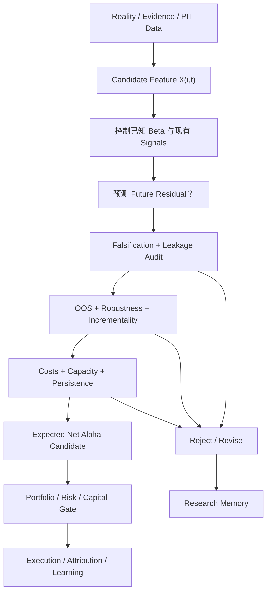

# ***Alpha Discovery 与 Validation 关系图谱***

> **中心问题：** 一个“看起来有用”的 Candidate Feature，如何经过机构式研究关卡，才有资格成为可进入资本配置的 Expected Alpha？

$$
\boxed{
Candidate\ Feature
\neq
Validated\ Alpha
\neq
Deployable\ Net\ Alpha
}
$$

## `（一）Reality → Feature → Expected Alpha → Capital 主关系图`

```text
┌──────────────────────────────────────────────────────────────────────────────┐
│                     ALPHA DISCOVERY：从现实提出候选解释                        │
└───────────────────────────────────┬──────────────────────────────────────────┘
                                    ▼
Reality → Evidence → Point-in-Time Data → Enterprise / Market State
                                    │
                                    ▼
                         Candidate Feature X(i,t)
                   “在 t 时点已经能观察到的候选特征”
                                    │
                                    ▼
                 Control Known Factor / Beta / Existing Signals
                                    │
                                    ▼
                   X(i,t) 能否预测 Future Residual(i,t+1)？
                                    │
                    ┌───────────────┴───────────────┐
                    ▼                               ▼
             没有增量预测力                   Candidate Alpha
             Reject / Learn                         │
                                                    ▼
┌──────────────────────────────────────────────────────────────────────────────┐
│                    ALPHA VALIDATION：主动寻找它为何是假的                      │
├──────────────────────────────────────────────────────────────────────────────┤
│ PIT / Leakage Audit → Falsification → OOS → Robustness → Multiple Testing    │
│ → Incrementality → Costs → Capacity → Persistence / Regime → Live Evidence   │
└───────────────────────────────────┬──────────────────────────────────────────┘
                                    ▼
                         Expected / Net Alpha Forecast
                                    │
                                    ▼
                  Portfolio + Risk + Deterministic Capital Gates
                                    │
                                    ▼
                  Execution → Attribution → Research Memory Update

失败路径同样进入 Research Memory：
Rejected Feature → Failure Reason → Future Search Space Shrinks
```

> **读图原则：** Discovery 扩大候选空间，Validation 缩小错误空间。研究的专业性不在于生产多少 Signal，而在于能否用正确时间语义、反证和真实摩擦，持续淘汰虚假 Alpha。

## `（二）Mermaid 一图看懂`



## `（三）Alpha Claim Gate：漂亮 Backtest 之后还要过什么`

```text
Looks Good in Backtest
          │
          ▼
1. Point-in-Time correct? ──No──> Reject / Rebuild Data
          │Yes
          ▼
2. Leakage / universe bias absent? ──No──> Reject
          │Yes
          ▼
3. Not omitted Beta or old Signal repackaging? ──No──> Reclassify
          │Yes
          ▼
4. Out-of-Sample survives? ──No──> Reject / Revise
          │Yes
          ▼
5. Robust across reasonable definitions and periods? ──No──> Fragile
          │Yes
          ▼
6. Multiple-testing risk controlled? ──No──> Evidence insufficient
          │Yes
          ▼
7. Gross edge survives fees, spread, slippage and impact? ──No──> Not tradable
          │Yes
          ▼
8. Capacity and safe exit sufficient? ──No──> Resize / Reject
          │Yes
          ▼
9. Persistence / Regime risk acceptable? ──No──> Conditional or Retire
          │Yes
          ▼
Only then → Usable Expected Alpha Candidate
          │
          ▼
Portfolio / Risk / Capital Authorization
```

> Gate 不是一张勾完即永久有效的清单。数据、市场结构、竞争和成本会变化，已上线 Signal 仍需监控、归因、降权和退休机制。

## `（四）理论层级与核心概念速查`

### `1. 内容性质`

| 层级 | 本图内容 |
|---|---|
| **Standard Research Theory / Practice** | Point-in-Time、OOS、Cross-validation、Leakage、Overfitting、Multiple Testing、Robustness、Transaction Costs、Capacity、Performance Decay。 |
| **AlphaResearchOS Working Architecture** | `Reality → Evidence → Enterprise Representation → Candidate Feature → Validation → Forecast → Capital` 的模块化组织。 |
| **Governance Principle** | `Falsification First`、`No Alpha Claim Without Falsification`、失败实验进入 Research Memory。它们是项目研究纪律，不是原创金融定理。 |

### `2. 从候选到资本的词汇表`

| 概念 | 最直白解释 | 升级条件 |
|---|---|---|
| **Evidence** | 有来源、时间和语义的现实事实 | 可追踪、可审计，不能只保存结论。 |
| **Point-in-Time Data** | 历史时点当时真实可知的数据快照 | Publication time、修订、成分与标识映射正确。 |
| **Candidate Feature $X_{i,t}$** | 今天可以观测、可能与未来有关的研究变量 | 只是候选，不因经济故事好听而自动有效。 |
| **Candidate Alpha** | 初步显示能预测风险调整未来收益的候选关系 | 尚未通过完整证伪与现实摩擦。 |
| **Falsification（证伪尝试）** | 主动寻找假设失效、伪相关或替代解释 | 预先定义会推翻观点的证据，并真正执行测试。 |
| **In-Sample（IS）** | 用于发现、拟合或选择模型的样本 | 只能说明模型适配过这些数据。 |
| **Out-of-Sample（OOS）** | 未用于拟合和挑选的保留样本 | 评估迁移到未见数据的表现。 |
| **Leakage** | 未来或测试集信息以直接/间接方式进入过去或训练过程 | 时间戳、修订、预处理、标签和模型选择均要审计。 |
| **Robustness** | 合理改变样本、定义和参数后，核心结论不过度依赖单点选择 | 不是“试到所有版本都好看”，而是检验脆弱性。 |
| **Incrementality** | 新 Feature 在已知 Factors 和已有 Signals 之外增加了多少信息 | 组合/联合模型中仍贡献 OOS 预测或组合价值。 |
| **Gross Alpha** | 尚未扣除全部交易与实施摩擦的预测/实现超额 | 不能直接用于资本决策。 |
| **Net Alpha** | 扣除费用、换手、滑点、冲击、融资等之后的剩余 | 仍需容量、风险与持久性判断。 |
| **Capacity** | 在 Alpha 被成本、冲击和机会数量侵蚀到不可接受前，可部署的资金规模 | 与 Signal Validity 分开证明。 |
| **Persistence** | 规律跨时期、竞争和市场状态是否仍存在 | 允许条件性有效，不要求永不衰减。 |

## `（五）核心公式骨架：研究究竟在检验什么`

### `1. Candidate Feature 必须是当时已知变量`

$$
X_{i,t}\in I_t
$$

$X_{i,t}$ 是股票 $i$ 在时点 $t$ 的候选特征；$I_t$ 是截至 $t$ 的合法信息集。

**为什么先写这个约束？** 如果 Feature 实际使用了 $t+1$ 才发布或修订的数据，那么后面所有统计检验都在回答一个现实中无法交易的问题。

### `2. 核心研究关系`

$$
X_{i,t}
\overset{?}{\longrightarrow}
Residual_{i,t+1}
$$

它问：今天已知的 $X$，是否能预测下一研究期在当前 Risk Model 控制后留下的收益。Residual 的组成和边界由 [alpha-beta-factor-residual-map.md](alpha-beta-factor-residual-map.md) 完整解释，本图不重复展开。

一个最简条件期望形式：

$$
\hat\alpha_{i,t}
=
E[Residual_{i,t+1}\mid X_{i,t},I_t]
$$

**为什么是未来 Residual？** 预测原始收益可能只是在预测 Market、Industry、Size 等已知 Beta；研究 Alpha 需要检查 Feature 是否贡献风险调整后的增量信息。

### `3. 横截面研究的最简骨架`

$$
Residual_{i,t+1}=a_t+b_tX_{i,t}+u_{i,t+1}
$$

| 符号 | 含义 |
|---|---|
| $b_t$ | 当期横截面中，Feature 与下一期 Residual 的关系斜率。 |
| $a_t$ | 当期共同截距。 |
| $u_{i,t+1}$ | 该简化关系仍未解释的部分。 |

研究者关心 $b_t$ 是否在时间上稳定、有合理不确定性，并在未参与选择的样本中仍有预测意义。一个时期 $b_t>0$ 不是 Alpha 证据链。

### `4. Incremental Alpha：不是只看 Feature 单独表现`

设已有信息集合为 $S_t$，新 Feature 为 $X_t$：

$$
Incremental\ Value
\approx
Performance(S_t+X_t)-Performance(S_t)
$$

**为什么做差？** 一个新 Feature 可能单独回测很好，却与 Momentum 或已有基本面 Signal 高度重复。真正价值是它加入现有系统后，是否改善 OOS 预测、组合风险或 Net Alpha。

### `5. Gross Alpha 到 Net Alpha`

$$
Net\ Alpha
=
Gross\ Alpha
-Fees
-Spread
-Slippage
-Turnover\ Cost
-Market\ Impact
-Financing/Borrow\ Cost
-Operational\ Frictions
$$

**为什么每项都要扣？** Backtest 中的理论成交价不是资本真实获得的价格；换手越高、流动性越弱、规模越大，统计优势越容易在实施中消失。

### `6. Capacity 不是一个纯统计显著性数字`

可用治理骨架表达：

```text
Capacity
= min(
    交易流动性容量,
    安全退出容量,
    有效机会数量,
    组合集中度容量,
    Alpha 拥挤/衰减容量,
    融资/融券/对冲容量
  )
```

这是 AlphaResearchOS 的容量检查表，不是严格数学恒等式。它提醒研究者：最紧的约束决定可部署规模。

## `（六）Point-in-Time、Leakage 与 OOS：最容易制造假 Alpha 的三处`

### `1. Point-in-Time 例子：财年结束不等于市场已经知道`

```text
财务报表期末：2025-12-31
正式发布日期：2026-04-30
```

这份报表中的信息不能用于 2026-01-02 的 Signal。Feature 的可用时间至少要以实际发布、系统接收和清洗完成时间为边界，而不是报表所描述的业务期间终点。

### `2. 三类 Leakage`

| 类型 | 典型错误 | 为什么虚假 |
|---|---|---|
| **Future Data Leakage** | 用下一期价格、未来公告或完整未来样本统计量生成今天 Feature | 真实交易时信息尚不存在。 |
| **Revised Data Leakage** | 回测历史直接使用后来修订的财务数据库最新值 | 模型获得了当时投资者不知道的“干净历史”。 |
| **Train/Test Leakage** | 用全样本标准化、筛变量或调参后才划 OOS | 测试集已参与研究选择，不再真正独立。 |

还要审计 Survivorship Bias、Universe Leakage、Corporate Action Timing 和 Identifier Mapping；它们都可能让历史股票池比现实更“聪明”。

### `3. IS / Validation / OOS 的直觉`

```text
Training / Discovery Set
→ 提出、拟合、初筛

Validation Set
→ 有限次数地选择超参数与模型版本

Final OOS / Holdout
→ 在研究冻结后做接近一次性的外部检验
```

时间序列通常不能随意随机打乱，因为未来和过去有顺序；应考虑 walk-forward、rolling/expanding window 等符合决策时序的设计。

> 如果研究者反复查看 Final OOS 并据此修改模型，它实际上已经变成新的 In-Sample；需要新的保留期或真实前瞻数据。

## `（七）Falsification、Overfitting 与 Multiple Testing`

### `1. Falsification First`

对每个假设先写：

```text
什么证据会让我放弃它？
它可能只是哪个已知 Factor？
在哪些时期、行业或制度下应当失效？
如果经济机制为真，还应观察到什么伴随证据？
```

证伪不是证明“永远无效”，也不是追求一次 p-value 未通过；它是主动设计能区分目标机制与替代解释的测试。

### `2. Overfitting`

模型自由度过高时，它会记住历史噪声：

```text
更复杂模型
+ 更多参数
+ 更多人工筛选
→ 更容易拟合过去
≠ 更能预测未来
```

### `3. Multiple Testing`

假设每个垃圾变量都有小概率偶然给出漂亮结果。当测试成百上千个变量、窗口和参数，再只展示最佳曲线时，出现“明星 Signal”几乎不可避免。

应保留：

- 全部尝试记录与 Experiment Registry；
- 预注册或冻结关键假设和评价指标；
- 多重比较/选择偏差意识；
- 真正独立的 OOS 与前瞻验证；
- 经济机制和替代解释测试。

> 小 p-value 只是在特定统计假设下衡量证据，不等于经济意义、可交易性或研究流程无偏。

## `（八）端到端数值例子：漂亮结果如何被逐层压缩`

以下为假想年化结果，用于展示 Gate 的作用，不代表任何真实策略：

### `候选 Feature`

```text
X(i,t) = 经营现金流改善 − 会计利润改善
直觉：现金流质量改善是否领先未来风险调整收益？
```

### `证据链`

| 阶段 | 年化表现/结论 | 发生了什么 |
|---|---:|---|
| 初始 In-Sample 多空回测 | Gross Active Return $+8.0\%$ | 看起来非常漂亮，但尚未审计。 |
| 修正报表发布日期与修订数据 | $+6.0\%$ | 删除了时间泄漏带来的虚假部分。 |
| 控制 Industry、Size 与已有 Quality Signal | Residual Spread $+4.0\%$ | 部分收益原来是已知 Exposure。 |
| 冻结规则后的 OOS | Gross Incremental Alpha $+2.5\%$ | 未见数据中仍为正，但明显衰减。 |
| Fees + Spread + Slippage + Turnover | $-1.2\%$ | 小资金预估 Net Alpha 为 $+1.3\%$。 |
| 目标规模下 Market Impact | 再减 $0.8\%$ | 目标规模预估 Net Alpha 只剩 $+0.5\%$。 |
| 压力情景：流动性减半 | Net Alpha $-0.4\%$ | 表明容量与退出条件脆弱。 |

这个 Feature 不能因为第一行 $+8\%$ 就直接进入资本。合理结论可能是：

```text
统计关系有候选价值
+ OOS 仍为正
- 目标规模容量不足
- 流动性压力下失效
→ 小风险预算前瞻观察 / 重新设计，而非直接大规模部署
```

### `小资金实盘能证明什么`

若后续小资金实盘成功，它可以增加以下证据：信号能实时产生、订单能成交、费用与滑点可观测、风控链路真实运行。但它仍不能单独证明更大规模的市场冲击和安全退出容量。

## `（九）今天最重要的认知纠偏`

| 常见误区 | 正确认识 |
|---|---|
| **1. Backtest 好看 = Alpha** | 好看只是候选起点；时间语义、风险控制、选择偏差和现实摩擦都可能推翻它。 |
| **2. p-value 小 = 可以交易** | 统计显著不等于经济显著、增量价值、成本后收益或容量。 |
| **3. 样本内稳定 = 样本外稳定** | 模型可能只适配已见数据；必须冻结规则并接受真正未见样本。 |
| **4. Feature 单独有效 = 有增量价值** | 它可能只是已有 Factor/Signal 的重包装；需比较加入现有系统后的 OOS 增量。 |
| **5. 小资金实盘成功 = 大资金容量已证明** | 小资金证明真实链路，不证明目标规模的冲击、机会数量与安全退出。 |
| **6. Gross Alpha = Net Alpha** | 费用、点差、滑点、换手、冲击、融资和运营约束都要扣除。 |
| **7. AI 发现的 Feature 可以跳过验证** | AI 扩大搜索空间，也可能放大 Multiple Testing 与叙事幻觉；验证标准只能更严格。 |
| **8. OOS 通过一次 = 永久有效** | 市场竞争、制度与 Regime 会变化；Signal 需要持续监控和退休规则。 |
| **9. 失败实验没有价值** | 记录失败原因能减少未来搜索空间，是 Research Memory 的重要资产。 |

## `（十）进阶但必要的现实理解`

### `1. 数据正确不等于经济命题正确`

时间戳完全正确的 Feature 仍可能缺少因果/经济机制，只利用偶然相关。反之，有合理故事也不能替代统计证据。研究需要 `Economic Rationale + Brutal Empiricism`。

### `2. Robustness 不是无限试参数`

稳健性检验应围绕合理扰动：替代定义、相邻窗口、不同 Universe、行业/规模控制和极端期。反复试到“每个版本都好看”会重新引入研究者自由度。

### `3. Capacity 与 Alpha 有效性是两份证明`

低换手、流动性好、机会广的策略通常更易承载资金，但不存在“基本面天然高容量”。容量还受拥挤、组合集中度、做空与退出路径限制。

### `4. Persistence 可以是条件性的`

Signal 可能只在特定制度、估值分散度、流动性或商业周期下有效。专业系统应明确适用条件、失效指标和 Regime Exposure，而不是要求一个无条件永恒规律。

### `5. Research-to-Production 有最后一公里风险`

研究代码与生产数据的时区、延迟、缺失值、公司行动、订单限制和异常恢复可能不一致。资本动作必须经过可复现、可观察的确定性边界；AI 生成的研究建议不能直接改写真实仓位。

## `（十一）与 AlphaResearchOS 的连接`

```text
AI Fundamental Engine
→ Evidence Extraction / Enterprise State / Candidate Feature

Quant Research
→ Hypothesis / Falsification / OOS / Incrementality

Factor & Risk Model
→ Known Beta Control / Exposure Attribution

Forecast Layer
→ Expected Alpha + Uncertainty + Horizon

Portfolio & Risk
→ Costs / Capacity / Constraints / Capital Allocation

Execution & Attribution
→ Real Fill / Outcome / Failure / Research Memory
```

| 模块 | 不该做什么 | 应该输出什么 |
|---|---|---|
| **AI Fundamental Engine** | 不直接输出 BUY / SELL | 有证据的企业状态、候选 Feature 与不确定性。 |
| **Quant Research** | 不只生产漂亮图表 | 可复现的实验、OOS 结果、失败原因与增量证据。 |
| **Risk Model** | 不把未知剩余自动叫 Alpha | 已知 Exposure、风险分解与控制接口。 |
| **Forecast** | 不把历史相关原样外推 | 带 horizon、uncertainty 和 as-of 的 Expected Alpha。 |
| **Portfolio** | 不按单个 Signal 排名直接下单 | 联合 Expected Alpha、风险、成本、容量和约束配置资本。 |
| **Research Memory** | 不只保存成功报告 | 同时保存 rejected / retired ideas 与失效条件。 |

对应的研究资产建议至少记录：

```text
experiment_id
hypothesis / economic_rationale
dataset_version / universe / as_of logic
feature_definition / code_commit
IS / OOS results
factor controls / existing signals
cost and capacity assumptions
failure modes
status: candidate / accepted / rejected / retired
```

## `（十二）面试怎么解释`

### `面试 30 秒版本`

我不会把好看的 Backtest 直接叫 Alpha。候选 Feature 必须先满足 point-in-time，证明它能在控制已知 Factor 和已有 Signals 后预测未来 Residual；然后接受 leakage audit、falsification、真正 OOS、稳健性和 multiple-testing 检查。最后还要扣除交易成本，验证容量、持久性和生产链路，才可能形成可进入 Portfolio 的 Expected Net Alpha。

### `典型追问与答题锚点`

| 追问 | 一句话答题锚点 |
|---|---|
| **为什么 OOS 很重要？** | 它检查模型是否只记住已见样本；但反复用 OOS 调参会让 OOS 失去独立性。 |
| **Point-in-Time 最常见错误是什么？** | 把报表期末当可用日、使用后来修订值，或让全样本统计量进入历史 Feature。 |
| **Falsification 在 Quant 中怎么做？** | 预先列出替代因子、失效环境和反证，并设计能区分目标机制与伪相关的测试。 |
| **Feature 为什么要测 Incrementality？** | 单独好看可能与已有 Signal 重复，系统只为新增的 OOS 信息和组合价值付费。 |
| **小资金 Live 为什么不能证明 Capacity？** | 它验证实时链路和小额成交，无法外推大资金冲击、机会数量与安全退出。 |

## `（十三）最小记忆框架`

| 阶段 | 最小问题 |
|---|---|
| Candidate Feature | 今天真的知道吗？ |
| Risk Control | 只是已知 Beta/旧 Signal 吗？ |
| Falsification | 什么证据会推翻它？ |
| OOS | 未见数据还成立吗？ |
| Incrementality | 加入现有系统后多了什么？ |
| Net Alpha | 全部成本后还剩什么？ |
| Capacity | 放大资金后还能剩多少？ |
| Persistence | 竞争和 Regime 变化后还能活多久？ |

### `复习时只保留五句话`

1. **Candidate Feature 只是今天可观测的研究变量，不是 Alpha 结论。**
2. **真正的问题是它在控制已知 Beta 和已有 Signals 后，能否事前预测 Future Residual。**
3. **PIT、Leakage Audit、Falsification 和真正 OOS 负责排除“知道未来”和“记住历史”。**
4. **单独有效不等于有增量，Gross Alpha 也不等于成本与冲击后的 Net Alpha。**
5. **容量、持久性、生产一致性与持续归因决定统计信号能否安全进入资本。**

## `（十四）是否继续扩张本图谱？`

当前主图暂时停止扩张。

本图只保留从 Feature 到 Capital 的主 Gate。以下内容应拆分：

- `ic-cross-sectional-research-map.md`：IC、分组回测、Fama–MacBeth 与横截面评估；
- `backtest-bias-map.md`：Look-ahead、Survivorship、Selection 与 Data Snooping；
- `multiple-testing-map.md`：FDR、Reality Check 与选择后推断；
- `capacity-market-impact-map.md`：参与率、冲击模型、影子订单和扩容证据链；
- `signal-decay-regime-map.md`：半衰期、拥挤、状态切换与退休机制。

---

> **最终锚点：Alpha Discovery 负责提出“也许”，Alpha Validation 负责不断问“为什么可能是假的”；只有当时可知、控制已知风险后有增量、样本外存活、成本后为正、容量与持久性可接受的预测，才有资格靠近真实资本。**
