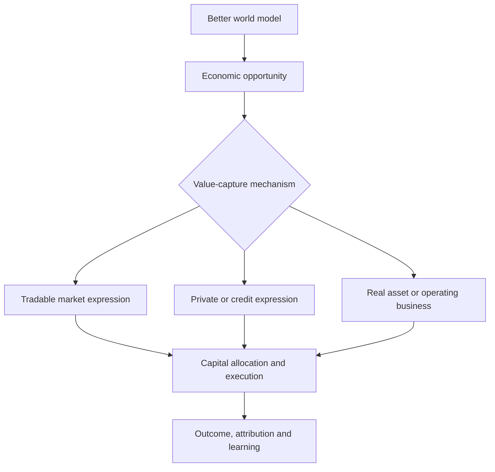

# Alpha、Economic Opportunity、Investment Expression 与 Capital Allocation 图谱

> **Map ID:** 13  
> **性质声明：** 本图把严格的 Tradable Alpha 放回更大的 Economic Opportunity 与 Capital Allocation 空间。`Opportunity Research / Capital Intelligence` 目前仅为候选方向，不是 AlphaResearchOS 当前架构或能力声明。  
> **中心问题：** 为什么“发现一个机会”和“选择怎样捕获价值”是两个不同问题？Tradable Alpha 在更广的经济机会发现与资本配置体系中位于哪里？

$$
\boxed{
Economic\ Opportunity\supset Tradable\ Alpha;
\quad Opportunity\neq Expression;
\quad High\ Return\neq Alpha
}
$$

## （一）主关系图：从世界模型到价值捕获

```text
Reality
↓
Better World Model
↓
Economic Edge
↓
Opportunity
↓
Value-Capture Mechanism
  ├─ Public Securities
  ├─ Derivatives
  ├─ Private Equity
  ├─ Credit
  ├─ Real Assets
  ├─ Operating Business
  └─ Other legal / feasible structures
↓
Capital Allocation
↓
Execution
↓
Economic Outcome
```

## （二）Mermaid 一图看懂



## （三）理论层级

| 层级 | 本图内容 |
|---|---|
| **Standard Theory / Mature Practice** | Opportunity Cost、Capital Budgeting、Portfolio Choice、Ownership Rights、Public / Private Markets、Credit、Derivatives、Liquidity、Control、Scalability、Execution。 |
| **AlphaResearchOS Working Model** | Alpha 必须 benchmark-relative、risk-adjusted、incremental、PIT、OOS、cost-aware、capacity-aware、executable。 |
| **Candidate Concept** | Alpha 作为 Economic Opportunity 的专业分支；Value-Capture Mapping；Opportunity Research / Capital Intelligence。 |
| **Critical Boundary** | 所有赚钱行为不能统称 Alpha；Operating Business 的回报结构与公开证券 residual return 不同。 |

## （四）严格保护 Alpha 语义

### Tradable Alpha

在本图中，Alpha 只指：

> 在明确 Benchmark 与 Risk / Factor Model 下，利用决策时点可得信息，对未来增量风险调整收益形成可验证预测，并在 OOS、成本、容量与执行后仍有资本意义。

```text
Active Return != Alpha
Residual != Alpha
Disagreement != Alpha
Mispricing != Tradable Alpha
Correct Story != Alpha
```

### Economic Opportunity

更宽泛地指：

> 现实中存在一种合法、可行的行动或权利结构，使特定主体能够以可接受的资源、风险和时间成本改善经济状态。

它可以存在于证券市场之外。

## （五）从 Information Edge 到 Economic Edge

```text
Information access
→ interpretation
→ better world model
→ actionable difference
→ feasible value capture
```

| 阶段 | 失败方式 |
|---|---|
| Information | 数据错误、无权使用、已公开且同质解释。 |
| Interpretation | 对象、机制或时点错误。 |
| Economic Edge | 判断正确但不改变任何重要决策。 |
| Opportunity | 没有合法可行的行动。 |
| Value Capture | 权利结构不把价值归给行动者。 |
| Capital Allocation | 风险、流动性、容量或机会成本不合格。 |
| Execution | 价格、冲击、运营或治理失败。 |

## （六）Value-Capture Mechanisms 对比

| 机制 | 获得的权利 / 曝险 | 流动性 | 控制 | 典型限制 |
|---|---|---|---|---|
| Public equity | 剩余现金流、有限治理权 | 通常较高但异质 | 通常低 | 市场定价、波动、治理。 |
| Public credit | 合同现金流、优先权、covenant | 视品种而定 | 低至中 | default、recovery、利率、流动性。 |
| Derivative | 合同化 payoff | 视合约而定 | 无 | margin、expiry、basis、counterparty。 |
| Private equity | 非公开股权、治理和退出权 | 低 | 中至高 | 锁定期、估值、运营与退出。 |
| Private credit | 定制现金流、抵押与 covenant | 低 | 中 | illiquidity、underwriting、workout。 |
| Real asset | 使用、租赁、稀缺性或生产权 | 低至中 | 中至高 | 运维、地点、监管、融资。 |
| Operating business | 直接经营与剩余收益 | 很低 | 高 | 执行、组织、竞争、责任。 |

表中是一般比较，不代表任何具体产品一定具有该特征；合同条款优先。

## （七）Observe Reality vs Change Reality

### 公开市场投资者

```text
Observe Reality
→ form expectations
→ allocate capital
→ mostly accept existing operating system
```

### 控股资本 / 企业经营

```text
Observe Reality
→ acquire rights and resources
→ allocate capital
→ change operations / incentives / capabilities
→ potentially change Reality
```

区别不是“被动/主动”标签，而是控制权与 action set 不同。

同一信息可能在公开市场已被定价，但仍能通过建立供应链、改进流程或购买控制权形成 Economic Opportunity；反之，真实商业机会也未必适合缺乏运营能力的资本所有者。

## （八）Opportunity 与 Expression 是两个决策

### Decision 1 — Is there an opportunity?

```text
Reality difference
+ better model
+ actionability
+ value creation / transfer logic
```

### Decision 2 — How should it be expressed?

```text
Rights
+ payoff alignment
+ liquidity
+ control
+ capital efficiency
+ operating capability
+ horizon
+ risk
```

同一个 economic view 可以有多种表达；同一个表达也可能同时承载多个 view。

## （九）Capital Allocation 的共同坐标

概念决策向量：

$$
C=(ExpectedOutcome,Risk,Liquidity,Control,Scale,Duration,CapitalEfficiency,Capability)
$$

| 坐标 | 关键问题 |
|---|---|
| Expected outcome | 期望结果与概率分布是什么？ |
| Risk | 永久损失、尾部、杠杆与路径风险是什么？ |
| Liquidity | 何时、以何成本退出？ |
| Control | 能否改变经营、合同或治理？ |
| Scalability | 增加资本后回报是否衰减？ |
| Duration | 资本被占用多久？ |
| Capital efficiency | 需要多少现金、抵押或承诺资本？ |
| Capability | 是否拥有运营、研究、法务和执行能力？ |

## （十）Public Securities 分支中的 Alpha Gate

```text
Research hypothesis
→ explicit benchmark
→ explicit risk model
→ incremental predictive test
→ PIT and OOS
→ gross alpha assessment
→ cost / net alpha
→ capacity and execution
→ portfolio fit
→ capital authorization
```

因此：

$$
NetAlpha
=GrossAlpha-TradingCost-Borrow-Funding-Impact-ImplementationDrag
$$

该式是检查骨架，不保证所有现实摩擦可线性精确相加。

## （十一）Private / Operating 分支的不同 Gate

非公开机会不能套用同一套 daily-return Alpha 语言。它更需要：

```text
Ownership and governance rights
Due diligence
Cash-flow and downside underwriting
Legal / tax / regulatory structure
Operational plan
Management capability
Capital call and liquidity plan
Exit pathways
Counterfactual value creation
```

这里的回报可能来自：

- risk bearing；
- illiquidity；
- leverage；
- control improvement；
- operational execution；
- bargaining and contract design；
- genuine informational advantage。

不能把所有这些未经分解地称为 Alpha。

## （十二）Expression Selection：多分支比较例

假设研究者认为某工业材料长期供给偏紧：

| 表达 | 观点纯度 | 关键新增风险 |
|---|---|---|
| Commodity future | 较直接 | curve、margin、roll、timing。 |
| ETF | 操作方便 | tracking、fees、underlying structure。 |
| Producer equity | 带经营杠杆 | cost、hedge、debt、country、management。 |
| Producer credit | downside / covenant | default、recovery、seniority。 |
| Mine acquisition | 可控制经营 | illiquidity、permit、operations、capital intensity。 |
| Recycling business | 可改变供给 | technology、collection、scale、competition。 |

“最好的观点”与“最适合自己的表达”必须分开。

## （十三）Capital Efficiency、Leverage 与 Survival

资本效率高通常意味着较少初始资本控制较大 exposure，但不等于经济风险低。

```text
Leverage
→ amplifies desired exposure
+ amplifies model error
+ introduces margin and path dependency
+ shortens survival horizon
```

长期资本结果取决于：

$$
Outcome
=f(Edge,Capital,Time,Costs,Risk,Survival,Reinvestment)
$$

这是一条组织性启发式，不是财富定理。

## （十四）Ownership Rights：谁最终获得价值

一个机会只有在权利结构允许时才能被捕获：

- equity holder 是否被稀释；
- creditor 是否有 seniority / collateral；
- token 是否拥有 fee or governance claim；
- license 是否可转让；
- operator 是否拥有客户关系和资产；
- derivative payoff 是否精确覆盖事件。

```text
Value exists somewhere
!=
Your instrument captures it
```

## （十五）Outcome Attribution：赚钱以后仍要问为什么

```text
Economic thesis contribution
Benchmark / beta contribution
Factor / liquidity contribution
Leverage contribution
Control / operational improvement
Timing and luck
Costs and implementation drag
```

没有 attribution，就无法知道应复用 research capability、risk exposure 还是 operating playbook。

## （十六）常见误区与纠偏

| 误区 | 纠偏 |
|---|---|
| 所有赚钱机会都是 Alpha | Alpha 是公开可交易市场中的严格专业概念。 |
| 发现需求增长就有投资机会 | 价值可能流向消费者、供应商、土地、专利或已被价格化。 |
| 控制权越高越好 | 控制权要求运营能力，并牺牲流动性。 |
| 私募回报高说明 Alpha 高 | 回报可能含 illiquidity、leverage、selection 和估值平滑。 |
| 衍生品资本效率高所以风险低 | leverage、margin、expiry 和 path risk 可能更高。 |
| 世界模型正确就应投入资本 | 还需权利、价格、风险、期限、能力和机会成本。 |

## （十七）Candidate Promotion Tests

若 `Opportunity Research / Capital Intelligence` 要晋升，至少需要：

1. 证明它与已有 Research、Portfolio、Capital Governance 概念不重复；
2. 为 value-capture mechanism 定义可操作字段；
3. 用多个案例证明跨分支比较提高决策质量；
4. 明确与 Alpha、corporate strategy、personal finance 的边界；
5. 证明新增复杂度值得；
6. 不绕过专业法律、合规、投资与运营判断。

## （十八）与其他 Maps 和 AlphaResearchOS 的连接

### Prerequisites

- Map 07：严格 Alpha 语义；
- Map 12：产生受影响资产和 expression candidates。

### 本图独占

```text
Which legal and feasible value-capture mechanism?
How should scarce capital be allocated among them?
```

### 向后接口

- Map 14：Human Capital 和 operating capability 决定可行 action set。

### Architecture Boundary

```text
Capital Intelligence System
= Candidate Direction
≠ Current Implemented Architecture
```

## （十九）Interview / Oral Explanation

> 我会严格区分 Economic Opportunity 和 Tradable Alpha。Alpha 是公开市场里相对 benchmark、经风险调整和增量验证、成本容量后仍成立的可交易预测；经济机会更广，可以通过股票、债权、衍生品、私募、实物资产或经营企业捕获。发现机会后还要第二次决策：哪种权利结构最匹配观点、期限、流动性、控制权、资本效率和自身运营能力。

## （二十）最小记忆框架

1. Economic Opportunity > Tradable Alpha；
2. Opportunity 与 Expression 是两个决策；
3. 资产决定 rights 与 payoff；
4. Public investor 多为 observe + allocate；control capital 还能 change reality；
5. 比较 risk、liquidity、control、scale、duration、efficiency、capability；
6. Capital efficiency 不等于低风险；
7. Value exists 不等于 your instrument captures it；
8. Outcome 必须 attribution。

## （二十一）Mastery Checkpoints

| Level | 能力证据 |
|---|---|
| 1 — Explain | 能解释为什么 Economic Opportunity 大于 Tradable Alpha。 |
| 2 — Distinguish | 能区分六类 value-capture mechanism 的 rights。 |
| 3 — Apply | 能为一个经济观点比较三种以上表达。 |
| 4 — Falsify | 能指出高回报的非 Alpha 来源与幸存者偏差。 |
| 5 — Transfer | 能把公开市场观点重构为经营或信用机会并说明新增能力要求。 |

## （二十二）本图不负责

- 不把所有盈利行为称为 Alpha；
- 不提供个人资产配置或具体投资建议；
- 不设计当前 AlphaResearchOS Portfolio Engine；
- 不宣布 Opportunity Research 已成为正式产品；
- 不替代法律、税务、合规、信用或运营尽调。

## （二十三）精选来源

- [SEC — Private Fund Investor Bulletin](https://www.sec.gov/resources-for-investors/investor-alerts-bulletins/private-funds)
- [CME Group — Product Specifications and Listed Derivatives](https://www.cmegroup.com/trading/products/)
- [British Business Bank — Enterprise Capital Funds](https://www.british-business-bank.co.uk/finance-options/equity-finance/enterprise-capital-funds)
- [BIS — An Intermediation-based Model of Exchange Rates](https://www.bis.org/publications/working-paper-743-intermediation-based-model-exchange-rates)

