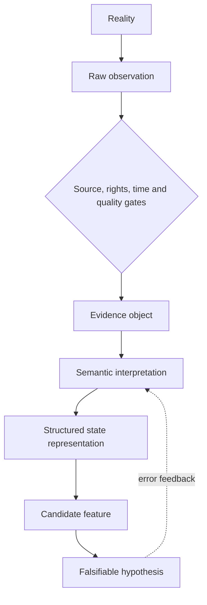

# Alternative Evidence、Domain Knowledge 与 Representation Edge 图谱

> **Map ID:** 10  
> **性质声明：** 本图连接成熟的数据治理、语义建模、provenance、point-in-time 与合规概念，并提出 AlphaResearchOS 的 **Representation Edge Candidate Concept**。Representation Edge 不是已经证实的 Alpha 来源，也不是当前实现声明。  
> **中心问题：** 另类数据真正的价值在哪里？为什么“别人没有的数据”远远不够，而 Domain Knowledge、Semantics、PIT、Provenance 与 Representation 才可能形成研究优势？

$$
\boxed{
Raw\ Data\neq Evidence;
\quad Evidence\neq Interpretation;
\quad Data\ Edge\neq Representation\ Edge;
\quad More\ Data\neq Better\ Model
}
$$

## （一）主关系图：从 Reality 到 Research Feature

```text
Reality
↓
Raw Observation
↓ source / rights / time / quality gates
Evidence
↓ semantic interpretation
Structured State
↓ ontology / relations / uncertainty
Representation
↓ operational definition
Candidate Research Feature
↓ falsifiable proposition
Hypothesis
```

## （二）Mermaid 一图看懂



## （三）理论层级与概念速查

| 层级 | 本图内容 |
|---|---|
| **Standard Theory / Mature Practice** | Data Provenance、Ontology、Data Quality、PIT Data、Revision History、Missing Data、Selection Bias、Survivorship Bias、Licensing、Privacy、MNPI Controls。 |
| **AlphaResearchOS Working Model** | Evidence 必须带来源、时间、语义与可审计身份；AI Fundamental Engine 输出 Research Objects，而不是 BUY / SELL。 |
| **Candidate Concept** | Representation Edge：在合法、可追溯的数据基础上，更准确地表示经济对象和状态的能力。 |
| **Example / Intuition** | 白银作为其他金属开采副产品，用于展示错误对象表示怎样污染供给模型。 |

| 概念 | 最小解释 | 关键边界 |
|---|---|---|
| Raw Observation | 传感器、网页、文本、交易或人工记录留下的原始观测 | 可能错误、无授权、重复或没有经济含义。 |
| Evidence | 可用于支持或反驳命题的、带身份的观测 | Evidence 不自动给出解释。 |
| Semantic Definition | 一个字段究竟描述谁、什么、何时、何种口径 | 同名不等于同义。 |
| Ontology | 对实体、属性、关系和允许状态的显式组织 | 不是术语表，也不保证因果正确。 |
| Representation | 对研究对象当前状态及关系的结构化表达 | 任何表示都会选择并遗漏现实。 |
| Feature | 可进入经验检验的操作化变量 | Feature 不等于 Signal，更不等于 Alpha。 |
| Provenance | 数据从哪里来、经何活动生成、由谁负责、如何修订 | 来源存在不等于来源可靠。 |
| PIT | 仅使用决策时点真实可得的信息版本 | `effective_time` 与 `publication_time` 不可混同。 |

## （四）Raw Data 为什么还不是 Evidence

一条观测成为研究 Evidence，至少要补齐：

```text
What was observed?
Which entity does it refer to?
Who / what generated it?
When did the underlying state occur?
When was it observed and published?
Under what rights may it be used?
What transformations were applied?
What could make it wrong?
```

可以把 Evidence identity 写成：

$$
E=(value,entity,definition,source,t_{effective},t_{published},lineage,rights,quality)
$$

这只是 AlphaResearchOS 的概念 schema，不是现有接口。

## （五）Data Edge vs Representation Edge

### Data Edge

```text
access to observation
+ coverage
+ speed
+ exclusivity
```

它可能很有价值，但也可能因为语义错误、授权风险或无法映射经济机制而无效。

### Representation Edge

```text
Reliable Evidence
+ Domain Semantics
+ Correct Economic Object
+ Time-aware State
+ Relations and Constraints
+ Uncertainty
→ Better Research Representation
```

Representation Edge 的候选定义：

> 在同一信息集合或合法可得信息集合下，比竞争者更准确、可审计、及时地把观察映射为经济对象、状态、关系和不确定性的能力。

它仍需通过研究任务证明：更好的表示是否真的提高 OOS 判断或减少错误。

## （六）Domain Knowledge 是 Representation Prior

领域知识不只是“增加几个行业术语”。它帮助决定：

- 什么是正确 entity；
- 什么是 state，什么是 event；
- 哪些单位可比；
- 哪些关系是物理约束、合同关系或会计映射；
- 什么缺失是随机，什么缺失本身有信息；
- 哪些替代解释必须保留。

### 示例：库存上升

```text
Inventory ↑
```

可能表示：

- 需求弱；
- 主动备货；
- 供应链中断前囤货；
- 会计分类变化；
- 并表范围变化；
- 原材料价格变化导致金额库存上升但数量未升。

没有 domain semantics，`inventory_growth` 只是一串数字。

## （七）Structured vs Unstructured：不是高低之分

| 类型 | 优势 | 主要风险 |
|---|---|---|
| Structured | schema 明确、易比较、易计算 | schema 可能把关键现实压扁。 |
| Unstructured | 保留叙事、条件、因果线索 | 抽取误差、歧义、版本和引用困难。 |
| Semi-structured | 同时保留字段和上下文 | 设计与治理成本更高。 |

更合理的目标是：

```text
Raw text / image / observation
→ extracted claims with source spans
→ normalized entities and units
→ structured state
→ retain original evidence for audit
```

## （八）Provenance：每个结论都要能沿链返回

W3C PROV-O 使用 Entity、Activity、Agent 以及 `wasGeneratedBy`、`wasDerivedFrom`、`wasAttributedTo` 等关系表达 provenance，说明 lineage 不只是保存一个 URL，而是保存生成与责任链。参见 [W3C PROV-O Recommendation](https://www.w3.org/TR/prov-o/)。

研究中的最小 lineage：

```text
Source Artifact
→ Extraction Activity
→ Normalization Activity
→ Evidence Object
→ Representation Update
→ Feature Version
→ Experiment
```

如果无法返回源证据，就难以区分：

- 世界改变；
- 来源修订；
- parser 改变；
- ontology 改变；
- feature logic 改变。

## （九）Time Semantics 与 Revision History

### 四个时间字段

| 时间 | 含义 |
|---|---|
| `effective_time` | 现实状态发生或适用的时间。 |
| `observation_time` | 传感器或来源记录时间。 |
| `publication_time` | 合法研究者可获得时间。 |
| `ingestion_time` | 系统实际接收时间。 |

### Revision identity

```text
same economic period
!=
same published artifact version
```

PIT 研究必须保存：

- 初始值；
- 每次 revision；
- revision publication time；
- 当时实际使用的版本。

否则 revision leakage 会把未来知识带回过去。

## （十）Missingness、Coverage 与 Survivorship

缺失不是一个统一状态：

| 缺失类型 | 研究含义 |
|---|---|
| Sensor failure | 技术性缺失。 |
| Not applicable | 经济对象不适用。 |
| Not disclosed | 可能与激励或监管有关。 |
| Provider coverage | 供应商只覆盖特定群体。 |
| Entity exit | 破产、退市或停止运营。 |
| Late arrival | 当时不可得、后来补录。 |

错误地删除消失的公司、矿山、协议或资产，会制造 survivorship bias。

## （十一）Rights、Privacy、Confidentiality 与 MNPI Gate

另类数据的“可访问”不代表“可合法用于投资”。最小 Gate：

```text
Source legitimacy
→ Collection rights
→ Contract / license
→ Privacy and consent
→ Confidentiality
→ MNPI / inside-information review
→ Permitted research use
```

SEC 2022 Risk Alert 指出，使用另类数据的投资顾问需要针对潜在 MNPI 风险建立并一致执行尽调与政策，包括数据提供方来源、合同义务和 red flags；它也明确 alternative data **并不必然**包含 MNPI。参见 [SEC Code of Ethics Risk Alert](https://www.sec.gov/files/code-ethics-risk-alert.pdf)。

英国的数据保护边界由 UK GDPR 与 Data Protection Act 2018 共同构成，具体适用必须由合规或法律专业人士判断。参见 [UK Government — Data protection](https://www.gov.uk/data-protection)。

```text
Alternative Data
!= Inside Information

but

Alternative Data
!= Automatically Permitted Data
```

## （十二）白银副产品案例：错误成本语义怎样污染供给模型

USGS 2026 Mineral Commodity Summary 指出，白银主要作为铅锌、铜和金矿的副产品获得。这是供给结构事实，不意味着“白银经济成本为零”。参见 [USGS Silver 2026](https://pubs.usgs.gov/periodicals/mcs2026/mcs2026-silver.pdf)。

### 1. 四种不能混用的成本

| 成本概念 | 研究问题 |
|---|---|
| Accounting allocated cost | 企业把联合采矿成本怎样分摊到白银？ |
| Incremental cost | 已开采矿石的前提下，多回收一单位白银增加多少现金支出？ |
| Joint cost | 共同开采多个金属、分离点之前的成本是多少？ |
| Economic cost | 包含机会成本、资本、风险、维持产能与资源耗竭后的完整成本是什么？ |

### 2. “副产品”改变的是 supply response

```text
Silver price rises
        ↓
Does host-metal mine output change?
        ↓
Depends on lead-zinc / copper / gold economics
        ↓
Recovery investment and processing response
        ↓
Silver supply response may be indirect and lagged
```

如果模型把所有银矿都表示为独立的 primary silver mine，就可能高估银价对短期产量的直接刺激。

### 3. 需要表示的 Economic Object

```text
Mine
├─ ore body and grades
├─ host metals / coproducts
├─ processing and recovery rates
├─ joint and incremental costs
├─ capacity / permits / lead time
└─ revenue contribution by metal
```

这展示 Representation Edge 的含义：不是知道“白银是副产品”这句话，而是把它转成可检验的供给对象与约束。

## （十三）从 Representation 到 Candidate Feature

一个 feature 必须写清：

```text
Economic object
→ state variable
→ unit and aggregation
→ time identity
→ transformation
→ expected mechanism
→ falsifier
```

例：

$$
ByproductExposure_t
=
\frac{SilverOutputFromHostMetalOperations_t}{TotalSilverOutput_t}
$$

即使数据可得，这仍只是 Candidate Feature；它是否预测供给弹性或资产收益，需要单独验证。

## （十四）常见误区与纠偏

| 误区 | 纠偏 |
|---|---|
| 数据独家，所以一定有 Alpha | 独家数据也可能没有语义、没有权限或没有增量预测力。 |
| NLP 抽取完成就等于理解企业 | 抽取是转换步骤，Representation 还需要实体、关系、时间和不确定性。 |
| Ontology 越大越好 | 过度建模会提高维护成本并隐藏关键假设。 |
| 有来源 URL 就有 provenance | 还需保存版本、转换活动、责任和派生关系。 |
| 缺失值全部填零 | 零是观测值；缺失是一种状态。 |
| 副产品成本等于零 | 分摊成本低不等于增量、联合或经济成本为零。 |
| 合法抓取等于合法交易 | 访问、合同、隐私、保密和 MNPI 是不同 Gate。 |

## （十五）Falsification 与 Promotion Tests

Representation Edge 若要晋升，至少回答：

1. 相比简单 schema，它减少了哪类可观测错误？
2. 表示差异能否被两个研究者独立重建？
3. 是否提高 OOS prediction、calibration 或 error attribution？
4. 新 ontology 的复杂度成本是否值得？
5. 在对象和市场变化后是否仍稳定？
6. 是否完整通过 rights / privacy / MNPI Gate？

## （十六）与其他 Maps 和 AlphaResearchOS 的连接

### Prerequisites

- Map 08：本地市场结构改变数据语义；
- Map 09：不同 sensors 在传导链上生成 raw observations。

### 向后接口

- Map 11：定义需要表示的 Economic Object；
- Map 12：提供状态节点和可追溯 Evidence；
- Map 13：合规和权利约束继续限制价值捕获机制。

### 系统连接

```text
Evidence-backed Structured State
→ Enterprise Representation
→ Candidate Feature
→ Hypothesis
```

本图不意味着 `Economic Object Representation` 或 `Representation Edge` 已成为当前软件架构。

## （十七）Interview / Oral Explanation

> 另类数据的优势不只是别人有没有，而是你能否把原始观察合法、PIT、可追溯地变成正确的经济对象和状态。数据如果缺少实体、口径、时间、版本和领域语义，越多反而可能制造越多伪特征。我把真正可能持久的优势称为 Representation Edge，但它仍要通过具体任务证明能减少错误或提高样本外判断。

## （十八）最小记忆框架

1. Raw Data ≠ Evidence；
2. Evidence ≠ Interpretation；
3. Domain Knowledge 决定实体、状态和口径；
4. Provenance 要保存生成与派生链；
5. PIT 要区分 effective / publication / ingestion time；
6. Missingness 和 survivorship 是研究对象；
7. Rights、privacy、confidentiality、MNPI 是强制 Gate；
8. Representation Edge 是 Candidate Concept，不是 Alpha 证明。

## （十九）Mastery Checkpoints

| Level | 能力证据 |
|---|---|
| 1 — Explain | 能解释 Raw Observation 到 Hypothesis 的完整链。 |
| 2 — Distinguish | 能区分四种成本和四种时间。 |
| 3 — Apply | 能为一个另类数据源填写 Evidence identity。 |
| 4 — Falsify | 能设计对照证明 ontology 是否真的增加研究价值。 |
| 5 — Transfer | 能把 Representation Edge 迁移到商品、协议或地产对象。 |

## （二十）本图不负责

- 不判断某个另类数据集具有可交易 Alpha；
- 不把 ontology 或 Causal Graph 宣布为现有系统实现；
- 不提供具体法律意见；
- 不展开跨资产基本面对象；
- 不负责状态变化的因果传播。

## （二十一）精选来源

- [W3C — PROV-O: The PROV Ontology](https://www.w3.org/TR/prov-o/)
- [SEC — Risk Alert: Investment Adviser MNPI and Alternative Data Controls](https://www.sec.gov/files/code-ethics-risk-alert.pdf)
- [UK Government — Data protection](https://www.gov.uk/data-protection)
- [USGS — Silver, Mineral Commodity Summaries 2026](https://pubs.usgs.gov/periodicals/mcs2026/mcs2026-silver.pdf)

