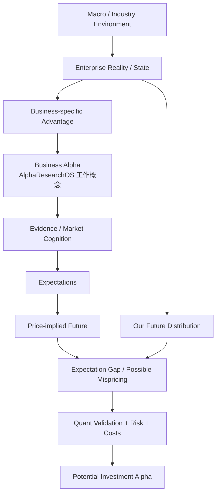

# ***Business Alpha 与 Investment Alpha 关系图谱***

> **术语声明：** `Business Alpha` 是 AlphaResearchOS 为 Fundamental Quant 建立的**工作概念**，用于区分企业经营层面的特异性价值创造与资本市场层面的 Investment Alpha。它不是需要冒充标准学术定义的术语，也不是一个已经统一标准化的会计指标。

> **中心问题：** 企业本身优秀，与股票作为投资优秀，为什么是两件不同的事情？

$$
\boxed{
好公司
\neq
好股票；
\qquad
Business\ Alpha
\neq
Investment\ Alpha
}
$$

## `（一）Enterprise Reality—Market Cognition—Price—Investment Alpha 主关系图`

```text
┌──────────────────────────────────────────────────────────────────────────────┐
│                             现实世界中的企业                                  │
└───────────────────────────────────┬──────────────────────────────────────────┘
                                    ▼
                       Macro / Industry / Cycle
                                    │
                                    ▼
                           Enterprise Reality
                                    │
                                    ▼
                           Enterprise State
                 财务、现金流、竞争、治理、资本配置、周期位置
                                    │
                 ┌──────────────────┴──────────────────┐
                 ▼                                     ▼
       外部环境可解释部分                   Business-specific Advantage
       Macro / Industry Exposure            企业自身结构性经营优势
                                                       │
                                                       ▼
                                        Business Alpha（项目工作概念）
                                        企业特异价值创造能力候选
                                                       │
                                                       ▼
                                      Evidence / Information enters market
                                                       │
                                                       ▼
                                              Market Cognition
                                                       │
                                                       ▼
                                               Expectations
                                                       │
                                                       ▼
                                                   Price
                                                       │
                                                       ▼
                                         Price-implied Future / Distribution
                                                       │
                              ┌────────────────────────┴───────────────────────┐
                              │                                                │
                              ▼                                                ▼
                  My Model of Future Reality                     Market-implied Model
                              │                                                │
                              └────────────────────────┬───────────────────────┘
                                                       ▼
                                    Expectation Gap / Possible Mispricing
                                                       │
                                  可验证？未充分价格化？可交易？风险调整后存在？
                                                       │
                                                       ▼
                                       Potential Investment Alpha
                                                       │
                                                       ▼
                                   Quant Validation → Portfolio → Outcome
```

> **读图原则：** 企业经营优势只有经过“市场是否已知道—价格隐含什么未来—自己的模型是否更准确—差异能否交易”的桥梁，才可能转化为 Investment Alpha。

## `（二）Mermaid 一图看懂`



## `（三）理论层级与核心概念速查`

### `1. 必须先划清术语性质`

| 层级 | 内容 |
|---|---|
| **Standard Theory / Practice** | 企业基本面分析、Discounted Cash Flow、Reverse DCF / Expectations Analysis、市场价格化、风险调整收益、价值投资。 |
| **AlphaResearchOS Working Model** | `Business Alpha`、`Enterprise Representation → Market Cognition → Price-implied Expectations → Investment Alpha` 的系统桥梁。 |
| **Research Implication** | AI 可以帮助理解企业现实并形成 Candidate Features，但 Investment Alpha 必须由市场预期比较与 Quant Validation 共同确认。 |

### `2. 核心概念`

| 概念 | 最直白解释 | 关键边界 |
|---|---|---|
| **Enterprise Reality** | 企业真实发生的经营、财务、竞争和治理状态 | 研究者只能通过不完整 Evidence 逼近它，不能直接全知。 |
| **Enterprise State** | 对企业某一时点状态的结构化表示 | 是模型表示，不等于企业现实本身。 |
| **Business Quality** | 商业模式、竞争优势、ROIC、资产负债表、治理等综合质量 | 高质量不等于当前股票便宜。 |
| **Business Alpha** | 控制宏观、行业、周期等外部环境后，企业自身仍呈现的特异经营改善/价值创造能力 | 项目工作概念；不是现成单一指标，也不自动转成股票 Alpha。 |
| **Market Cognition** | 市场参与者如何观察、理解并交易企业信息 | 不等于每个人观点一致；Price 是多种观点与约束的聚合结果。 |
| **Expectations** | 市场对未来增长、利润率、ROIC、风险和持续期的概率判断 | 高预期本身不是高估，低预期本身也不是低估。 |
| **Price-implied Expectations** | 当前 Price 必须隐含哪些未来假设才大致成立 | 依赖估值模型、折现率和终值等假设，不是唯一可观察真值。 |
| **Expectation Gap** | 自己的未来分布与价格隐含未来分布之间的差异 | “我不同意市场”不等于“我更正确”。 |
| **Mispricing** | Price 相对风险、现金流与可执行约束出现可利用偏离 | 不能仅由 `Price ≠ Value` 推出。 |
| **Investment Alpha** | 尚未被充分、正确、及时价格化，并能被资本捕获的风险调整增量收益 | 需要可行动、可验证、成本后存在，且可能随价格更新而消失。 |
| **Permanent Capital Loss** | 企业价值或资本结构受损，使损失难以通过等待恢复 | 与短期价格波动不同，是价值策略必须控制的核心风险。 |

## `（四）核心公式骨架：经营优秀如何穿过价格`

### `1. Business Alpha 的概念分解`

AlphaResearchOS 可用以下工作骨架组织企业状态：

$$
Enterprise\ Outcome
\approx
Macro/Industry/Cycle\ Contribution
+
Business\text{-}specific\ Contribution
+
Noise
$$

其中 Business-specific Contribution 是 `Business Alpha` 想隔离的对象：在相似外部环境下，企业是否凭借产品、成本、网络效应、组织、治理和资本配置持续做得更好。

> 这不是可直接从财报中精确相减得到的会计恒等式。研究者必须定义同业、周期、结果指标、时间跨度与证据，再进行经验检验。

### `2. 价格是未来预期的折现结果`

一个最简 DCF 骨架：

$$
P_t
\approx
\sum_{n=1}^{N}
\frac{E^{mkt}_t[CF_{t+n}]}{(1+r^{mkt}_t)^n}
+
\frac{TV^{mkt}_t}{(1+r^{mkt}_t)^N}
$$

| 符号 | 含义 |
|---|---|
| $E^{mkt}_t[CF_{t+n}]$ | 市场在 $t$ 时点隐含的未来现金流预期。 |
| $r^{mkt}_t$ | 市场隐含的风险与时间折现要求。 |
| $TV^{mkt}_t$ | 显式预测期之后的终值假设。 |
| $P_t$ | 当前交易价格。 |

**为什么公式重要？** Price 不只包含“公司好不好”，还包含市场认为它会好到什么程度、持续多久，以及为这些未来承担多少风险。优秀企业若需要极端乐观假设才能支撑 Price，仍可能不是优秀投资。

### `3. Reverse DCF：从 Price 反推市场在押什么`

传统正向估值：

```text
My Fundamentals Forecast → Estimated Value
```

Expectations Analysis / Reverse DCF：

```text
Current Price → Implied Growth / Margin / ROIC / Duration / Risk
```

它不问“我的估值点是多少”就结束，而是问：

> 当前 Price 需要怎样的收入增速、利润率、再投资回报和竞争优势持续期才能成立？这些条件相对现实是否过于乐观或悲观？

### `4. Expectation Gap 是候选，不是 Alpha 恒等式`

可写一个研究骨架：

$$
Gap_t
=
Our\ Future\ Distribution_t
-
Price\text{-}implied\ Future\ Distribution_t
$$

但不同“未来分布”不能总被压成一个可直接相减的标量。更重要的是逐项比较：增长、利润率、资本效率、持续期、风险和尾部情景。

只有当 Gap 同时满足：

```text
Our Model is more accurate
+ Gap is not fully priced
+ Difference is economically meaningful
+ Position is executable
+ Risk and time horizon are bearable
+ Costs do not consume the edge
```

它才可能转化为 Potential Investment Alpha。

### `5. 价值投资的收益发动机`

$$
Expected\ Return
\approx
Intrinsic\ Value\ Compounding
+
Mispricing\ Convergence
+
Cash\ Distribution
-
Permanent\ Capital\ Loss
$$

| 部分 | 含义 |
|---|---|
| **Intrinsic Value Compounding** | 优秀企业以较高回报率再投资，使企业价值本身增长。 |
| **Mispricing Convergence** | Price-implied Future 与更接近现实的估计之间差距收敛。 |
| **Cash Distribution** | 股息、回购等向所有者分配现金。 |
| **Permanent Capital Loss** | 业务、治理、杠杆或估值错误造成不可逆价值损失。 |

这是一条长期研究骨架，不是严格收益归因恒等式；四部分的估计都带有模型不确定性。

## `（五）两个镜像数值例子`

以下例子故意简化税费、折现和概率分布，只用于说明 Business Alpha 与 Investment Alpha 的方向可以不同。

### `例 1：好公司，但不是好投资`

假设一家公司：

```text
当前合理化内在价值估计：100
企业经营优秀，未来 3 年内在价值每年复合增长：15%
当前市场价格：160
三年累计现金分配：3
```

三年后企业价值若按预期增长：

$$
100\times(1+15\%)^3\approx152.1
$$

加上现金分配，投资者对应价值约：

$$
152.1+3=155.1
$$

相对今天支付的 160：

$$
Total\ Return\approx\frac{155.1}{160}-1\approx-3.1\%
$$

企业拥有很强的经营复利能力，`Business Alpha > 0`；但市场 Price 已经支付了更乐观的未来，甚至超过这份优秀经营能兑现的价值，因此该简化情景下 `Investment Alpha ≤ 0`。

> 真正研究不能把“内在价值 100”当已知真理；应使用情景分布和不确定性。本例只展示价格可以吞掉好公司的投资回报。

### `例 2：普通公司，但可能是好投资`

假设另一家公司：

```text
当前合理化内在价值估计：100
未来 3 年没有增长，Business Alpha ≈ 0
当前市场因极度悲观只给 Price：60
三年累计现金分配：6
```

若业务只是维持、市场预期回归：

$$
Ending\ Value+Cash\approx100+6=106
$$

相对 60 的简化总回报：

$$
Total\ Return\approx\frac{106}{60}-1\approx76.7\%
$$

这家公司不需要表现出超强经营改善；只要现实没有市场预期得那么糟，Price 的悲观假设收敛，就可能产生正 Investment Alpha。

> “便宜”可能反映真实破产、治理或流动性风险。只有更准确的现实判断和可承受的风险，才能把低 Price 与价值陷阱区分开。

### `两个例子合在一起`

| 企业/价格组合 | Business Alpha | 市场预期 | Potential Investment Alpha |
|---|---:|---|---:|
| 优秀企业 + Price 透支未来 | 正 | 过度乐观 | 零或负 |
| 普通企业 + Price 过度悲观 | 接近零 | 过度悲观 | 可能为正 |

因此投资研究始终需要同时看：

```text
Business Quality
× Price
× Expectations
× Risk
× Time
```

## `（六）今天最重要的认知纠偏`

| 常见误区 | 正确认识 |
|---|---|
| **1. 好公司 = 好股票** | 股票回报取决于企业未来相对 Price-implied Expectations 是否更好，而不只取决于绝对质量。 |
| **2. 公司增长快 = 一定有 Alpha** | 高增长可能已被 Price 充分甚至过度反映；关键是增长相对隐含预期的差。 |
| **3. 股票便宜 = 一定低估** | 低倍数可能反映盈利不可持续、杠杆、治理、周期高点或永久损失风险。 |
| **4. Business Alpha = Investment Alpha** | 前者是企业特异价值创造的项目工作概念，后者是可被资本捕获的风险调整超额。 |
| **5. AI 看懂公司 = 已找到交易 Alpha** | AI 主要改善 Reality/Evidence/Enterprise Representation；还需市场预期、价格、风险和 Quant Validation。 |
| **6. Price ≠ Value，所以任何差异都是套利机会** | Value 估计可能错，Price 也可能反映未建模风险；差异还受时间、资金与套利限制。 |
| **7. 只要长期持有，Business Alpha 终会兑现** | 高估值、竞争恶化、资本配置失误和永久损失会让时间放大错误。 |
| **8. 市场知道这条信息就没有机会** | 市场可能注意到事实却解释、折现或行动不充分；但研究者必须证明这种不充分，而非假设它存在。 |

## `（七）进阶但必要的现实理解`

### `1. Enterprise Reality 不能被完全观察`

财报、公告、电话会和另类数据都是 Reality 的证据投影。会计口径、管理层激励、数据缺失和语义误读会让 Enterprise Representation 偏离真实状态。

### `2. Price-implied Expectations 不是唯一答案`

同一个 Price 可以由“高现金流 + 高折现率”或“低现金流 + 低折现率”等不同组合产生。Reverse DCF 的价值在于暴露假设，而不是宣称反推出唯一市场思想。

### `3. 折现率变化可以压过经营改善`

企业盈利按计划增长，股票仍可能因利率、风险溢价或流动性变化而下跌。把所有 Price 变化归因于 Business Alpha 会漏掉资本市场状态。

### `4. 正确但过早也可能失败`

市场预期收敛需要时间，期间可能发生更大错价、赎回、保证金或机会成本压力。`Ability to Hold` 是 Investment Alpha 能否被捕获的组成部分。

### `5. 市场会反向影响企业现实`

Price 变化可影响融资成本、员工激励、并购能力和客户信心，因此 Reality → Price 并非单向。研究系统需要处理这种 Reflexivity，而不是把企业与市场完全割裂。

### `6. 价值陷阱与永久性损失`

| 现实风险 | 为什么低 Price 可能合理 |
|---|---|
| 盈利处于周期高点 | 静态 PE 很低，但未来利润将回落。 |
| 高杠杆与再融资压力 | 股权价值具有左尾毁灭风险。 |
| 治理与资本配置差 | 现金流不能有效归属于外部股东。 |
| 技术替代/竞争恶化 | 历史盈利不代表未来价值生成能力。 |
| 流动性与制度约束 | 理论价值不能低成本、及时地被资本捕获。 |

## `（八）与 AlphaResearchOS 的连接`

```text
Reality / Evidence
        ↓
Enterprise Representation
        ↓
Fundamental Features / Business-specific State
        ↓
Expectations Analysis
        ↓
Price-implied Model
        ↓
Expectation Gap / Candidate Investment Alpha
        ↓
Factor Control + Quant Validation
        ↓
Forecast → Portfolio / Risk → Execution → Attribution
```

| AlphaResearchOS 模块 | 本图中的责任 |
|---|---|
| **Evidence Layer** | 保存来源、publication time、effective period 与可信度。 |
| **Enterprise Representation** | 将财务、业务、行业与替代数据更新为可审计的企业状态。 |
| **AI Fundamental Engine** | 提取 Evidence、形成状态与 Candidate Features；**不直接输出 BUY / SELL**。 |
| **Expectations Analysis** | 将当前 Price 转译为增长、利润率、ROIC、持续期和风险假设。 |
| **Quant Research** | 检验 Candidate Feature / Expectation Gap 是否预测未来风险调整收益。 |
| **Portfolio & Risk** | 合并 Expected Alpha、Beta、成本、容量、约束和不确定性。 |
| **Attribution / Learning** | 区分经营判断、估值变化、Factor、执行和模型错误，再更新 Research Memory。 |

Fundamental Quant 的桥梁可以压缩为：

> **Enterprise Understanding + Expectations Comparison + Systematic Validation + Capital Allocation。**

AI Fundamental Engine 的正确边界则是：

> **更好理解企业现实，而不是把语言模型的连贯叙事直接变成仓位。**

## `（九）面试怎么解释`

### `面试 30 秒版本`

我会把企业经营优势和投资 Alpha 分开。Business Alpha 是 AlphaResearchOS 的工作概念，指控制宏观、行业和周期后企业自身的特异价值创造能力；但股票回报还取决于市场是否已知道这些优势，以及当前 Price 隐含了多高的增长、持续期和风险假设。只有我们的未来分布比 Price-implied Distribution 更准确、差异尚未价格化且通过风险与成本验证，才可能形成 Investment Alpha。

### `典型追问与答题锚点`

| 追问 | 一句话答题锚点 |
|---|---|
| **好公司为什么可能没有 Investment Alpha？** | 因为市场可能已充分知道，Price 甚至透支了更乐观的未来。 |
| **普通公司为什么可能是好投资？** | 如果 Price 隐含的悲观程度超过未来现实，预期收敛仍可能产生超额。 |
| **Business Alpha 是标准金融术语吗？** | 不是；它是 AlphaResearchOS 用于组织 Fundamental Quant 研究对象的工作概念。 |
| **Reverse DCF 在做什么？** | 从 Price 反推支撑当前估值所需的增长、利润率、持续期和风险假设。 |
| **AI Fundamental Engine 为什么不直接 BUY/SELL？** | 它擅长把非结构化 Evidence 转成企业状态；交易结论还需预期比较、统计验证、风险和资本约束。 |

## `（十）最小记忆框架`

| 研究层 | 最小问题 |
|---|---|
| Enterprise Reality | 企业实际处于什么状态？ |
| Business Alpha | 控制外部环境后，企业自身做得多好？ |
| Market Cognition | 市场知道并如何解释这些事实？ |
| Price-implied Future | 当前 Price 已经押了怎样的未来？ |
| Expectation Gap | 我的未来分布与市场隐含分布差在哪？ |
| Investment Alpha | 这份差异是否更准确、未价格化、可交易且风险调整后存在？ |

### `复习时只保留五句话`

1. **Business Alpha 是 AlphaResearchOS 的工作概念，描述企业特异价值创造，不是标准单一指标。**
2. **好公司不等于好股票，因为 Price 已经包含市场对未来质量与增长的预期。**
3. **Investment Alpha 来自更准确的企业未来分布相对 Price-implied Distribution 的可行动差异。**
4. **高增长、低估值或 Price ≠ Value 都不能单独证明存在 Alpha；还要检查风险、价格化与可交易性。**
5. **AI 可以改善 Evidence 和 Enterprise Representation，但最终交易结论必须经过 Expectations Analysis 与 Quant Validation。**

## `（十一）是否继续扩张本图谱？`

当前主图暂时停止扩张。

本图只负责“企业优秀如何穿过市场认知与 Price，才可能成为投资优秀”的桥梁。以下内容应拆成专题：

- `enterprise-representation-map.md`：Knowledge Objects、Company State 与 Evidence Lineage；
- `reverse-dcf-expectations-map.md`：Price-implied Growth、Margin、ROIC 与 Duration；
- `quality-roic-capital-allocation-map.md`：Business Quality 的可计算表达；
- `value-trap-permanent-loss-map.md`：低估值、周期、治理、杠杆与左尾风险；
- `fundamental-feature-validation-map.md`：企业状态如何变成可验证 Candidate Feature。

---

> **最终锚点：企业研究回答“现实中它有多好”，投资研究还必须回答“市场已经相信它会有多好、Price 为此付了多少”；Business Alpha 只有穿过 Market Cognition、Price-implied Expectations、风险与验证，才可能转化为 Investment Alpha。**
