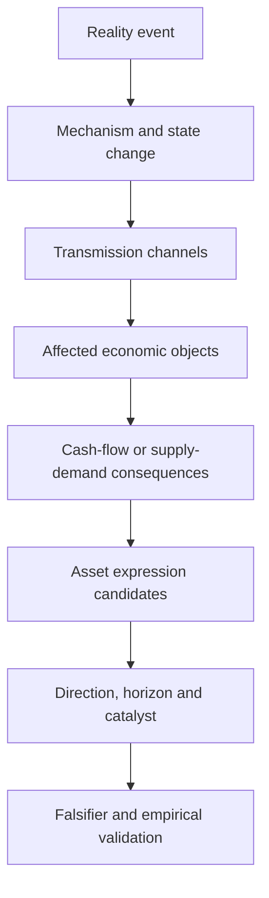

# Causal Transmission、Asset Mapping 与 Investment Expression 图谱

> **Map ID:** 12  
> **性质声明：** 本图把成熟的 causal inference、economic transmission、event study 与合约映射概念连接为研究流程，并提出 `Causal Transmission Graph` 与 `Asset Expression Object` 两个 **Candidate Research Design Concepts**。它们不是已验证因果、不是当前软件架构，也不直接产生交易指令。  
> **中心问题：** 一个现实事件或经济变化，怎样经过传导链影响不同实体和资产？知道一个事实之后，怎样形成可证伪的投资假设与表达候选？

$$
\boxed{
Narrative\neq Causality;
\quad Affected\ Asset\neq Best\ Expression;
\quad Correct\ View\neq Profitable\ Trade
}
$$

## （一）主关系图：从事件到可验证表达候选

```text
Reality Event
↓
Economic Mechanism
↓
State Change
↓
Transmission Channel
↓
Affected Economic Objects
↓
Financial / Supply-demand Consequences
↓
Tradable Asset Candidates
↓
Direction + Horizon + Uncertainty
↓
Catalyst / Path + Falsifier
↓
Research Validation
```

## （二）Mermaid 一图看懂



## （三）理论层级

| 层级 | 本图内容 |
|---|---|
| **Standard Theory / Mature Concepts** | Structural Causal Models、DAG、Potential Outcomes、Mediation、Confounding、Pass-through、Elasticity、Event Study、Contract Payoff、Basis / Spread。 |
| **AlphaResearchOS Working Model** | Reality → Evidence-backed State → Hypothesis → Quant Validation → Portfolio / Risk / Execution。 |
| **Candidate Concept** | Causal Transmission Graph；Asset Expression Object。 |
| **Critical Boundary** | Graph 是假设容器，不是因果证明；asset mapping 是候选生成，不是资本授权。 |

## （四）Narrative Chain vs Causal Hypothesis

### Narrative Chain

```text
A happened
→ B sounds related
→ therefore asset C should rise
```

它的问题不是故事一定错，而是没有明确：

- 干预变量；
- 传导机制；
- 中介状态；
- 混杂变量；
- 时间顺序；
- 可观测反证；
- 替代路径。

### Causal Hypothesis

```text
If A changes, holding specified confounders and conditions,
B should change through channel M within horizon H;
if mediator M does not move, the proposed path weakens.
```

Pearl 的因果图工作把 graphical models 作为结合统计与领域知识、判断因果效应是否可识别的语言；图本身仍依赖结构假设。参见 [Pearl, Causal Diagrams for Empirical Research](https://ftp.cs.ucla.edu/pub/stat_ser/R218-B.pdf)。

## （五）Causal Transmission Graph：Candidate Schema

一个节点候选：

$$
Node=(Object,State,Time,Unit,Source,Uncertainty)
$$

一条边候选：

$$
Edge=(Cause,Effect,Mechanism,Sign,Lag,Conditions,Evidence,Falsifier)
$$

| 字段 | 必须回答的问题 |
|---|---|
| Cause / Effect | 哪个状态影响哪个状态？ |
| Mechanism | 通过物理、合同、会计、行为还是融资渠道？ |
| Sign | 方向固定、状态依赖还是非线性？ |
| Lag | 影响立即、延迟还是累积？ |
| Conditions | 在什么制度、库存或产能状态下成立？ |
| Evidence | 哪些来源支持这条边？ |
| Falsifier | 看到什么会削弱或推翻该边？ |

```text
Causal Transmission Graph
!=
Proof of Causality
```

## （六）常见 Transmission Channels

| Channel | 传导对象 | 例子 |
|---|---|---|
| Physical | 数量、库存、产能、物流 | 产量下降导致可用库存减少。 |
| Price / Cost | 原料成本、售价、margin | 输入品涨价压缩下游利润。 |
| Contractual | 价格联动、交付、seniority | 长协把现货冲击延迟传导。 |
| Financial | 融资、抵押品、杠杆、汇率 | 资产跌价触发 margin call。 |
| Behavioral | 注意、预期、追逐、恐慌 | 新闻改变 belief 和 positioning。 |
| Policy / Regulatory | 税、配额、许可、制裁 | 许可变化限制供给响应。 |
| Technological | 效率、替代、工艺 | 单位材料用量下降。 |
| Competitive | 份额、进入、退出、定价权 | 竞争使成本下降无法转为利润。 |

同一事件可通过多条路径产生方向相反的结果。

## （七）State-dependent Transmission

传导强度通常不是常数：

$$
\frac{\partial Y}{\partial X}
=f(Inventory,Capacity,Leverage,Contracts,Policy,Regime)
$$

例如同样的需求增加：

- 在高库存、闲置产能环境中，主要增加产量；
- 在低库存、满产环境中，更可能提高价格；
- 在价格管制环境中，可能形成短缺而非公开价格上涨。

因此“需求增加 → 价格上涨”只是有条件命题。

## （八）从 Economic Object 到 Asset Mapping

```text
Affected object
→ Which rights / cash flows / contracts reference it?
→ Which asset embeds those rights?
→ How cleanly does the asset expose the view?
```

| Economic object | 可能表达 |
|---|---|
| Physical commodity | futures、ETF、inventory owner、producer。 |
| Producer economics | producer equity、credit、royalty company。 |
| Consumer margin | consumer equity、supplier/customer spread。 |
| Volatility / uncertainty | options、variance exposure。 |
| Relative dislocation | calendar spread、cross-commodity spread、pair。 |

资产不是因果图的自然终点，而是权利与 payoff 的合同接口。

## （九）Asset Expression Object：Candidate Schema

```text
Underlying thesis
Instrument / contract
Exposure sign and convexity
Horizon and expiry
Liquidity and depth
Basis / tracking risk
Leverage / margin / financing
Carry / borrow / roll
Counterparty / custody / operational risk
Capacity
Catalyst
Exit / invalidation rule
```

候选表达评分：

$$
ExpressionScore
=f(Purity,PayoffAlignment,Liquidity,Cost,Capacity,Convexity,PathRisk)
$$

这是决策启发式，不是通用最优化公式。

## （十）Affected Asset vs Best Expression

某资产受影响，不代表它是最好的表达：

| 问题 | 为什么会错 |
|---|---|
| Producer equity 是否等于 commodity beta？ | 企业还有成本、对冲、债务、地域和管理风险。 |
| ETF 是否等于 spot？ | 可能持有期货，存在 roll、费用和 tracking。 |
| Future 是否等于长期主题？ | 到期、margin、curve 与路径风险可能不匹配。 |
| Consumer short 是否纯粹？ | 企业可能转嫁成本、替代投入或已有对冲。 |
| Options 是否更安全？ | 有期限、隐含波动率与 theta 成本。 |

“最纯”也不总是“最好”：纯度更高的工具可能流动性更低、成本更高或容量更小。

## （十一）白银—光伏案例：只作为公开资料支持的研究骨架

### 1. 公开事实锚点

- USGS 2026 指出白银主要作为铅锌、铜和金矿的副产品生产：[USGS Silver 2026](https://pubs.usgs.gov/periodicals/mcs2026/mcs2026-silver.pdf)。
- IEA-PVPS 研究把白银视为光伏组件材料，并讨论未来报废组件回收对白银需求的潜在贡献：[IEA-PVPS Material Flows 2026](https://iea-pvps.org/key-topics/t12-material-flows-global-deployment-silicon-systems-2026/)。

### 2. 候选传导链

```text
PV deployment / technology mix
→ module production
→ silver use per watt × total watts
→ gross PV silver demand
→ substitution / thrifting / recycling
→ net physical demand
→ inventory and market balance
→ spot / curve / volatility
→ producer and consumer economics
```

### 3. 必须显式保留的反向与缓冲路径

- silver loading per watt 下降；
- copper substitution；
- recycling 增加；
- PV deployment 不及预期；
- 宏观需求或投资需求反向变化；
- 地上库存释放；
- host-metal production 增加带来副产品供给；
- 长协与 hedging 延迟企业利润影响。

### 4. 节点级研究问题

| 节点 | 关键变量 | Falsifier 示例 |
|---|---|---|
| PV expansion | annual installations / module output | 装机和产量持续低于路径假设。 |
| Silver intensity | grams per watt | 技术节银快于装机增长。 |
| Net demand | gross use - recycling/substitution | 回收或替代覆盖新增需求。 |
| Balance | supply - demand - inventory absorption | 可用库存持续增加。 |
| Price | spot / curve / volatility | 供需收紧但长期无价格或库存响应。 |
| Producer economics | realized price - cost + hedge | 对冲或副产品结构隔离价格变化。 |

### 5. 可能表达

```text
Silver future
Silver ETF
Options
Calendar spread
Primary silver producer
Diversified host-metal producer
Downstream consumer short
Producer–consumer relative value
```

每个候选必须单独研究，不从因果链自动选出赢家。

## （十二）Catalyst、Path 与 Horizon

正确的长期终点不等于可持有的路径。

```text
Thesis horizon
Instrument horizon
Catalyst horizon
Funding horizon
must be jointly compatible
```

### 三类失败

1. **Thesis wrong:** 机制或方向错误；
2. **Timing wrong:** 方向最终成立但超出资本期限；
3. **Expression wrong:** 观点正确但工具被 basis、carry、leverage 或企业 idiosyncratic risk 吞噬。

## （十三）Research Validation Ladder

```text
Mechanism plausibility
→ source-backed state evidence
→ temporal ordering
→ mediator evidence
→ alternative explanations
→ identification strategy
→ OOS / event / panel validation
→ price-implied expectation gap
→ cost / capacity / execution
→ capital authorization
```

必须区分：

```text
Mechanism Evidence
!= Return Predictability Evidence

Return Predictability
!= Incremental Alpha
```

## （十四）常见误区与纠偏

| 误区 | 纠偏 |
|---|---|
| 画出箭头就证明因果 | 箭头只是结构假设。 |
| 相关性高说明 transmission | 可能有共同原因、反向因果或同步冲击。 |
| 需求增长一定推高价格 | 取决于供给、库存、替代、预期和状态。 |
| 商品上涨就买矿企 | 矿企是带成本、对冲、债务和治理的复杂表达。 |
| 观点正确就会盈利 | 市场可能已定价，工具和路径也可能不匹配。 |
| Falsifier 是止损价 | 价格止损是风控；falsifier 应针对命题或机制。 |

## （十五）与其他 Maps 和 AlphaResearchOS 的连接

### Prerequisites

- Map 10：`What is the state?`；
- Map 11：`What economic object carries the state?`。

### 本图独占

```text
How might a state change propagate?
Which assets may express the consequence?
```

### 向后接口

- Map 13 接收多个 expression candidates，决定更广义 value-capture mechanism 与 capital allocation；
- Map 14 解释研究者怎样形成机制判断与证伪能力。

### Architecture Boundary

```text
Causal Transmission Graph
= Candidate Research Design Concept
≠ Implemented AlphaResearchOS Architecture
```

## （十六）Interview / Oral Explanation

> 知道一个事实后，我不会直接跳到股票代码。我先把事件拆成状态变化、传导渠道、受影响经济对象和现金流或供需后果，再为每条边写方向、时滞、条件、证据和反证。然后才列期货、ETF、股票、期权或价差等表达候选，比较纯度、期限、流动性、basis、carry 和路径风险。因果图只是可审计的假设容器，最后仍需实证和 Alpha Gate。

## （十七）最小记忆框架

1. Narrative ≠ Causality；
2. Node 要有 object、state、time、source；
3. Edge 要有 mechanism、sign、lag、conditions、falsifier；
4. Transmission 是 state-dependent；
5. Asset 是 rights / payoff 接口；
6. Affected Asset ≠ Best Expression；
7. Thesis、timing、expression 可分别失败；
8. 正确经济观点仍不等于 Alpha。

## （十八）Mastery Checkpoints

| Level | 能力证据 |
|---|---|
| 1 — Explain | 能从事件讲到验证而不直接跳到交易。 |
| 2 — Distinguish | 能区分 narrative、causal hypothesis、supported mechanism。 |
| 3 — Apply | 能为新事件画含 mediator 与 falsifier 的候选图。 |
| 4 — Falsify | 能找出共同原因、反向因果与缓冲路径。 |
| 5 — Transfer | 能为同一观点设计跨资产表达并比较路径风险。 |

## （十九）本图不负责

- 不证明白银或光伏存在具体交易机会；
- 不把因果图当作识别策略本身；
- 不选择最终资本配置；
- 不提供具体仓位、杠杆或交易建议；
- 不把 Candidate Concept 宣布为软件实现。

## （二十）精选来源

- [Pearl — Causal Diagrams for Empirical Research](https://ftp.cs.ucla.edu/pub/stat_ser/R218-B.pdf)
- [Pearl — The Deductive Approach to Causal Inference](https://ftp.cs.ucla.edu/pub/stat_ser/r424-reprint.pdf)
- [USGS — Silver, Mineral Commodity Summaries 2026](https://pubs.usgs.gov/periodicals/mcs2026/mcs2026-silver.pdf)
- [IEA-PVPS — Primary and Secondary Material Flows for Future PV Deployment](https://iea-pvps.org/key-topics/t12-material-flows-global-deployment-silicon-systems-2026/)
- [CME Group — Silver Futures Contract Specifications](https://www.cmegroup.com/silver)

