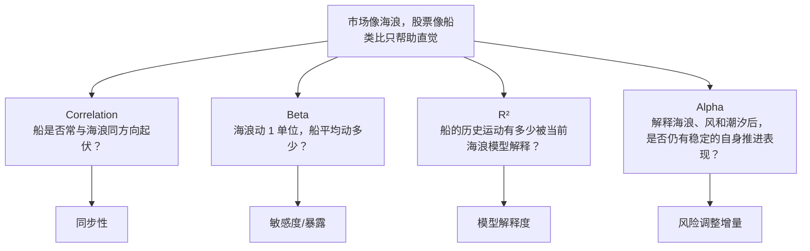

# ***Correlation、Beta、R² 与 Alpha 辨析图谱***

> **中心问题：** “和市场一起动”“对市场响应多大”“市场能解释多少”“控制风险后有没有增量表现”，分别由哪个量回答？

$$
\boxed{
\rho:\ 同步程度
\quad\big|\quad
\beta:\ 响应幅度
\quad\big|\quad
R^2:\ 解释比例
\quad\big|\quad
\alpha:\ 风险调整后的增量表现
}
$$

## `（一）四个问题总关系图`

```text
┌──────────────────────────────────────────────────────────────────────────────┐
│              同一组资产收益数据，可以提出四个完全不同的问题                      │
└───────────────────────────────────┬──────────────────────────────────────────┘
                                    │
          ┌─────────────────────────┼─────────────────────────┐
          │                         │                         │
          ▼                         ▼                         ▼
┌───────────────────┐     ┌───────────────────┐      ┌───────────────────────┐
│ Correlation ρ     │     │ Beta β            │      │  R²                   │
│ 是否通常同向？     │     │ 市场动 1 单位，    │      │  当前模型解释了资产     │
│ 同步程度多高？     │     │ 资产平均动多少？   │      │  历史波动的多少比例？   │
│ 范围：[-1, 1]     │     │ 无固定上下界       │      │  范围：[0, 1]          │
└────────┬─────────┘      └─────────┬─────────┘      └──────────┬────────────┘
         │                          │                           │
         │  β = ρ × σ(asset)/σ(market)                         │
         └──────────────────────────┴───────────────────────────┘
                                    │
                                    ▼
                         ┌────────────────────────┐
                         │ Alpha α                │
                         │ 控制当前已知风险/Factor  │
                         │ 后，是否仍有稳定增量表现  │
                         └────────────┬────────────┘
                                      │
                                      ▼
               ┌──────────────────────────────────────────────┐
               │ 不可互相代替：                                │
               │ 高相关 ≠ 高 Beta；低 R² ≠ 高 Alpha；          │
               │ 低 Beta ≠ 高 Alpha；高 Beta 也可有正 Alpha    │
               └──────────────────────────────────────────────┘
```

> **读图原则：** Correlation 看标准化后的共同方向，Beta 再加入双方波动率比例，$R^2$ 评价当前模型的历史解释度，Alpha 则是风险调整后的增量问题。四者相关，但不回答同一个问题。

## `（二）海浪与船：Mermaid 一图看懂`



> **类比边界：** 现实资产收益不是机械船只运动，统计关系也不自动代表物理因果；正式判断仍以收益数据、模型定义和估计不确定性为准。

## `（三）理论层级与核心概念速查`

### `1. 内容性质`

| 层级 | 本图内容 |
|---|---|
| **Standard Theory** | Covariance、Correlation、Beta、线性回归、$R^2$、风险调整 Alpha。 |
| **AlphaResearchOS Working Expression** | 用四个固定问题压缩概念：“同步多少、响应多少、解释多少、增量多少”。这是教学组织，不是新统计理论。 |
| **Research Implication** | QD/QR 在读取风险模型、归因和研究报告时，不能用一个统计量替代另一个。 |

### `2. 四个量的最小对照`

| 概念 | 它回答的问题 | 单位与范围 | 它不回答什么 |
|---|---|---|---|
| **Correlation（相关系数）$\rho$** | 两个收益序列的线性同步方向与程度如何？ | 无量纲，$[-1,1]$ | 不告诉你资产响应的绝对幅度，也不证明因果。 |
| **Beta $\beta$** | 市场收益变化 1 单位时，资产平均变化多少单位？ | 收益对收益时无量纲；无固定上下界 | 不等于同步程度，不直接说明 Alpha。 |
| **$R^2$（决定系数）** | 当前模型解释了因变量样本波动的多大比例？ | 通常在含截距 OLS 样本内为 $[0,1]$ | 不评价收益好坏，也不说明未解释部分可预测。 |
| **Alpha $\alpha$** | 控制当前已知 Factor/Risk 后，是否仍存在稳定增量表现？ | 常用收益率或年化收益率表达 | 不等于低相关、低 Beta 或低 $R^2$。 |

### `3. 同一股票可能同时具有怎样的四个标签？`

例如某股票可以同时：

```text
Correlation 较高：大多数时候与市场同向
Beta 较低：自身波动比市场小，响应幅度不大
R² 较高：单市场模型解释其历史波动比例较高
Alpha 接近 0：控制市场暴露后没有稳定增量
```

这四句话互不矛盾。

## `（四）核心公式骨架与直观解释`

### `1. Covariance：共同变化的原材料`

$$
\operatorname{Cov}(R_i,R_M)
=
E\!\left[(R_i-E[R_i])(R_M-E[R_M])\right]
$$

它衡量股票收益 $R_i$ 与市场收益 $R_M$ 是否共同偏离各自均值。共同同向偏离时乘积多为正，共同反向偏离时多为负。

Covariance 受双方波动尺度影响，因此不适合直接比较不同资产组合的“同步程度”；Correlation 会进一步标准化。

### `2. Correlation：把共同变化标准化`

$$
\rho_{i,M}
=
\frac{\operatorname{Cov}(R_i,R_M)}
{\sigma_i\sigma_M}
$$

| 符号 | 含义 |
|---|---|
| $R_i,R_M$ | 股票与市场的收益序列。 |
| $\sigma_i,\sigma_M$ | 两个收益序列的标准差，即各自波动尺度。 |
| $\rho_{i,M}$ | 标准化后的线性同步程度。 |

**为什么除以两个标准差？** 为了去掉量纲和波动大小，把问题压缩为“方向上有多同步”。因此一只波动很小的资产也可以与市场高度相关。

### `3. Beta：市场每动 1 单位，股票平均响应多少`

$$
\beta_i
=
\frac{\operatorname{Cov}(R_i,R_M)}{\operatorname{Var}(R_M)}
=
\rho_{i,M}\frac{\sigma_i}{\sigma_M}
$$

Beta 同时受两部分影响：

```text
Beta
=
与市场的同步程度
×
股票波动 / 市场波动
```

所以高相关不保证高 Beta：如果股票波动远低于市场，Beta 仍可能很小。反过来，中等相关配合很高的股票波动，也可能得到高 Beta。

### `4. R²：当前模型解释了多少样本波动`

含截距的样本内 OLS 中，可写成：

$$
R^2
=
1-
\frac{\sum_t(R_{i,t}-\hat R_{i,t})^2}
{\sum_t(R_{i,t}-\bar R_i)^2}
$$

| 部分 | 含义 |
|---|---|
| $\hat R_{i,t}$ | 当前模型对股票收益的拟合值。 |
| 分子 | 模型尚未解释的平方误差总量。 |
| 分母 | 股票收益相对自身均值的总平方波动。 |
| $R^2$ | 用模型后，样本波动被解释的比例。 |

**为什么这样算？** 如果模型误差相对总波动很小，$R^2$ 接近 1；如果模型几乎不比“只猜均值”更好，$R^2$ 接近 0。

在**只有一个解释变量、含截距的样本内线性回归**中：

$$
R^2=\rho_{i,M}^2
$$

但在多因子、无截距、样本外评价或其他模型中，不能机械使用这个等式。

### `5. Alpha：不是第四个“相关性统计量”`

最简时间序列回归骨架：

$$
R_{i,t}=\alpha_i+\beta_iR_{M,t}+\varepsilon_{i,t}
$$

这里为突出四个参数使用了简化收益口径；若按 CAPM / Jensen Alpha 的超额收益口径，应在资产和市场两侧一致扣除与期限匹配的 $R_f$。

$\alpha_i$ 是在该样本和模型设定下，市场暴露没有解释掉的平均截距。它与 Correlation、Beta、$R^2$ 的根本差别是：

- Correlation 描述共同运动；
- Beta 描述响应斜率；
- $R^2$ 描述拟合解释比例；
- Alpha 讨论风险调整后的平均增量。

> 历史估计 Alpha 仍不自动等于未来可交易 Alpha；Residual、遗漏因子与 Expected Alpha 的完整边界见 [alpha-beta-factor-residual-map.md](alpha-beta-factor-residual-map.md)。

## `（五）今天最重要的认知纠偏`

| 常见误区 | 正确认识 |
|---|---|
| **1. 高 Correlation = 高 Beta** | Beta 还乘以 $\sigma_i/\sigma_M$；同步程度相同，波动比例不同，Beta 就不同。 |
| **2. 低 Correlation = 高 Alpha** | 低相关可能只是公司特异噪声很大，未解释不等于可预测。 |
| **3. 低 Beta = 高 Alpha** | 低 Beta 只表示对市场响应较弱；风险调整增量可能为正、零或负。 |
| **4. 高 Beta 股票不可能有 Alpha** | 高市场暴露与正/负 Alpha 可以同时存在；它们是不同参数。 |
| **5. 低 $R^2$ = 模型发现了很多 Alpha** | 低 $R^2$ 只说明当前模型解释比例低；剩余可能大多是 Noise。 |
| **6. 高 $R^2$ = 好投资或好模型** | 高解释度可能只是资产高度跟随市场；它不评价收益、风险或交易价值。 |
| **7. Correlation 证明市场导致股票涨跌** | 相关性描述线性共同变化，不单独建立因果链。共同冲击和反向因果都可能存在。 |
| **8. 一次估计得到的四个数是永久属性** | 采样频率、窗口、市场状态、异常值和业务变化都会使估计移动。 |

## `（六）两个必会数值反例`

### `例 1：高相关，但低 Beta`

已知：

```text
ρ(stock, market) = 0.9
σ(stock)          = 5%
σ(market)         = 10%
```

则：

$$
\beta
=0.9\times\frac{5\%}{10\%}
=0.45
$$

在满足单解释变量、含截距样本内 OLS 条件时：

$$
R^2=0.9^2=0.81
$$

解释：这只股票与市场方向高度同步，市场模型能解释其相当多的样本波动；但股票自身波动只有市场一半，所以市场动 1%，它平均只动约 0.45%。**高相关、高 $R^2$ 与低 Beta 可以同时成立。**

### `例 2：中等相关，但高 Beta`

已知：

```text
ρ(stock, market) = 0.5
σ(stock)          = 30%
σ(market)         = 10%
```

则：

$$
\beta
=0.5\times\frac{30\%}{10\%}
=1.5
$$

在同样的简单回归条件下：

$$
R^2=0.5^2=0.25
$$

解释：股票与市场只有中等同步，但自身波动是市场三倍；因此市场动 1%，股票平均响应约 1.5%。**中等相关、低 $R^2$ 与高 Beta 也可以同时成立。**

### `把 Alpha 放回例 2，但不混淆参数`

若某期市场收益为 $+4\%$，用 $\beta=1.5$ 的简化线性模型估计市场贡献约为：

$$
1.5\times4\%=6\%
$$

股票实际收益若为 $+8\%$，当期未解释剩余约为 $+2\%$。但这只是一次 realized residual；还不能据此宣布存在稳定 Alpha。这个例子只说明：**高 Beta 与正的当期剩余完全可以同时出现。**

## `（七）进阶但必要的现实理解`

### `1. 采样频率会改变答案`

日频、周频和月频收益可能得到不同 Correlation 与 Beta。非同步交易、停牌和低流动性尤其会扭曲日频估计。

### `2. 时间窗口与 Regime 会改变答案`

牛市、危机和行业转型期的共同运动结构可能不同。一个全样本平均 Beta 会掩盖状态变化；滚动估计又会增加噪声，需要权衡。

### `3. 极端值会同时拉动多个统计量`

少数危机日可能显著改变 Covariance、Correlation、Beta 与 $R^2$。研究报告应说明异常值处理，而不是只给最终小数。

### `4. $R^2$ 高低没有脱离任务的统一好坏`

| 任务 | $R^2$ 的可能含义 |
|---|---|
| 风险归因 | 高 $R^2$ 可能说明主要共同波动被捕捉。 |
| Alpha 搜索 | 低 $R^2$ 只表示剩余较多，不保证剩余可预测。 |
| 预测模型 | 样本内高 $R^2$ 可能过拟合，必须检查样本外。 |
| 对冲 | 即使 $R^2$ 较高，Beta 估计误差和尾部失配仍可能造成风险。 |

### `5. Alpha 的统计不确定性不能省略`

一个正的 Alpha 点估计可能标准误很大；多个策略试验后挑出的最好 Alpha 还会遭遇选择偏差。显著性也不等于经济可交易性。完整验证关卡由 [alpha-discovery-validation-map.md](alpha-discovery-validation-map.md) 负责。

## `（八）与 AlphaResearchOS 的连接`

```text
Market / Factor Return Data
            ↓
Correlation：共同运动诊断
Beta：Exposure / Risk Model 输入
R²：当前模型解释度诊断
Alpha：风险调整后的增量研究问题
            ↓
Forecast / Portfolio / Attribution
```

| 系统场景 | 最容易误用的地方 | 正确做法 |
|---|---|---|
| **Risk Model** | 用 Correlation 代替 Beta Exposure | 同时估计共同方向和响应幅度，并保留不确定性。 |
| **Factor Research** | 把低 $R^2$ 当 Alpha 来源 | 继续检验剩余是否能被事前 Feature 稳定预测。 |
| **Portfolio** | 把低 Beta 当“安全且高 Alpha” | 分开评价市场敏感度、总风险、尾部风险与 Expected Alpha。 |
| **Attribution** | 看到跑赢市场就写 Alpha | 先按 Factor Exposure 归因；Benchmark 与主动收益边界见 Map 04。 |

对 QD / Research Engineer 而言，理解这四个量能避免接口层错误：`correlation_matrix`、`factor_exposure`、`model_fit`、`alpha_forecast` 不应混成同一个字段。

## `（九）面试怎么解释`

### `面试 30 秒版本`

Correlation 衡量两个收益序列标准化后的线性同步程度；Beta 衡量市场变化 1 单位时资产的平均响应，且 $\beta=\rho\,\sigma_i/\sigma_M$。$R^2$ 是当前模型对资产样本波动的解释比例，而 Alpha 是控制已知风险因子后的增量表现问题。因此高相关不一定高 Beta，低 $R^2$ 也绝不自动意味着高 Alpha。

### `典型追问与答题锚点`

| 追问 | 一句话答题锚点 |
|---|---|
| **Beta 和 Correlation 有什么区别？** | Correlation 只看标准化同步性；Beta 还包含资产相对市场的波动尺度。 |
| **什么时候 $R^2=\rho^2$？** | 单解释变量、含截距的样本内线性回归；多因子或其他设定不能机械套用。 |
| **低 $R^2$ 为什么不代表高 Alpha？** | 未解释波动可能主要是不可预测噪声，而 Alpha 要求风险调整后的稳定增量。 |
| **高 Beta 股票能有正 Alpha 吗？** | 能；Beta 是市场暴露斜率，Alpha 是控制暴露后的增量，两者可以独立为高或低。 |
| **Correlation 能证明因果吗？** | 不能；它只描述线性共同变化，因果需要额外设计和证据。 |

## `（十）最小记忆框架`

| 想问的问题 | 立刻想到的量 |
|---|---|
| 是否一起动？ | Correlation $\rho$ |
| 市场动 1 单位，我动多少？ | Beta $\beta$ |
| 当前模型解释了多少波动？ | $R^2$ |
| 控制风险后还有没有增量？ | Alpha $\alpha$ |

### `复习时只保留五句话`

1. **Correlation 衡量标准化后的线性同步程度，不衡量响应幅度。**
2. **Beta 等于 Correlation 乘以资产与市场的波动率之比，所以高相关不一定高 Beta。**
3. **$R^2$ 衡量当前模型解释了多少样本波动，不评价收益好坏。**
4. **低相关、低 Beta 或低 $R^2$ 都不自动等于高 Alpha；未解释部分可能只是 Noise。**
5. **四个量都会受样本、频率、异常值和 Regime 影响，估计值不是永久标签。**

## `（十一）是否继续扩张本图谱？`

当前主图暂时停止扩张。

本图只负责四项辨析。以下内容应独立展开：

- `covariance-correlation-map.md`：协方差矩阵、相关矩阵与组合风险；
- `regression-diagnostics-map.md`：标准误、异方差、自相关与稳健推断；
- `dynamic-beta-map.md`：滚动 Beta、状态切换与估计收缩；
- [neutralization-benchmark-alpha-map.md](neutralization-benchmark-alpha-map.md)：Benchmark、Active Return 与风险调整 Alpha。

---

> **最终锚点：Correlation 问“是否同步”，Beta 问“响应多少”，$R^2$ 问“解释多少”，Alpha 问“控制已知风险后还有多少增量”；不先分清问题，就不可能正确解释统计量。**
