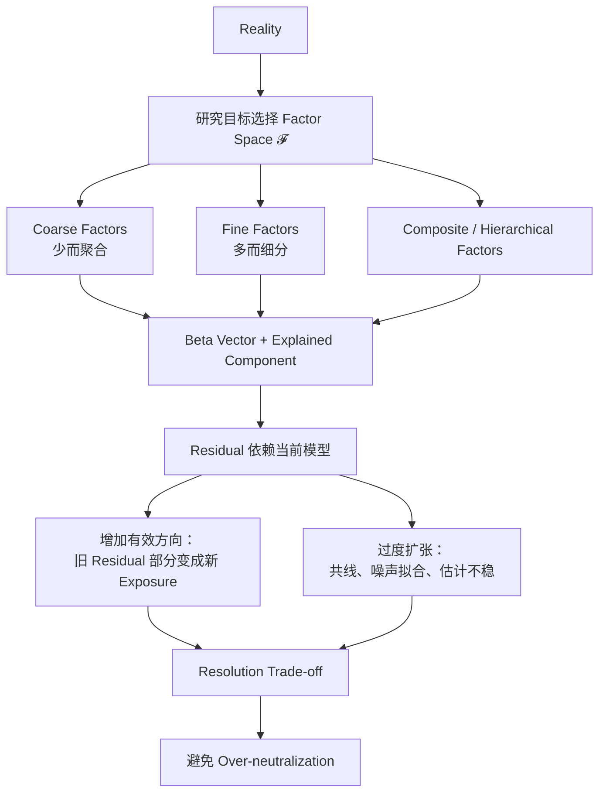

# ***Factor Space、Beta Vector、Hierarchy 与 Model Resolution 图谱***

> **中心问题：** 当前模型的 Factor Space 如何构成、拆分和分层？当模型分辨率变化时，为什么同一个对象的 Beta、Residual 与 Alpha Candidate 也会改变？

> **前置边界：** Factor、Beta、Residual 与 Expected Alpha 的基础定义已由 [alpha-beta-factor-residual-map.md](alpha-beta-factor-residual-map.md) 固定。本图不重新教学这些定义，只讨论它们在更高维解释空间中的结构。

$$
\boxed{
\mathcal F
=
\operatorname{span}(F_1,F_2,\ldots,F_K)
}
$$

> **核心锚点：Factor Space 是当前模型选择的解释坐标系，而不是世界本身。**

## `（一）Factor Space—Hierarchy—Resolution 主关系图`

```text
┌──────────────────────────────────────────────────────────────────────────────┐
│                               REALITY                                        │
│        真实世界包含连续、交互、动态且无法被当前模型完全观察的结构             │
└───────────────────────────────────┬──────────────────────────────────────────┘
                                    ▼
                     研究目标 + 理论 + 数据 + 约束
                                    │
                                    ▼
┌──────────────────────────────────────────────────────────────────────────────┐
│               当前模型选择公共解释方向：Factor Space 𝓕                      │
│                    𝓕 = span(F1, F2, ..., FK)                                │
└───────────────────────────────────┬──────────────────────────────────────────┘
                                    │
                 ┌──────────────────┼──────────────────┐
                 ▼                  ▼                  ▼
          Factor 可拆分          Factor 可合成       Factor 可分层
       Industry → 子行业       子特征 → Composite    Macro / Industry / Style
                 └──────────────────┼──────────────────┘
                                    ▼
                   对象 i 的 Beta / Exposure Vector
                    β(i) = [β(i1), ..., β(iK)]'
                                    │
                                    ▼
              Known Explained Component = β(i)'F = Σ β(ik)F(k)
                                    │
                                    ▼
               当前 Factor Space 之外 = Residual（不是 Alpha 答案）
                                    │
                 ┌──────────────────┴──────────────────┐
                 ▼                                     ▼
          模型分辨率提高                         模型降维 / 聚合
     增加有效且独立的方向                    保留主要公共结构、压缩噪声
                 │                                     │
                 ▼                                     ▼
   部分旧 Residual 被重新解释                  更稳定但可能遗漏细结构
   Old Alpha Candidate → New Exposure          Residual 可能重新变大
                 └──────────────────┬──────────────────┘
                                    ▼
                         Resolution Trade-off
        解释力 / 稳定性 / 可识别性 / OOS / 治理目的之间的平衡
                                    │
                                    ▼
                         Over-neutralization Gate
      若把研究对象提前定义为 Risk Factor 并完全剥除，可能把 Alpha 一起删掉
```

> **读图原则：** Factor Set 决定“模型承认什么是公共结构”；Beta Vector 描述对象在这套坐标系中的位置；Residual 只表示坐标系之外的剩余。换坐标系或分辨率，三者的数值和解释都可能变化。

## `（二）Mermaid 一图看懂`



## `（三）理论层级与核心概念速查`

### `1. Standard Theory 与 AlphaResearchOS Working Model`

| 层级 | 本图内容 |
|---|---|
| **Standard Theory / Practice** | Multifactor Model、Factor Exposure Vector、Linear Span、Factor Loading、Composite/Hierarchical Factor、遗漏变量、共线性、降维、Bias–Variance Trade-off。 |
| **AlphaResearchOS Working Model** | “Factor = 当前公共解释方向”“Factor Space = 当前模型认识边界”“Residual is a question, not an answer”。这些是项目统一语言，不是新资产定价定理。 |
| **Research Governance** | 明确区分 `Risk / Control Factor` 与 `Candidate Alpha Feature`，防止 Risk Factor Set 无意识地删除研究对象。 |

### `2. 核心概念`

| 概念 | 本图中的直觉 | 关键边界 |
|---|---|---|
| **Factor as Direction** | 一条会变化、能解释多个对象共同运动的方向 | 方向由模型、样本和研究目的定义，不是天然固定标签。 |
| **Factor Vector $\mathbf F_t$** | 在时点 $t$，世界沿每条已知公共方向分别变化多少 | 它是当前模型的状态向量，不包含世界全部结构。 |
| **Beta Vector $\boldsymbol\beta_i$** | 对象 $i$ 对每条 Factor 方向的响应/暴露集合 | “Beta = 1.2”通常只是在说单一 Market Beta。 |
| **Factor Space $\mathcal F$** | 当前 Factor 能够线性表达的公共结构集合 | Factor 多不等于有效维度一定增加；冗余 Factor 可能落在已有 Span 内。 |
| **Basis / Coordinates** | 用一组方向给 Factor Space 建立坐标 | 不同基底可张成相近空间；Beta 坐标会变，整体解释可能相近。 |
| **Atomic Factor** | 在当前研究粒度下不再继续拆分的最小工作单元 | “Atomic”只相对当前分辨率，不代表宇宙中不可再分。 |
| **Composite Factor** | 由多个子特征或子因子按规则合成的宽方向 | 合成可提高稳健性，也可能掩盖内部异质性。 |
| **Hierarchical Factor** | 粗层方向可由更细层方向组织或解释 | 层级可能重叠、交叉，不一定是一棵唯一自然树。 |
| **Model Resolution** | 模型把公共结构切得多粗或多细 | 不只等于 Factor 数量，还涉及行业粒度、期限、Universe 和交互形式。 |
| **Over-neutralization** | 控制集合过宽，把目标 Signal 自身也当作已知风险剥除 | “控制更多”不自动代表识别更干净。 |
| **Factor Rotation** | 对相同解释空间换一组线性组合方向 | 单个 Factor 名称与 Beta 会变，模型所覆盖的空间可能基本不变。 |

## `（四）公式骨架：从方向到解释空间`

### `1. Factor Vector：世界沿各方向变化多少`

$$
\mathbf F_t
=
\begin{bmatrix}
F_{1,t}\\
F_{2,t}\\
\vdots\\
F_{K,t}
\end{bmatrix}
$$

每个 $F_{k,t}$ 是第 $k$ 个 Factor 在时点 $t$ 的实现值，例如 Market、Industry、Value、Momentum、Rates 或 Liquidity 的变化/收益。

**为什么要写成向量？** 因为现实对象通常同时暴露在多条公共方向上；单 Market Factor 只是更高维世界的简化切片。

### `2. Beta Vector：同一对象拥有多条 Exposure`

$$
\boldsymbol\beta_i
=
\begin{bmatrix}
\beta_{i1}\\
\beta_{i2}\\
\vdots\\
\beta_{iK}
\end{bmatrix}
$$

$\beta_{ik}$ 表示对象 $i$ 对第 $k$ 个 Factor 的响应方向与强度。

```text
“这只股票 Beta = 1.2”
= 只报告了它的 Market Exposure

机构式风险视角更接近：
[Market, Industry, Size, Value, Momentum, Rates, Liquidity, ...]
对应的一整组 Exposure
```

> Beta 与 Correlation 的公式辨析仍归 [correlation-beta-r2-alpha-map.md](correlation-beta-r2-alpha-map.md)，本图不重复。

### `3. Dot Product：全部已知方向贡献相加`

$$
\boldsymbol\beta_i^\top\mathbf F_t
=
\sum_{k=1}^{K}\beta_{ik}F_{k,t}
$$

直觉只有三步：

```text
每个 Factor 方向变化多少 F(k,t)
×
对象对该方向响应多少 β(ik)
↓
所有方向贡献相加
= 当前模型可解释的总结果
```

这是线性模型下的解释骨架，不表示每个 Factor 都具有独立、稳定的因果含义。

### `4. Factor Space：当前方向能表达什么`

$$
\mathcal F
=
\operatorname{span}(F_1,F_2,\ldots,F_K)
$$

`span` 的人话解释：允许对当前 Factors 做各种线性组合后，模型能够表达的公共结构集合。

两个重要结论：

1. 新增 Factor 若只是旧 Factors 的近似线性组合，Factor 数量增加，但有效解释维度未必增加；
2. 对同一空间做 Factor Rotation，单个 Beta 坐标会改变，但整体拟合/风险空间可能相近。

### `5. Residual 随 Factor Space 改变`

$$
u_{i,t}
=
R_{i,t}
-
\boldsymbol\beta_i^\top\mathbf F_t
$$

若模型从 $\mathcal F^{coarse}$ 扩展到更有效的 $\mathcal F^{fine}$：

$$
\mathcal F^{coarse}\subset\mathcal F^{fine}
$$

那么旧 Residual 的一部分可能被新空间解释：

```text
Old Residual
= New Factor Contribution
+ New Residual
```

这不是说新 Residual 必然更“真实”，而是模型把一部分旧剩余重新分类了。

### `6. Composite Factor：细特征合成宽方向`

$$
F^{composite}_t
=
\sum_{m=1}^{M}w_mS_{m,t}
$$

$S_{m,t}$ 是组成该 Composite 的第 $m$ 个 Component Score / 子特征值，$w_m$ 是合成权重；这里不用全系列已保留给 Candidate Feature 的 $X_{i,t}$。

例如：

```text
Quality Composite
= Profitability
+ Earnings Quality
+ Balance-sheet Strength
+ Capital Efficiency
```

合成的好处可能是降低单指标噪声、形成更稳定的宽概念；代价是隐藏子成分方向相反、失效机制不同等异质性。

### `7. Hierarchical Factor：粗层也可由细层解释`

一个示意性层级式：

$$
F_j^{(\ell)}
=
\sum_k w_{jk}^{(\ell+1)}F_k^{(\ell+1)}
+c_j^{(\ell)}
+\varepsilon_j^{(\ell)}
$$

| 符号 | 含义 |
|---|---|
| $F_j^{(\ell)}$ | 第 $\ell$ 层的粗 Factor。 |
| $F_k^{(\ell+1)}$ | 下一层更细的子 Factor。 |
| $w_{jk}^{(\ell+1)}$ | 子 Factor 对粗 Factor 的组合/加载权重。 |
| $c_j^{(\ell)}$ | 当前示意关系的截距；避免与 Expected Alpha 符号混淆。 |
| $\varepsilon_j^{(\ell)}$ | 当前层级下的随机或模型误差。 |

> 这只是层级思维骨架，不是统一行业标准公式；$w$ 也不是股票的 $\boldsymbol\beta_i$。真实风险模型可采用分类、回归、统计因子或混合结构。

## `（五）Factor 可以拆、合、分层，但没有唯一自然树`

### `1. 一种可能的研究分层`

```text
Market Environment
        │
        ├── Macro
        │     ├── Rates
        │     ├── Inflation
        │     └── Growth
        │
        ├── Industry
        │     ├── Technology
        │     ├── Financials
        │     └── Consumer
        │
        └── Style
              ├── Value
              ├── Momentum
              └── Quality
```

这张树是**研究分辨率与治理分类**，不是宣称 Macro、Industry、Style 在经济上互斥。Rates 会影响行业，行业结构会与 Style Exposure 交叉；真实层级可能是重叠网络。

### `2. 拆分回答“内部风险来自哪里”`

```text
Technology Factor
→ Semiconductors / Software / Hardware / Internet
```

粗 Technology Exposure 相同的两家公司，在半导体周期、订阅收入或硬件供应链上的实际风险可能完全不同。

### `3. 合成回答“能否用更稳定的宽方向表达”`

```text
多个盈利、现金流和资产负债表指标
→ Quality Composite
```

Composite 不天然优于 Atomic，也不天然更差；评价取决于研究目标、稳定性、解释性、增量信息与 OOS 表现。

### `4. 降维也可能有研究价值`

将多个高度相关方向压缩为少数主要方向，可能：

- 减少共线性与估计方差；
- 降低风险模型复杂度；
- 提高优化器稳定性；
- 让有限样本支持更可靠的 Exposure 估计。

但降维也可能牺牲经济解释或删除小而重要的结构。PCA / Latent Factor 的具体方法应另图展开。

## `（六）Model Resolution：更细不等于更真`

### `1. 粗模型与细模型的取舍`

| 维度 | 粗模型：少量聚合 Factors | 细模型：更多有效 Factors |
|---|---|---|
| 解释结构 | 简单、易沟通 | 更细、能分辨异质来源 |
| Residual | 通常较大，可能包含遗漏结构 | 一部分旧 Residual 被吸收 |
| 参数数量 | 少，估计相对稳定 | 多，需要更多数据与收缩 |
| 共线性 | 通常较低 | 更容易出现冗余与不稳定坐标 |
| OOS 风险 | 可能因欠拟合漏掉结构 | 可能因过拟合追随噪声 |
| Neutralization | 可能控制不足 | 可能过度控制目标 Signal |
| 适用任务 | 高层归因、有限样本、稳定治理 | 精细风险、足够数据、明确机制 |

### `2. Resolution 不只等于 K 的大小`

模型分辨率还包括：

```text
行业层级：Sector / Industry / Sub-industry
时间尺度：Daily / Monthly / Long-horizon
对象范围：全市场 / 国家 / 行业 / 单公司
函数形式：线性 / 交互 / 状态依赖
经济角色：Risk Control / Forecast Feature / Attribution
```

同一个变量在不同层级可能承担不同角色。例如 Oil Price 对航空公司是外部成本 Factor，对石油生产商则更接近核心行业状态。

### `3. 为什么更多 Factor 不保证更好`

```text
增加 Factor
        │
        ├── 可能减少 Omitted Structure
        │
        └── 也可能增加：
             Overfitting
             Multicollinearity
             Noise Fitting
             Unstable Estimates
             Interpretation Drift
             OOS Failure
             Over-neutralization
```

真正目标不是最大化 Factor 数量，而是找到对当前任务**足够、稳定、可识别、可验证**的解释空间。

## `（七）Over-neutralization：研究者可能把自己的 Alpha 删掉`

### `1. 问题怎样发生`

```text
Research Question：
Earnings Quality 是否预测未来风险调整收益？
        ↓
错误的控制设计：
先把 Earnings Quality 定义为必须完全中性化的 Risk Factor
        ↓
再检验中性化后的 Earnings Quality Signal
        ↓
研究对象已被定义删除
        ↓
Signal 消失
```

这个结果不能直接解释为“Earnings Quality 没有 Alpha”。它可能只证明：研究者先用控制集合拿走了想研究的变化。

### `2. Risk Factor 与 Candidate Alpha Feature 是研究角色`

| 角色 | 核心目的 | 判断问题 |
|---|---|---|
| **Risk / Control Factor** | 解释或约束当前不想归入目标 Signal 的公共暴露 | 这是已知风险溢价、共同冲击还是必须隔离的结构吗？ |
| **Candidate Alpha Feature $X_{i,t}$** | 检验其是否提供未来 Residual 的增量预测 | 它是本次研究真正想测量的对象吗？ |
| **Attribution Factor** | 事后说明收益来自哪里 | 它用于解释结果，还是用于事前预测？ |

同一个变量可以在不同研究中扮演不同角色。角色应由假设、Benchmark、产品目标和证据决定，而不是由变量名字永久决定。

### `3. 最小治理顺序`

```text
先写清 Research Question
→ 再声明 Target Feature
→ 再声明必须控制的 Alternative Explanations
→ 检查控制项是否与 Target 重叠
→ 做有/无控制的敏感性对照
→ 解释“Signal 消失”究竟意味着什么
```

> **Risk Factor Set 是研究选择，不是宇宙真理。**

## `（八）三个具体例子`

### `Example A｜相同 Market Beta，细粒度风险完全不同`

假设两家公司在粗单市场模型中均有：

$$
\beta_{market}=1.2
$$

细粒度 Exposure 示意：

| 公司 | Market | Technology | Rates | Commodity |
|---|---:|---:|---:|---:|
| **A** | 1.2 | 0.8 | -0.1 | 0.3 |
| **B** | 1.2 | 0.1 | 0.7 | 0.3 |

粗模型会说两者市场敏感度相似；细模型揭示：A 的风险更集中在 Technology，B 对 Rates 更敏感。Market Beta 并没有错，只是分辨率不足以回答“具体风险来自哪里”。

> 数值为教学示意；真实联合回归中 Factor 相关性、标准化和 Exposure 估计方法会影响坐标。

### `Example B｜Factor Space 扩展后 Alpha Candidate 缩水`

| 模型 | Factor Space | 历史平均 Residual / Alpha Candidate |
|---|---|---:|
| Coarse | Market | $10\%$ |
| Medium | Market + Industry | $6\%$ |
| Fine | Market + Industry + Momentum | $3\%$ |

解释：原来的 10% 中，一部分是行业选择，一部分是 Momentum Exposure；加入有效公共方向后被重新分类。剩下的 3% 仍不是自动 Alpha，只是更细模型下的新 Residual。

该例承接 Map 01，但本图关注的是：**模型分辨率改变了解释边界**，而不是重新证明 Residual ≠ Alpha。

### `Example C｜Over-neutralization 删除 Quality Signal`

```text
目标：研究 Quality 是否有增量预测力

Raw Quality Signal 的 OOS Spread：+4%
控制 Market / Industry / Size 后：+2.5%
再把同一定义的 Quality 当 Risk Factor 完全中性化：≈0%
```

最后一步不是独立反证，而是近似把变量对自己回归并拿走。更有意义的比较是：

- Quality 是否只是 Market / Industry / Size 的包装？
- 它相对已有 Quality Signal 是否仍有增量？
- 在组合中保留多少 Quality Exposure 符合产品目标？

## `（九）今天最重要的认知纠偏`

| 常见误区 | 正确认识 |
|---|---|
| **1. Factor 越多，模型越好** | 有效方向可减少遗漏结构；冗余与噪声方向会增加估计方差、共线性和 OOS 失败。 |
| **2. Factor 是客观世界天然存在的固定维度** | 经济结构真实存在，但如何把它投影为 Factor 取决于模型、数据、Universe、期限与目标。 |
| **3. Beta 只有一个** | 单 Market Beta 是简化；真实对象更接近拥有一组 Factor Exposure，即 Beta Vector。 |
| **4. Alpha 是永远无法解释的神秘部分** | 稳定公共结构被发现后，旧 Alpha Candidate 可能被重分类为新 Beta Exposure。 |
| **5. Factor 拆得越细越接近真相** | 过细会遇到样本不足、噪声拟合、坐标不稳和解释碎片化。 |
| **6. Composite Factor 一定不如 Atomic Factor** | Composite 可降低单项噪声；是否更好取决于稳定性、机制、透明度和任务。 |
| **7. Residual 在更高维模型下保持不变** | Residual 定义依赖当前 Factor Space；扩展或旋转模型会改变分解。 |
| **8. 所有 Candidate Feature 最终都应变成 Risk Factor** | Feature 是否进入 Risk Set 是治理选择；过早纳入会删除目标 Signal。 |
| **9. 降维只是丢数据，没有研究价值** | 合理降维可减轻共线性、稳定 Exposure 和优化器，但可能牺牲解释与细结构。 |
| **10. 升维一定提高 OOS 表现** | 样本内解释度可能上升，OOS 却可能因过拟合和估计误差下降。 |
| **11. Factor 名称不同就代表不同风险空间** | 两组 Factors 可能只是对相近空间做不同旋转；应检查 Span 与增量方向。 |
| **12. 完全 Neutralize 总比部分控制专业** | 控制强度应服务研究问题；完全剥除可能造成 Over-neutralization。 |

## `（十）进阶但必要的现实边界`

### `1. Factors 往往不正交`

Value、Quality、Industry 与 Size 可能相关。共线会使单个 Beta 对样本变化敏感：模型总体解释稳定，单项归因却漂移。需要正则化、收缩、约束或重新设计 Factors。

### `2. Factor 含义会随 Universe 与构造变化`

同名 `Value` 可使用 B/P、E/P、FCF/P，不同中性化、加权、更新频率与股票池也会产生不同收益序列。名称一致不代表经济暴露完全一致。

### `3. 层级结构可能重叠而非嵌套`

一家新能源公司同时属于行业、成长、利率敏感和商品链条。强制唯一分类会简化治理，却可能遗漏交叉暴露。

### `4. Exposure 会随时间变化`

业务转型、杠杆变化、供应链重构和市场 Regime 都会改变 Beta Vector。静态 Exposure 可能把真实变化误放入 Residual。

### `5. Statistical Factor 与 Economic Factor 不同`

统计方法可发现能解释协方差的潜在方向，但方向未必具有稳定经济语义；经济 Factors 更可解释，却也可能遗漏数据中的重要共同结构。二者可互补，不能混为一类。

### `6. “更好模型”必须绑定任务`

| 任务 | 可能偏好的 Factor Space |
|---|---|
| 高层绩效归因 | 少量、稳定、可沟通的经济 Factors |
| 组合风险控制 | 覆盖主要协方差、可估计且可更新的 Risk Factors |
| Alpha Research | 能排除替代解释，但不删除 Target Feature 的控制集合 |
| 执行与短期风险 | 更关注流动性、波动、拥挤和微观结构方向 |

不存在脱离任务、样本和治理目标的唯一“最细真模型”。

## `（十一）与前 5 张 Map 的连接`

| 前置 Map | 它负责什么 | Map 06 只新增什么 |
|---|---|---|
| [Map 01：Alpha / Beta / Factor / Residual](alpha-beta-factor-residual-map.md) | 基础定义和 Expected Alpha | Factor Space、层级、旋转与分辨率如何改变分解。 |
| [Map 03：Correlation / Beta / R² / Alpha](correlation-beta-r2-alpha-map.md) | 四个统计/资产定价量的区别 | Beta 从标量扩展为 Exposure Vector；不重复 Correlation 公式。 |
| [Map 04：Neutralization / Benchmark / Alpha](neutralization-benchmark-alpha-map.md) | Research Neutralization 与 Portfolio Neutrality | Factor Set 选择为什么会造成 Over-neutralization。 |
| [Map 02：Alpha Discovery / Validation](alpha-discovery-validation-map.md) | Feature 到资本的完整 Gate | Risk Set 与 Candidate Feature 的角色治理；不重复 OOS/成本流程。 |
| [Map 05：Business / Investment Alpha](business-alpha-investment-alpha-map.md) | 企业经营优势到投资超额 | 只提醒 Business State 也可在不同层级被 Factor 化，不展开价值链。 |

## `（十二）与 AlphaResearchOS 的连接`

```text
Risk Model
= 定义当前 Known Factor Space
  + 估计 Beta / Exposure Vector

Alpha Research
= 在明确 Control Set 后
  检验 Candidate Feature 是否预测 Future Residual

Research Governance
= 决定每个变量当前属于：
  Risk / Control Factor
  Candidate Alpha Feature
  Attribution Factor
  Retired / Rejected Variable
```

未来系统可考虑三类注册表概念：

| Registry | 建议记录 |
|---|---|
| **Factor Registry** | 定义、构造、版本、数据时间、Universe、频率、父子/组合关系、经济语义。 |
| **Risk Factor Registry** | 为什么进入控制集、目标 Exposure、估计方法、适用产品、失效与漂移指标。 |
| **Candidate Feature Registry** | Hypothesis、目标关系、与 Risk Set 的重叠、增量测试、状态与证据。 |

> 这些是未来系统治理概念，不是要求本轮修改 AlphaResearchOS 架构或 Foundation。

一个关键研究对象应同时带上：

```text
as_of
factor_space_version
exposure_estimation_version
candidate_feature_version
neutralization_policy
```

否则“同一个 Alpha 结果”可能只是使用了不同解释空间，无法真正复现。

## `（十三）面试怎么解释`

### `面试 30 秒版本：为什么 Beta 更像一个向量？`

单一 Market Beta 只是低维简化。多因子风险模型里，一项资产会同时暴露于 Market、Industry、Size、Style、Rates 等公共方向，所以它更自然地拥有 Beta Vector；$\boldsymbol\beta_i^\top\mathbf F_t$ 汇总各方向的解释贡献。Factor Space 由模型选择，扩展有效方向会把部分旧 Residual 重分类为 Exposure，但 Factor 过多也会造成共线、过拟合和 Over-neutralization。

### `典型追问与答题锚点`

| 追问 | 一句话答题锚点 |
|---|---|
| **为什么增加 Factor 后 Alpha 会下降？** | 新 Factor 解释了原来遗漏在 Residual 中的公共结构，旧 Alpha Candidate 被重新归类。 |
| **Factor 越多越好吗？** | 不是；要在遗漏结构与估计方差、共线、OOS 稳定性之间权衡。 |
| **Risk Factor 和 Alpha Feature 有何区别？** | 前者是本次研究要控制/归因的公共暴露，后者是要检验增量预测力的目标变量；角色由研究问题决定。 |
| **什么叫 Omitted Factor？** | 世界中存在、能系统解释收益但当前模型未纳入的公共方向。 |
| **为什么 Over-neutralization 会伤害 Alpha？** | 如果控制集与 Target Feature 重叠，研究者会在测试前先把目标变化剥除。 |
| **Composite Factor 是否更差？** | 不一定；它可降低噪声，但也可能隐藏子成分异质性，需按任务和 OOS 证据评价。 |

## `（十四）最小记忆框架`

| 关键词 | 最小锚点 |
|---|---|
| Factor Space | 当前模型能表达的公共解释空间 |
| Beta Vector | 对各 Factor 方向的 Exposure 集合 |
| Dot Product | 每条方向变化 × 响应，再求和 |
| Hierarchy | 粗 Factor 可拆，细 Factors 可合 |
| Resolution | 更细减少遗漏，也增加估计风险 |
| Residual | 随当前 Factor Space 改变 |
| Over-neutralization | 控制集可能提前删除 Target Feature |

### `复习时只保留五句话`

1. **Factor Space 是当前模型选出的公共解释坐标系，不是世界本身。**
2. **同一对象同时暴露于多个方向，因此 Beta 更自然地是 Vector，$\boldsymbol\beta_i^\top\mathbf F_t$ 汇总已知贡献。**
3. **Factors 可以拆分、合成、旋转和分层；不同坐标可能表达相近空间。**
4. **Residual 依赖模型分辨率：有效升维会吸收遗漏结构，但更多 Factors 也可能带来共线、过拟合与 OOS 失效。**
5. **Risk Factor Set 是研究选择；若它与 Candidate Feature 重叠，Over-neutralization 会把想研究的 Alpha 一起删掉。**

## `（十五）是否继续扩张本图谱？`

当前主图暂时停止扩张。

本图只完成 Factor Space 的统一理解。以下内容应拆成未来专题：

- `factor-model-map.md`；
- `pca-latent-factor-map.md`；
- `fama-french-factor-map.md`；
- `barra-risk-model-map.md`；
- `cross-sectional-regression-map.md`；
- `multicollinearity-map.md`。

---

> **最终锚点：Factor Space 决定模型当前看得见什么，Beta Vector 描述对象如何暴露于这些方向，Residual 标出模型边界之外还剩什么；改变分辨率可以重新解释旧 Alpha Candidate，但若无纪律地扩张和中性化，也可能把噪声写进模型、把真正研究对象删出模型。**
