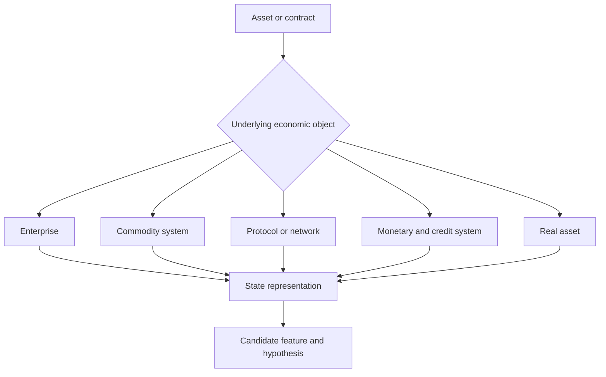

# Fundamental Research Beyond Equities：Economic Object Representation 图谱

> **Map ID:** 11  
> **性质声明：** 本图说明成熟意义上的 fundamental research 可以研究任何资产背后的经济现实，并提出 `Economic Object Representation` 作为对 Enterprise Representation 的 **candidate generalization**。它不是 AlphaResearchOS 当前已批准或已实现的架构。  
> **中心问题：** 当研究对象从股票变成 Commodity、Crypto / Protocol、Rates、FX 或 Real Estate 时，“基本面”究竟意味着什么？

$$
\boxed{
Fundamental\ Research
=Research\ Underlying\ Economic\ Reality
\neq Financial\ Statement\ Reading
}
$$

## （一）主关系图：资产只是权利接口，背后对象不同

```text
Tradable / Investable Asset
↓ What claims, rights or exposures does it encode?
Underlying Economic Object
↓ What state governs future outcomes?
State + Mechanism + Constraints
↓
Future Distribution
↓ compared with price-implied expectations
Research Hypothesis
```

## （二）Mermaid 一图看懂



## （三）理论层级

| 层级 | 本图内容 |
|---|---|
| **Standard Theory / Mature Practice** | Equity analysis、Commodity supply-demand and inventories、Cost of carry、Monetary / rates / FX analysis、Real-estate cash flow、Protocol and network analysis。 |
| **AlphaResearchOS Working Model** | Reality → Evidence-backed State → Representation → Candidate Feature → Validation。 |
| **Candidate Concept** | Economic Object Representation：把 Enterprise Representation 推广到不同经济对象。 |
| **Critical Boundary** | 研究对象表示正确，不等于预测正确；预测正确，不等于存在 Tradable Alpha。 |

## （四）什么是 Economic Object

候选定义：

> 能够承载经济状态、约束、权利、资源流与因果关系，并与某种资产或价值捕获机制建立可解释连接的研究对象。

概念 schema：

$$
O=(Identity,State,Flows,Stocks,Rules,Rights,Constraints,Relations,Time,Uncertainty)
$$

| 字段 | 问题 |
|---|---|
| Identity | 究竟研究哪个企业、矿山、网络、货币区或地产？ |
| State | 当前关键状态是什么？ |
| Flows | 收入、产量、交易、资金或人口如何流动？ |
| Stocks | 资产、库存、债务、token supply、住房存量是多少？ |
| Rules | 会计、协议、监管或合同如何约束？ |
| Rights | 资产持有人获得何种现金流、控制权或使用权？ |
| Relations | 与供应商、消费者、抵押品、协议或政策怎样连接？ |
| Time | 状态何时有效、何时被观察？ |
| Uncertainty | 哪些变量不可观测或情景依赖？ |

## （五）Equity：Enterprise Representation

### 核心状态

```text
Revenue and unit economics
Margin and cost structure
ROIC / reinvestment
Cash flow and working capital
Balance-sheet resilience
Competitive advantage
Management and capital allocation
Governance and ownership rights
```

### 权利接口

普通股不是企业 Reality 本身，而是对剩余现金流与治理权利的一种索取结构。

$$
EquityValue
=PV(FutureResidualCashFlows\mid Rights,Risk,Survival)
$$

这只是估值骨架，不表示存在唯一无争议价值。

### 常见错误

- 好企业自动等于好股票；
- Revenue growth 不看 unit economics；
- ROIC 不看投入资本口径；
- 会计利润替代现金与资产负债表；
- 忽略 dilution、debt seniority 和治理权。

## （六）Commodity：Supply–Demand–Inventory System

商品没有统一企业报表，它的基本面对象通常是一个物理与库存系统：

```text
Production
+ Secondary supply / recycling
+ Imports
- Consumption
- Exports
= Inventory change
```

概念平衡式：

$$
\Delta Inventory_t
=Supply_t-Demand_t+NetImports_t
$$

不同统计口径可能把进出口归入供需，研究时必须保持恒等口径一致。

### Commodity Representation

| 维度 | 研究对象 |
|---|---|
| Supply | 矿山、油井、农田、产能、开工、回收。 |
| Demand | 终端行业、地区、替代、弹性。 |
| Inventory | 可见与不可见库存、地点、质量、可交割性。 |
| Cost curve | 维持、关闭、重启、增量与长期激励成本。 |
| Capacity | 许可、建设期、技术、基础设施。 |
| Storage / carry | 仓储、融资、保险、损耗与便利收益。 |
| Policy | 配额、税、补贴、制裁、环保与战略储备。 |

EIA 的 Weekly Petroleum Status Report 同时发布供应、库存、炼厂活动和价格等数据，直观说明原油基本面是一套 stock-flow-operational system，而不是一张企业利润表。参见 [EIA Weekly Petroleum Status Report](https://www.eia.gov/petroleum/supply/weekly/)。

### Futures 与现货对象

简化 carry 骨架：

$$
F_{t,T}\approx S_t\,e^{(r+u-y)(T-t)}
$$

其中 $u$ 是 storage / insurance 等持有成本，$y$ 是 convenience yield。现实价格还受可交割质量、地点、库存紧张与市场分割影响。

```text
Commodity fundamentals
!=
Only spot supply-demand
```

## （七）Crypto / Protocol：Network State 与 Rule System

加密资产的“基本面”需先区分：

- protocol；
- native token；
- application；
- governance rights；
- cash-flow or fee claims；
- collateral and liquidity role。

### Protocol Representation

```text
Consensus / security model
Supply and issuance rules
Validator / miner economics
Usage and transaction activity
Fees and value accrual
Developer and client diversity
Holder concentration
Liquidity / leverage / bridges
Governance and upgrade process
Regulation and market structure
```

Ethereum 官方资料将 Geth 定义为 execution client，负责交易、智能合约执行与 EVM；这个例子说明“协议研究”必须分清 execution、consensus、application 等对象层，而不是把链、代币和应用混成一个实体。参见 [go-ethereum 官方说明](https://geth.ethereum.org/)。

### 常见错误

- 活跃地址自动等于真实用户；
- TVL 自动等于不可撤回资本；
- token usage 自动转化为 token holder cash flow；
- 协议安全与市场价格稳定混同；
- 链上透明等于身份和经济含义透明。

## （八）Rates：Monetary–Inflation–Term-premium Object

利率资产的对象不是“某家公司”，而是一组货币、通胀、信用与期限状态。

```text
Expected policy path
+ Expected inflation
+ Real rate
+ Term premium
+ Credit / liquidity premium
→ Yield curve and instrument value
```

| 对象 | 关键状态 |
|---|---|
| Sovereign nominal bond | 政策、通胀、期限溢价、财政与流动性。 |
| Inflation-linked bond | 实际利率、breakeven、指数化规则。 |
| Credit | 无风险曲线、违约概率、回收、流动性、契约。 |
| Interest-rate derivative | reference rate、collateral、margin、convexity。 |

SOFR 期货的合约定义依赖参考利率与结算规则，说明资产表达与宏观观点之间仍有合同语义层。参见 [CME SOFR futures introduction](https://www.cmegroup.com/cn-t/education/courses/introduction-to-sofr/trading-sofr-futures.html)。

## （九）FX：Relative Economic Object

汇率天然是两个货币体系的相对价格：

```text
Relative inflation and productivity
Relative monetary policy
External balance and capital flows
Funding and hedging demand
Risk appetite and intermediary balance sheets
Policy and reserve actions
```

因此：

```text
Strong domestic economy
!= Automatically stronger currency
```

因为价格取决于相对状态、预期和资本流。BIS 对汇率研究的综述涵盖货币政策、利率、风险和国际资本流等多重机制，参见 [BIS Working Paper 178](https://www.bis.org/publications/working-paper-178-research-exchange-rates-and-monetary-policy-overview.pdf)。

## （十）Real Estate：Physical Asset + Contract + Financing

```text
Location and physical quality
+ Occupancy / rent / tenant quality
+ Operating and maintenance cost
+ Supply pipeline / land / permits
+ Financing and refinancing
+ Tax / regulation
+ Ownership and control rights
→ Property cash-flow distribution
```

房价指数、REIT equity、mortgage、development project 不是同一 asset expression；它们对同一地产状态的权利、杠杆和流动性不同。

## （十一）跨对象统一接口

不同对象可以共享研究问题，但不能共享一套未经修改的字段：

| 统一问题 | Enterprise | Commodity | Protocol | Rates / FX | Real Estate |
|---|---|---|---|---|---|
| What is produced? | 产品/服务 | 物理商品 | blockspace / service | money / credit conditions | usable space |
| Capacity? | 产能/组织 | 矿井/油井/土地 | throughput / validators | policy / balance sheets | land / permits / construction |
| Stock? | inventory / assets | physical inventory | token / state | debt / reserves | property stock |
| Flow? | revenue / cash | production / consumption | transactions / fees | issuance / capital flow | rent / sales |
| Rights? | equity / debt | title / futures claim | token / governance | contract / seniority | ownership / lease / mortgage |
| Failure? | insolvency / disruption | depletion / shortage | attack / governance failure | default / inflation / funding | vacancy / refinancing |

这张表是 candidate abstraction，不是统一数据库 schema。

## （十二）Economic Object Representation 的 Promotion Boundary

当前已接受的方向是 Enterprise Representation。扩展为 Economic Object Representation 前必须证明：

1. 共享抽象确实减少重复，而不是制造空泛顶层类；
2. 每种对象保留必要领域语义；
3. time、rights、state 与 relations 有可操作定义；
4. 至少两个非 equity 研究案例证明复用价值；
5. 复杂度成本低于独立 domain model。

```text
Candidate Generalization
!= Current Architecture
```

## （十三）常见认知误区与纠偏

| 误区 | 纠偏 |
|---|---|
| 基本面就是读财报 | 财报只是企业对象的一类 Evidence。 |
| 商品看供需就够了 | 还需库存、carry、质量、地点、政策和交割。 |
| 链上数据完全透明 | 状态公开不代表身份、动机和价值归属透明。 |
| 利率只看央行 | 曲线还包含通胀、期限、信用、流动性与预期。 |
| FX 是单一国家强弱 | 它是两个货币与资本体系的相对价格。 |
| 表示了 Reality 就知道价格方向 | 还需 market expectation、风险、期限与表达工具。 |

## （十四）与 AlphaResearchOS 和后续 Maps 的连接

### Prerequisites

- Map 09：不同 sensors 在 Reality-to-Price 链上观测；
- Map 10：Raw Observation 如何成为 Representation。

### 向后接口

- Map 12：Economic Objects 成为 Causal Transmission Graph 的候选节点；
- Map 13：Asset / contract rights 决定价值捕获机制。

### 系统连接

```text
Enterprise Representation
→ proven current north-star concept

Economic Object Representation
→ candidate generalization only
```

## （十五）Interview / Oral Explanation

> 基本面研究不是股票财报的同义词，而是研究资产背后的经济现实。股票研究企业现金流、竞争和资本配置；商品研究供需、库存、成本曲线与 carry；协议研究网络状态、供应规则、安全和价值归属；利率和外汇研究货币、通胀、信用及相对资本流。统一的不是字段，而是先识别经济对象、状态、权利和约束，再把它们形成可证伪研究对象的方法。

## （十六）最小记忆框架

1. Asset 是权利接口，不是 underlying reality；
2. Fundamental = underlying economic reality；
3. Equity 核心是 enterprise cash flow 与 rights；
4. Commodity 核心是 supply-demand-inventory-carry；
5. Protocol 核心是 network state、rules、security、value accrual；
6. Rates / FX 是货币、信用与相对体系；
7. Economic Object Representation 只是 candidate generalization；
8. 正确表示仍不等于 Tradable Alpha。

## （十七）Mastery Checkpoints

| Level | 能力证据 |
|---|---|
| 1 — Explain | 能说明 fundamental research 为什么不等于财报分析。 |
| 2 — Distinguish | 能区分五类对象的 stocks、flows、rules 和 rights。 |
| 3 — Apply | 能为一个新资产填写 Economic Object schema。 |
| 4 — Falsify | 能指出统一抽象在哪里会丢失领域语义。 |
| 5 — Transfer | 能从新合同反推 underlying object 与关键状态。 |

## （十八）本图不负责

- 不教授各资产类别的完整专业知识；
- 不提供资产价格预测；
- 不把 Economic Object Representation 写成当前架构；
- 不负责状态变化怎样传播；
- 不把正确的基本面观点直接称为 Alpha。

## （十九）精选来源

- [EIA — Weekly Petroleum Status Report](https://www.eia.gov/petroleum/supply/weekly/)
- [USGS — Silver, Mineral Commodity Summaries 2026](https://pubs.usgs.gov/periodicals/mcs2026/mcs2026-silver.pdf)
- [go-ethereum — Official Go implementation and execution client](https://geth.ethereum.org/)
- [BIS — Research on exchange rates and monetary policy](https://www.bis.org/publications/working-paper-178-research-exchange-rates-and-monetary-policy-overview.pdf)
- [CME Group — Trading SOFR Futures](https://www.cmegroup.com/cn-t/education/courses/introduction-to-sofr/trading-sofr-futures.html)

