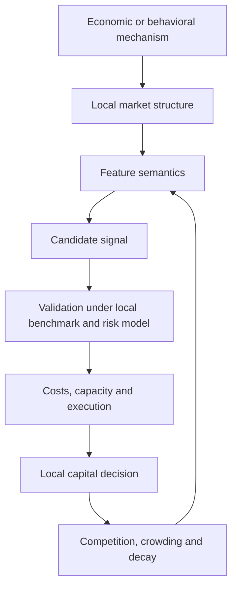
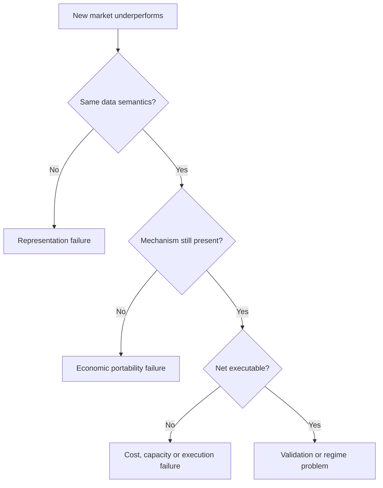

# Market Structure、Alpha Sources 与 Research Portability 图谱

> **Map ID:** 08  
> **性质声明：** 本图将成熟的市场微观结构、行为金融、套利约束与因子拥挤概念，和 AlphaResearchOS 的 Research Portability Hierarchy 连接起来。后者是 **Candidate Concept**，不是已经验证的定律或系统实现。  
> **中心问题：** 为什么同一个数学因子、策略或交易逻辑在不同市场可能表现完全不同？什么东西具有地域依赖，什么东西真正具有跨市场迁移能力？

$$
\boxed{
Same\ Formula\neq Same\ Semantics;
\quad Same\ Mechanism\neq Same\ Tradability;
\quad Portable\ Method\neq Guaranteed\ Alpha
}
$$

## （一）主关系图：市场结构如何改变 Alpha 的生成与消失

```text
Economic / Behavioral Mechanism
            ↓
Market Structure
  ├─ Participants & Objectives
  ├─ Institutions / Rules
  ├─ Information Structure
  ├─ Liquidity / Funding / Shorting
  ├─ Settlement / Price Limits
  └─ Competition / Execution
            ↓
Observable Feature Semantics
            ↓
Predictive Pattern before Costs
            ↓
Crowding / Arbitrage / Decay / Regime Change
            ↓
Net, Executable and Capacity-aware Result
```

## （二）Mermaid 一图看懂



## （三）理论层级

| 层级 | 本图内容 |
|---|---|
| **Standard Theory / Mature Concepts** | Market Microstructure、Limits to Arbitrage、Momentum / Reversal、Liquidity、Short-sale Constraints、Transaction Costs、Capacity、Crowding、Non-stationarity。 |
| **AlphaResearchOS Working Model** | `Global Method != Local Empirical Result`；研究必须在本地 Benchmark、Risk Model、PIT、OOS、Cost 与 Capacity 下重新成立。 |
| **Candidate Concept** | Strategy / Feature / Economic Mechanism / Research Method 四层 Portability Hierarchy。 |
| **Example / Intuition** | A-share 与 U.S. market、momentum 与 reversal 只用于展示“应检查什么”，不预先断言哪个市场必然存在何种效应。 |

## （四）Market Structure：不是背景，而是数据生成机制的一部分

市场结构决定谁可以交易、为何交易、何时交易、以什么成本交易，也决定价格与成交量数据究竟记录了什么。

| 维度 | 研究问题 | 可能改变的对象 |
|---|---|---|
| Participants | 个人、机构、做市商、被动资金、产业资本各占什么位置？ | 交易动机、持有期、反应速度。 |
| Institutions / Rules | 交易、披露、上市、退市、熔断、价格限制如何规定？ | 可观察路径与尾部形态。 |
| Information Structure | 信息何时公开、谁先看到、解释能力如何分布？ | Surprise、revision、reaction latency。 |
| Liquidity | 深度、价差、冲击成本、连续性如何？ | 可交易规模与退出风险。 |
| Shorting | 借券、保证金、召回与禁限售约束如何？ | 负面观点的表达能力。 |
| Settlement | 证券与现金何时完成交收？ | 周转、资金占用、违约与库存需求。 |
| Price Limits | 单日价格路径是否受约束？ | 收益序列、延迟反应、成交拥堵。 |
| Investor Composition | 投资者目标、期限和专业化程度如何？ | 注意力与行为模式。 |
| Competition | 同类研究资本有多少、复制速度多快？ | Alpha half-life 与 crowding。 |
| Execution | 订单类型、撮合、费用和市场冲击如何？ | Gross → Net 的落差。 |

> 美国 Regulation SHO 对卖空的 locate、close-out 等要求说明：即使“做空”这一动作在多个市场都存在，其操作约束也属于策略经济学的一部分，而不是回测之外的附注。参见 [SEC Regulation SHO 概览](https://www.sec.gov/investor/pubs/regsho.htm)。

## （五）四层 Research Portability Hierarchy

```text
Strategy Portability
        <
Feature Portability
        <
Economic Mechanism Portability
        <
Research Method Portability
```

这里的 `<` 表示“通常越来越不依赖具体本地实现”，不是严格数学序关系。

### 1. Strategy Portability

完整策略能否直接迁移，包括 universe、信号、组合、交易、风控与退出。它最脆弱，因为任一层都可能发生变化。

$$
NetReturn_m
=
GrossPattern_m-Cost_m-Impact_m-Borrow_m-Funding_m
$$

市场 $m$ 改变时，右侧每项都可能改变。

### 2. Feature Portability

字段或公式相同，不代表经济意义相同：

```text
past_return
turnover
volume
volatility
analyst_revision
```

它们都只是计算对象。真正的问题是：**谁的什么行为使这个变量变化？**

### 3. Economic Mechanism Portability

更可迁移的是可能存在于多个市场的机制，例如：

- underreaction；
- forced flows；
- funding constraints；
- slow information diffusion；
- inventory imbalance；
- agency or mandate constraints。

但机制存在仍不代表足够强、足够稳定或可交易。

### 4. Research Method Portability

进入新市场后仍能重复执行：

```text
Observe
→ Represent
→ Hypothesize
→ Define Benchmark / Risk Model
→ Build PIT data
→ Falsify
→ OOS
→ Cost / Capacity / Execution
→ Capital Decision
```

这是本图最重要的候选洞见：**研究方法可能比现成策略更可迁移。**

## （六）同一个 Feature 为什么会换一种语义

令 $X_{i,t}$ 为同一数学 feature，在市场 $m$ 中：

$$
Meaning(X_{i,t}\mid m)
=
g(Participants_m,Rules_m,Constraints_m,Information_m,Regime_t)
$$

该式是概念函数，不是可直接估计的定理。

### 示例：高换手率

高换手率可能来自：

- 信息到达后的快速重新定价；
- 散户注意力冲击；
- 指数调整和被动资金；
- forced deleveraging；
- 做市与套利活动；
- 价格限制下无法一次完成的订单积压。

因此 `turnover_high` 不是经济解释，只是需要解释的现象。

## （七）Momentum / Reversal：作为 portability case，而非结论

### 1. 两个最小定义

```text
Momentum：过去相对赢家在后续一段时间继续相对走强。
Reversal：过去相对赢家在后续一段时间反而相对走弱。
```

它们可能在不同 horizon 共存：短期流动性反转、中期动量、长期反转并不逻辑矛盾。

### 2. 机制候选

| 观察 | 可能机制 | 主要替代解释 |
|---|---|---|
| 中期 continuation | 信息扩散慢、underreaction、追涨资金 | 风险暴露、行业趋势、数据挖掘。 |
| 短期 reversal | 库存风险、流动性供给、临时价格压力 | bid-ask bounce、微盘偏差。 |
| 拥挤后崩溃 | deleveraging、共同持仓、流动性撤退 | 宏观冲击、样本选择。 |

量化策略在 2007 年 8 月发生同步损失与快速反转，是研究 crowding、共同去杠杆和流动性风险的经典案例，而不是“所有量化策略必然一起崩溃”的证明。参见 Khandani 与 Lo 的 [NBER Working Paper 14465](https://www.nber.org/papers/w14465)。

### 3. A-share vs U.S. market 应怎样比较

不先写结论，先建立对照表：

| 问题 | Market A | Market B |
|---|---|---|
| 可做空 universe 与 borrow cost | 待验证 | 待验证 |
| 价格限制及触发方式 | 待验证 | 待验证 |
| 交收与回转规则 | 待验证 | 待验证 |
| 投资者构成 | 待验证 | 待验证 |
| 披露时点与覆盖 | 待验证 | 待验证 |
| 交易成本和冲击 | 待验证 | 待验证 |
| 因子容量与拥挤 | 待验证 | 待验证 |

只有填完本地证据，才讨论 feature 是否可迁移。

## （八）Alpha Decay：为什么有效性会自己改变环境

```text
Pattern is discovered
→ Capital adopts it
→ Price reacts earlier
→ Entry becomes crowded
→ Capacity falls / costs rise
→ Gross pattern weakens or moves earlier
```

Alpha decay 至少有四类来源：

1. **Learning:** 市场吸收规律；
2. **Crowding:** 资本集中到同一交易；
3. **Structural change:** 制度、技术或参与者变化；
4. **Original false positive:** 规律从未真正存在。

研究曾观察到某些正反馈交易相关收益在美国下降而在其他市场的变化不同，这支持“竞争和采用会改变策略收益”的研究问题，但不构成普遍定律。参见 [NBER Working Paper 28624](https://www.nber.org/papers/w28624)。

## （九）从 Portability Failure 反推研究诊断



诊断时必须区分：

- Data failure；
- Semantic failure；
- Mechanism failure；
- Statistical failure；
- Portfolio construction failure；
- Execution failure；
- Regime change。

## （十）Research OS 作为 Alpha Factory

### Candidate Insight

```text
Alpha = Consumable Research Output
Research Capability = Productive Asset
```

这不意味着 Alpha 必然短命，也不意味着研究能力保证盈利。它强调：

- feature 要持续重估语义；
- hypothesis 要持续接收反证；
- strategy 要有退役机制；
- local evidence 要覆盖 global intuition；
- research lineage 要允许失败归因。

AlphaResearchOS 的角色不是保存一组永远有效的公式，而是支持“生产—验证—淘汰—更新”的研究循环。

## （十一）常见认知误区与纠偏

| 误区 | 纠偏 |
|---|---|
| 美国有效，所以中国也有效 | 只能形成迁移假设，必须重做本地语义与实证验证。 |
| 同名字段含义相同 | 字段是 schema；含义来自数据生成机制。 |
| 找到行为偏差就找到 Alpha | 行为机制还需定价差异、可识别性与可交易性。 |
| 回测收益高说明策略可迁移 | 可能是 risk exposure、leakage、成本遗漏或样本偶然。 |
| 市场更“无效”就更容易赚钱 | 低效率可能同时伴随高摩擦、低容量和高尾部风险。 |
| Alpha 衰减说明研究失败 | 衰减本身可成为市场学习与拥挤的研究对象。 |

## （十二）Falsification 与现实边界

一个 Portability Claim 至少要回答：

1. 原市场和目标市场的 feature 是否 point-in-time 同义？
2. 假设机制有哪些可观察中介变量？
3. 是否控制合理 Benchmark 与公共风险暴露？
4. 是否有本地 OOS 与跨时期验证？
5. 成本、borrow、冲击和容量是否重估？
6. 失败时，哪一层 portability 被否证？

```text
Research Method Portability
!=
Research Result Portability
```

## （十三）与其他 Learning Maps 和 AlphaResearchOS 的连接

### Prerequisite

- Map 07 `value-price-information-alpha-map.md`：说明 Price、Expectation Gap 与严格 Alpha 语义。

### 向后接口

- Map 09：市场结构决定不同信息 sensors 的 latency 与解释空间；
- Map 10：市场差异要求重新定义 Evidence 与 Representation；
- Map 12：传导机制必须在本地制度与可交易资产中落地；
- Map 14：Research Method Portability 构成人力资本的一部分。

### 系统连接

本图支持 Foundation 的：

```text
Global Method != Local Empirical Result
Benchmark != Risk Model
Candidate Signal != Validated Alpha
```

它不证明任何 AlphaResearchOS 软件组件已经实现。

## （十四）Interview / Oral Explanation

### 30 秒版本

> 同一个因子跨市场失效，往往不是公式突然变错，而是公式背后的数据生成机制变了。参与者、交易规则、做空、流动性、信息扩散和执行成本都会改变 feature 的经济语义。因此我把可迁移性分成策略、特征、经济机制和研究方法四层。最稳健的长期资产通常不是直接搬运策略，而是把同一套 PIT、证伪、OOS、成本和容量方法带到新市场，再重新做本地验证。

### 典型追问

- **Momentum 能否跨市场？** 先定义 horizon、universe、风险控制与本地机制，再谈经验结果。
- **最可迁移的是什么？** 通常是研究 protocol，而不是某组固定参数。
- **市场无效是否等于有 Alpha？** 不等于；摩擦可能使错误无法被资本捕获。

## （十五）最小记忆框架

1. Market Structure 是数据生成机制的一部分；
2. Same Formula 不等于 Same Semantics；
3. Strategy < Feature < Mechanism < Method Portability；
4. Momentum 与 Reversal 必须带 horizon 和本地机制；
5. Alpha 会受竞争、拥挤和制度变化影响；
6. 跨市场失败要分层诊断；
7. Research OS 的护城河是持续生产并淘汰假设的能力。

## （十六）Mastery Checkpoints

| Level | 能力证据 |
|---|---|
| 1 — Explain | 能解释为什么同名 feature 在不同市场不必同义。 |
| 2 — Distinguish | 能区分四层 portability 与七类 failure。 |
| 3 — Apply | 能为一个跨市场 momentum 研究填写结构对照表。 |
| 4 — Falsify | 能提出证据区分“机制消失”与“交易成本吞噬”。 |
| 5 — Transfer | 能把框架迁移到商品、利率或加密资产。 |

## （十七）本图不负责

- 不重新给出 Alpha Discovery Loop 的完整验证 Gate；
- 不重建 Value / Information / Price 总世界观；
- 不系统教授全部 market microstructure；
- 不断言 A-share 或美国市场必然更有效；
- 不把 Portability Hierarchy 宣布为已验证架构。

## （十八）精选来源

- [SEC — Key Points About Regulation SHO](https://www.sec.gov/investor/pubs/regsho.htm)
- [Khandani & Lo — What Happened to the Quants in August 2007?](https://www.nber.org/papers/w14465)
- [Ben-David et al. — Discontinued Positive Feedback Trading and the Decline of Return Predictability](https://www.nber.org/papers/w28624)

