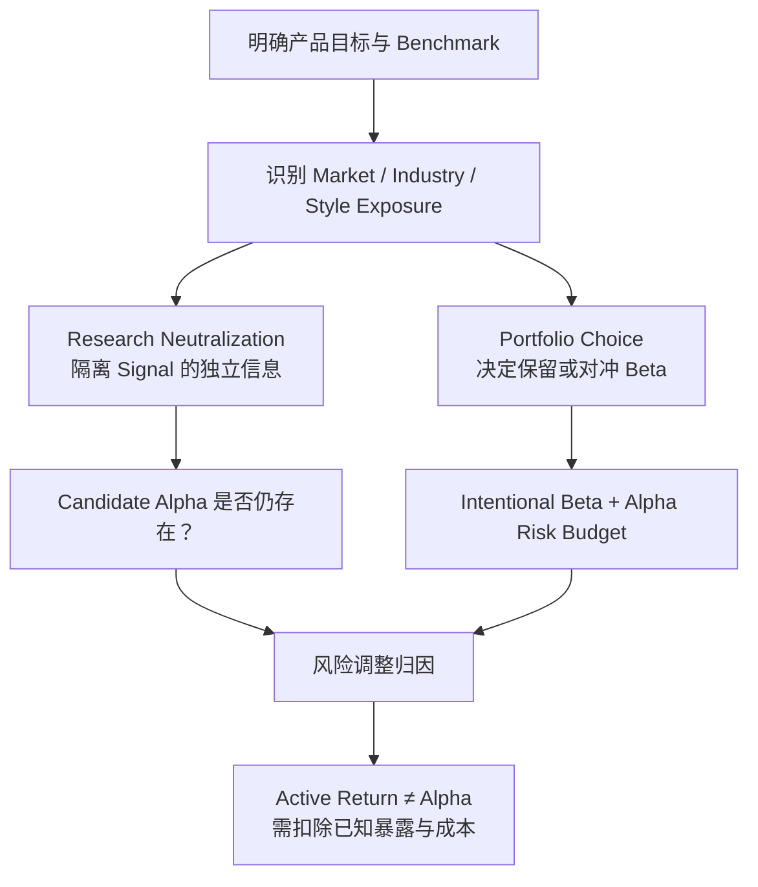

# ***Neutralization、Benchmark、Beta 与 Alpha 关系图谱***

> **中心问题：** 为什么 Quant Research 会中性化 Beta，而真实组合仍可以持有 Beta？跑赢或跑输指数，又为什么不自动等于正或负 Alpha？

$$
\boxed{
Research\ Neutralization
\neq
Portfolio\ Neutrality
}
$$

$$
\boxed{
追求\ Alpha
\neq
放弃\ Beta
}
$$

## `（一）Research Control—Benchmark—Portfolio Choice 主关系图`

```text
┌──────────────────────────────────────────────────────────────────────────────┐
│                   先明确研究问题与风险匹配 Benchmark                           │
│       “相对于谁？承担了什么风险？什么收益本来可低成本获得？”                      │
└───────────────────────────────────┬──────────────────────────────────────────┘
                                    │
                 ┌──────────────────┴──────────────────┐
                 ▼                                     ▼
┌──────────────────────────────────┐  ┌────────────────────────────────────────┐
│ Research Neutralization          │  │ Portfolio / Capital Allocation         │
│ 研究识别问题                      │  │ 真实资本配置问题                        │
│ 控制 Market/Industry/Size/Style  │  │ 决定保留、对冲或组合哪些 Beta            │
│ 目的：隔离 Signal 的增量信息       │  │ 目的：满足收益、风险、成本与产品目标      │
└────────────────┬─────────────────┘  └────────────────────┬───────────────────┘
                 │                                         │
                 ▼                                         ▼
┌──────────────────────────────────┐  ┌────────────────────────────────────────┐
│ Signal 控制已知 Exposure 后       │  │ Total Return                           │
│ 还能否预测未来风险调整收益？        │  │ = Intentional Beta + Alpha + Noise     │
└────────────────┬─────────────────┘  └────────────────────┬───────────────────┘
                 │                                         │
                 └──────────────────┬──────────────────────┘
                                    ▼
                     ┌─────────────────────────────────┐
                     │ Performance Attribution         │
                     │ Active Return = Rp − Rbenchmark │
                     │ Alpha = 风险/Factor 调整后增量   │
                     └────────────────┬────────────────┘
                                      │
                                      ▼
       ┌────────────────────────────────────────────────────────────┐
       │ Active Return ≠ Alpha：跑赢、跑输、赚钱、亏钱都要先看 Beta    │
       │ 与 Factor Exposure；单期“Alpha”只是归因，不证明持久能力       │
       └────────────────────────────────────────────────────────────┘
```

> **读图原则：** 研究中性化是为了回答“Signal 本身有没有增量预测力”；组合是否中性则是资本选择。Benchmark 决定比较坐标，Risk Model 决定哪些收益已被已知暴露解释。

## `（二）Mermaid 一图看懂`



## `（三）理论层级与核心概念速查`

### `1. 哪些是成熟框架，哪些是 AlphaResearchOS 的治理表达`

| 层级 | 内容 |
|---|---|
| **Standard Theory / Practice** | Factor Neutralization、Market Neutral、Benchmark、Active Return、Risk-adjusted Alpha、Performance Attribution。 |
| **AlphaResearchOS Working Model** | “Research Neutralization ≠ Portfolio Neutrality”的系统分层表达，以及“Beta 是主动研究的机会成本”。后者是治理原则，不是资产定价新定理。 |
| **Portfolio Governance Implication** | `Low-cost Beta Core + Validated Alpha Risk Budget` 是可选架构思想，不是个人资产配置比例建议。 |

### `2. 核心概念`

| 概念 | 最直白解释 | 关键边界 |
|---|---|---|
| **Neutralization（中性化）** | 主动降低或控制某类不希望混入结果的 Factor Exposure | 中性化只相对于指定因子和模型成立，不代表全部风险消失。 |
| **Research Neutralization** | 研究 Signal 时控制已知暴露，以判断它是否提供独立信息 | 是识别工具，不自动规定最终持仓。 |
| **Portfolio Neutrality** | 在真实组合中把某类净暴露压到目标范围，例如市场 Beta 接近 0 | 是产品与资本选择；需要对冲、融资、做空和再平衡。 |
| **Market Neutral** | 多空或对冲后，组合对市场因子的净 Beta 目标接近 0 | 不等于现金无波动、无回撤或无其他因子暴露。 |
| **Benchmark（基准）** | 用于评价策略机会成本和相对表现的可执行参照 | 需与产品目标和风险匹配，不能默认永远是沪深300。 |
| **Active Return（主动收益）** | 组合收益减 Benchmark 收益 | 是表面相对差，不必然是风险调整 Alpha。 |
| **Beta Return** | 承担公共系统性暴露所获得的收益/风险溢价实现 | 不是“坏收益”；也不保证每期为正。 |
| **Alpha** | 控制当前已知风险与 Factor Exposure 后的增量表现 | 单期归因值不证明未来可持续 Alpha。 |
| **Tracking Error** | Active Return 的波动程度 | 衡量偏离基准的风险，不等于 Alpha 大小。 |

### `3. 常见中性化对象`

| 中性化对象 | 研究时想排除什么 | 组合中可能怎样实现 |
|---|---|---|
| **Market** | Signal 是否只是押市场涨跌 | 控制净 Beta，使用多空头寸或指数工具对冲。 |
| **Industry** | Signal 是否只是偏好某些行业 | 行业内排序、行业权重约束或行业对冲。 |
| **Size** | Signal 是否只是小盘/大盘暴露 | 横截面回归残差化、分组匹配或规模暴露约束。 |
| **Style** | Signal 是否只是 Value、Momentum、Quality 等已有风格 | 对已知风格暴露回归控制或设置风险约束。 |

> 研究方法和实盘实现并非一一对应。例如研究阶段可先对 Feature 做横截面残差化，实盘阶段则由优化器统一管理多项暴露。

## `（四）核心公式骨架与直观解释`

### `1. Active Return：只做表面相减`

$$
R_{active,t}=R_{p,t}-R_{b,t}
$$

| 符号 | 含义 |
|---|---|
| $R_{p,t}$ | 组合在时点/期间 $t$ 的实现收益。 |
| $R_{b,t}$ | Benchmark 同期收益。 |
| $R_{active,t}$ | 相对 Benchmark 多赚或少赚了多少。 |

**为什么它不自动等于 Alpha？** 因为组合与 Benchmark 可能承担不同的市场、行业、风格、杠杆和流动性风险。简单相减没有把这些差异完全调整掉。

### `2. 单市场模型下的风险调整 Alpha`

$$
\alpha_p
\approx
R_p-
\left[R_f+\beta_p(R_M-R_f)\right]
$$

| 符号 | 含义 |
|---|---|
| $R_f$ | 无风险收益，需与研究期限匹配。 |
| $R_M-R_f$ | 市场超额收益。 |
| $\beta_p$ | 组合对市场因子的暴露。 |
| 括号内 | 按该简化风险模型，市场暴露应解释的收益。 |
| $\alpha_p$ | 实现收益相对模型解释值的剩余。 |

**为什么要先乘 Beta？** 因为一个 Beta 为 1.5 的组合本来就承担了比市场更高的系统暴露；只与市场指数做一比一收益比较，会把额外风险暴露误当成选股能力。

> 在真实多因子归因中，应加入行业、风格等多个 Exposure。单期算出的数更准确地说是 realized risk-adjusted residual/归因项，不足以证明存在持久 Expected Alpha。

### `3. 多因子组合分解骨架`

$$
R_{p,t}
=
R_{f,t}
+
\boldsymbol\beta_{p,t}^{\top}\mathbf F_t
+
\alpha_{p,t}
+
\varepsilon_{p,t}
$$

它把组合收益按当前模型拆成：无风险基线、已知 Factor/Beta 贡献、风险调整增量和随机/模型误差。完整 Factor/Residual 本体见 [alpha-beta-factor-residual-map.md](alpha-beta-factor-residual-map.md)，本图只使用该分解支持 Benchmark 与中性化判断。

### `4. Market Neutral 的目标约束`

$$
\beta_{portfolio,market}\approx0
$$

这表示组合对**指定市场因子**的一阶净暴露接近零。它不意味着：

- 总多头金额等于总空头金额就必然 Beta 为零；
- 行业、规模、利率、流动性和尾部暴露也为零；
- 对冲关系在下一期仍保持不变；
- 组合没有融资、借券和基差风险。

### `5. Research Neutralization 的简化形式`

对候选 Feature $X_i$，可用已知 Exposure $Z_i$ 做横截面控制：

$$
X_i=c+\boldsymbol\gamma^\top Z_i+X_i^{neutral}
$$

$X_i^{neutral}$ 是当前控制变量未解释的 Feature 部分。研究者再检查它是否仍能预测未来收益。

**为什么这样做？** 如果原始 $X$ 只是“偏好小盘股”的另一种写法，控制 Size 后其预测力可能消失；这能防止把已有风险暴露包装成新 Signal。

> 本式只是教学骨架。实际可使用分组、去均值、回归残差化或优化约束；方法选择会影响结果。

## `（五）四个数值例子：赚钱、跑赢与 Alpha 的坐标不同`

以下均为教学简化：假设 $R_f=0$、只有市场一个 Factor、忽略成本，并把单期风险调整剩余记作 $\alpha\approx R_p-\beta R_M$。它们用于理解坐标，不用于证明持久 Alpha。

### `Example A：跑输市场，负 Alpha`

```text
Market      = +10%
Portfolio β = 1.0
Portfolio   = +7%
```

$$
\alpha\approx7\%-1.0\times10\%=-3\%
$$

组合比市场少赚 3%，风险调整后也少 3%。

### `Example B：跑输指数，但正 Alpha`

```text
Market      = +10%
Portfolio β = 0.5
Portfolio   = +7%
```

$$
Expected\ Beta\ Contribution\approx0.5\times10\%=5\%
$$

$$
\alpha\approx7\%-5\%=+2\%
$$

组合表面跑输指数 3%，但它只承担一半市场暴露；相对风险模型解释值反而多赚 2%。

### `Example C：跑赢指数，但负 Alpha`

```text
Market      = +10%
Portfolio β = 1.5
Portfolio   = +12%
```

$$
Expected\ Beta\ Contribution\approx1.5\times10\%=15\%
$$

$$
\alpha\approx12\%-15\%=-3\%
$$

组合表面跑赢指数 2%，但承担了更高市场暴露；相对模型应解释的 15%，反而少赚 3%。

### `Example D：绝对亏钱，也可能有正 Alpha`

```text
Market      = −20%
Portfolio β = 1.0
Portfolio   = −12%
```

$$
\alpha\approx-12\%-1.0\times(-20\%)=+8\%
$$

组合仍亏损 12%，但比相同市场暴露的简化预期少亏 8%。所以“赚钱/亏钱”与“正/负 Alpha”不是同一坐标。

### `四例总表`

| 例子 | Active Return vs Market | 简化风险调整结果 | 关键结论 |
|---|---:|---:|---|
| A | $-3\%$ | $-3\%$ | 同 Beta 时，表面相对差与风险调整差一致。 |
| B | $-3\%$ | $+2\%$ | 跑输指数仍可有正的单期风险调整剩余。 |
| C | $+2\%$ | $-3\%$ | 跑赢指数仍可有负的单期风险调整剩余。 |
| D | $+8\%$ | $+8\%$ | 绝对亏损不等于负 Alpha。 |

## `（六）今天最重要的认知纠偏`

| 常见误区 | 正确认识 |
|---|---|
| **1. Market Neutral 是最专业、最高级的投资方式** | 它是一种风险暴露选择，适合特定目标；专业性来自目标一致、研究严谨和风险可控。 |
| **2. 做 Alpha 就应把所有 Beta 全去掉** | 研究可控制 Beta 识别 Signal；实盘可按产品目标主动持有低成本 Beta。 |
| **3. 跑赢 ETF = 正 Alpha** | 可能只是更高 Beta、行业集中、风格偏离或杠杆。 |
| **4. 跑输 ETF = 负 Alpha** | 若组合承担更低风险暴露，仍可能有正的风险调整剩余。 |
| **5. 亏损 = 负 Alpha** | 市场大跌时少亏可能对应正的风险调整归因；但不改变绝对财富损失。 |
| **6. Beta 是不值得研究的普通收益** | Beta 是公共风险暴露及其可能的风险溢价来源，也是主动策略的机会成本。 |
| **7. Benchmark 永远是沪深300** | 指数增强、市场中性、CTA、固收加和多策略需要与目标和风险匹配的不同基准。 |
| **8. 美元中性/市值中性就等于 Beta 中性** | 多空名义金额相等不保证风险暴露相等；两边 Beta 和因子结构可能不同。 |
| **9. 单期归因为正就证明有 Alpha 能力** | 单期结果可能是 Noise；持久 Alpha 仍需多期、OOS、成本与证伪。 |

## `（七）如何选择一个有意义的 Benchmark`

合理 Benchmark 应尽可能满足：

| 原则 | 核心问题 |
|---|---|
| **目标一致** | 它是否代表产品承诺获得的资产类别与投资范围？ |
| **风险匹配** | 市场、久期、行业、风格、杠杆和流动性是否大致可比？ |
| **可执行** | 投资者能否用现实工具和规则获得该基准暴露？ |
| **低成本** | 它是否代表放弃主动研究时可合理获得的机会成本？ |
| **透明可复现** | 成分、再平衡、收益口径和数据是否明确？ |

例子：

```text
沪深300指数增强 → 沪深300总收益/可投资跟踪方案
中证1000增强   → 中证1000相关基准，而非沪深300
市场中性多空   → 现金/融资基线 + 风险与绝对收益目标 + 同类约束
固收增强       → 久期、信用和流动性匹配的债券基准
多策略         → 与风险预算和策略集合相匹配的复合评价框架
```

> Benchmark 没有唯一万能答案；但没有明确 Benchmark 和 Risk Model，Alpha 声明就缺少严格参照系。

## `（八）进阶但必要的现实理解`

### `1. 中性化会改变研究对象`

控制行业或规模后，Signal 的经济含义可能变化。过度中性化也可能删除原本与假设不可分割的信息，因此控制项必须由研究问题决定，而不是越多越专业。

### `2. 实盘 Neutrality 会漂移`

价格变化、Beta 更新、成分调整和非线性暴露都会让组合偏离目标，需要再平衡；再平衡又带来换手、冲击和税费。

### `3. 对冲不是免费且完美的`

| 现实限制 | 影响 |
|---|---|
| 股指期货/ETF 基差与跟踪误差 | 对冲工具不完全复制组合风险。 |
| 融资、保证金与借券成本 | 中性组合仍可能面临资金压力。 |
| 空头可得性与召回 | 理论空头未必能建立或长期维持。 |
| 极端行情相关性上升 | 平时分散的暴露可能在危机中同时失效。 |
| Risk Model Misspecification | “中性”可能只对错误模型成立。 |

### `4. Beta Capture 也会被行为与摩擦破坏`

低仓位、错误择时、频繁换产品、费用和 Cash Drag 会让账户只获得“残缺 Beta”。因此 AlphaResearchOS 把 Beta 视为主动研究的机会成本：未经验证的主动决策至少要证明，成本后优于一个合理、低成本、可执行的替代方案。

### `5. Beta Core + Alpha Risk Budget 是治理框架`

```text
Total Portfolio
=
Low-cost / Intentional Beta Core
+
Strictly Validated Alpha Risk Budget
```

它表达的是资本纪律：尚未被证明的 Alpha 假设不应无上限吞掉可获得的 Beta。它**不规定**个人应配置多少，不表示 Beta 永远优于主动管理，也不适用于所有产品目标。

## `（九）与 AlphaResearchOS 的连接`

```text
Product Objective / Mandate
            ↓
Benchmark Definition
            ↓
Factor / Risk Model ──> Exposure Attribution
            │
            ├── Research：Neutralize known exposure
            │              ↓
            │       Test incremental signal
            │
            └── Portfolio：Choose intentional Beta
                           + validated Alpha budget
                           + costs / constraints
                                      ↓
                         Outcome / Attribution / Learning
```

| 模块 | 责任 |
|---|---|
| **Research** | 控制已知 Exposure，检验 Candidate Feature 的增量预测力。 |
| **Risk Model** | 估计 Market / Industry / Style 等 Beta Vector。 |
| **Forecast** | 输出 Expected Alpha，而非把 Beta Return 重命名为 Alpha。 |
| **Portfolio** | 决定哪些 Beta 是 Intentional，哪些 Exposure 要约束或对冲。 |
| **Execution** | 管理对冲工具、借券、换手、保证金和实际成交。 |
| **Attribution** | 区分 Benchmark Capture、Factor Contribution、Security Selection、Costs 与误差。 |

AlphaResearchOS 的治理锚点：

> **Beta 不是 Alpha 失败后的安慰奖，而是主动策略必须证明自己有资格替代的机会成本。**

## `（十）面试怎么解释`

### `面试 30 秒版本`

Research Neutralization 是识别问题：控制 Market、Industry、Size 等已知 Exposure 后，判断 Signal 是否仍有增量预测力。Portfolio Neutrality 是资本配置选择，实盘可以保留 Intentional Beta，也可以按 mandate 对冲。Active Return 只是组合减 Benchmark；Alpha 还要按 Risk Model 调整，所以跑赢指数不必然是正 Alpha，跑输也不必然是负 Alpha。

### `典型追问与答题锚点`

| 追问 | 一句话答题锚点 |
|---|---|
| **既然 Beta 也赚钱，为什么研究要中性化？** | 为了隔离 Signal 的独立信息，而不是宣判实盘必须放弃 Beta。 |
| **Market Neutral 是否无风险？** | 不是；它只约束指定市场 Beta，仍有其他因子、模型、融资、流动性和尾部风险。 |
| **Active Return 和 Alpha 有何区别？** | Active Return 是对 Benchmark 的简单收益差，Alpha 是控制风险暴露后的增量。 |
| **Benchmark 应怎么选？** | 与产品目标、风险、可执行性和机会成本匹配，而非默认某个宽基。 |
| **为什么 Beta 是机会成本？** | 因为放弃主动策略时，投资者通常可以低成本获得某种匹配的公共风险暴露。 |

## `（十一）最小记忆框架`

| 想起什么 | 立刻联想到什么 |
|---|---|
| Research Neutralization | 控制已知暴露，识别 Signal 增量 |
| Portfolio Neutrality | 真实资本是否保留某类 Beta |
| Active Return | $R_p-R_b$，表面相对差 |
| Alpha | Risk/Factor-adjusted increment |
| Benchmark | 目标一致、风险匹配、可执行、低成本 |
| Beta Opportunity Cost | 主动策略必须跨过的基线 |

### `复习时只保留五句话`

1. **研究中性化是为了识别 Signal，自身不决定实盘必须中性。**
2. **追求 Alpha 不等于放弃 Beta；Beta 可以是组合主动保留的公共风险暴露。**
3. **Active Return 只是组合减基准，Alpha 还必须控制已知 Factor 与风险。**
4. **跑赢、跑输、赚钱和亏钱都不能脱离 Beta 与 Benchmark 直接翻译成正负 Alpha。**
5. **真实中性化受模型漂移、对冲误差、借券、成本和极端行情约束，不存在“去掉全部风险”。**

## `（十二）是否继续扩张本图谱？`

当前主图暂时停止扩张。

本图已经完成“研究控制—资本选择—基准评价”的闭环。以下内容应拆成新专题：

- `market-neutral-long-short-map.md`：多空构建、Gross/Net Exposure 与融资；
- `performance-attribution-map.md`：Brinson、Factor Attribution 与交易归因；
- `benchmark-design-map.md`：复合基准、总收益口径与可投资性；
- `hedging-basis-risk-map.md`：股指期货对冲、基差与再平衡。

---

> **最终锚点：研究可以暂时拿掉 Beta 来看清 Signal，组合却可以有意识地持有 Beta；真正专业的判断不是“是否跑赢某个指数”，而是先定义风险匹配 Benchmark，再区分公共暴露、风险调整增量、成本与现实执行。**
