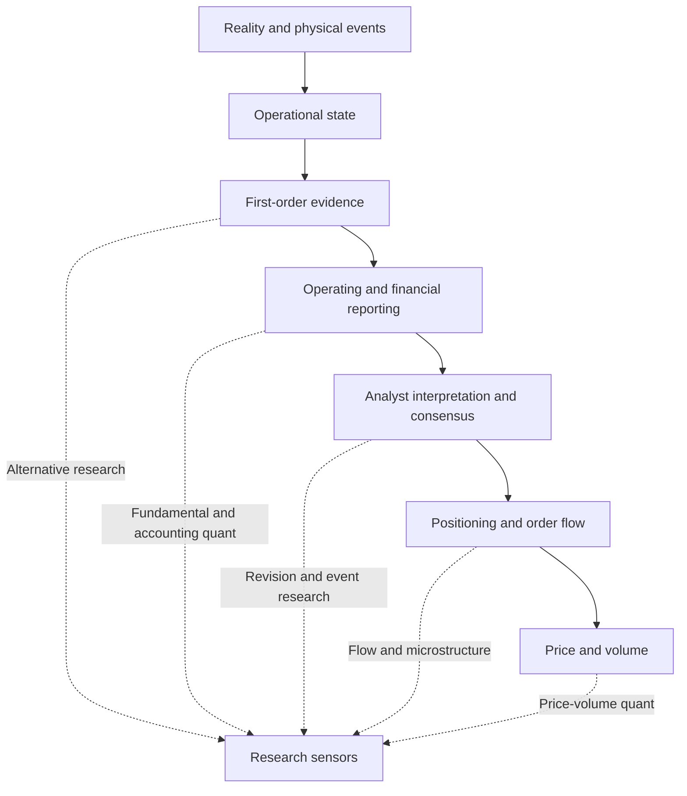

# Reality-to-Price Information Transmission 与 Research Entry Points 图谱

> **Map ID:** 09  
> **性质声明：** 本图不重建 Value–Information–Price–Alpha 世界观，而是把不同研究范式定位为 Reality → Price 传导链上的不同观测入口。该定位是 AlphaResearchOS **Working Model / Candidate Research Lens**。  
> **中心问题：** Fundamental Quant、Alternative Data、Analyst Revision、Event、Flow、Price/Volume Quant 与 Microstructure Research，分别在同一信息传导系统的哪里观察？

$$
\boxed{
Earlier\neq Better;
\quad Public\neq Fully\ Interpreted;
\quad Downstream\neq Noisy\ by\ Definition
}
$$

## （一）主链：Reality 到 Price 的多阶段传导

```text
Reality
↓ Physical / Economic Events
Operational State
↓
Alternative / First-order Evidence
↓
Corporate / Industry Operating Data
↓
Financial Reporting
↓
Analyst Interpretation / Forecasts
↓
Consensus Expectations
↓
Positioning / Order Flow
↓
Price & Volume
```

本图的问题不是“Price 如何代表 Value”，而是：**研究者从哪里插入这条链，观察到了什么，也遗漏了什么？**

## （二）Mermaid：研究范式与观测入口



## （三）理论层级

| 层级 | 本图内容 |
|---|---|
| **Standard Theory / Mature Concepts** | Information Dissemination、Price Discovery、Disclosure、Analyst Forecasts、Order Flow、Market Microstructure、Event Studies。 |
| **AlphaResearchOS Working Model** | 把 Reality → Price 拆成多个可观察但不完美的状态层；Price 同时是输出和下一轮信息输入。 |
| **Candidate Concept** | 将不同研究范式组织为同一系统的 Research Sensors / Entry Points。 |
| **Important Boundary** | 入口更上游通常更早但更含糊；更下游通常更结构化但更可能已被竞争吸收。 |

## （四）Research Entry Points 速查

| 研究范式 | 主要观测位置 | 典型对象 | 主要优势 | 主要盲点 |
|---|---|---|---|---|
| Alternative Fundamental | First-order evidence / operations | 卫星、物流、招聘、设备、网页、传感器 | 可能更早接触现实变化 | 语义、覆盖、授权与 mapping 困难。 |
| Fundamental Quant | Operating + financial state | 收入、毛利、库存、资本效率 | 可连接经济机制与横截面 | 报告滞后、会计口径和 revision。 |
| Accounting Quant | Financial reporting | accruals、quality、balance-sheet relations | 标准化、可扩展 | 报表不是 Reality 的完整复制。 |
| Estimate Revision | Analyst interpretation | forecast change、dispersion、target revision | 直接观察预期更新 | 覆盖偏差、herding、发布时间。 |
| Event-driven | Discrete event | 财报、政策、并购、诉讼 | 时间边界清晰 | anticipated event 与重叠事件。 |
| Flow / Positioning | Capital expression | fund flow、holdings、borrow、futures positioning | 观察约束和拥挤 | 归因不唯一、数据延迟。 |
| Price-volume Quant | Price public output | return、volume、volatility | 高标准化、高频、广覆盖 | 经济语义可能弱或变化。 |
| HFT / Microstructure | Order-book formation | quote、trade、depth、imbalance | 接近价格形成过程 | 基础设施、延迟与容量高度本地化。 |

## （五）三种 Latency：信息不是“出现/不存在”的二元变量

### 1. Information Latency

现实发生到证据可被合法观察的时间：

$$
L_{info}=t_{observable}-t_{event}
$$

### 2. Interpretation Latency

证据可观察到其经济含义被可靠表示的时间：

$$
L_{interpret}=t_{understood}-t_{observable}
$$

### 3. Reaction Latency

含义形成到资本充分表达的时间：

$$
L_{reaction}=t_{capitalized}-t_{understood}
$$

概念上：

$$
L_{total}=L_{info}+L_{interpret}+L_{reaction}
$$

这是研究分解，不是可直接观测的恒等式；`fully capitalized` 本身通常无法精确标记。

## （六）为什么 Public Information 不等于 Zero Research Value

公开只是访问状态，不自动回答：

- 是否被注意；
- 是否被正确解析；
- 是否与其他证据连接；
- 是否映射到现金流、供需或风险；
- 是否相对 consensus 构成 surprise；
- 是否能在成本和约束下行动。

```text
Public
→ Accessible to eligible observers

not necessarily

Public
→ Correctly represented by everyone
→ Fully priced immediately
```

美国 Regulation FD 的核心是限制选择性披露并促进公平公开，而不是宣称公开材料会被所有投资者同时、同质、无误地解释。参见 [SEC Regulation FD 发布说明](https://www.sec.gov/rules-regulations/2000/08/selective-disclosure-insider-trading)。

同时必须保护另一侧边界：

```text
Public Information
!= Automatically Underpriced Information
```

研究者必须证明自己的解释具备事前增量价值。

## （七）Upstream vs Downstream：不是价值排序，而是误差结构不同

| 位置 | 可能优势 | 主要误差 |
|---|---|---|
| Upstream Reality / physical evidence | 更接近业务发生、可能更早 | ambiguity、coverage、mapping、seasonality。 |
| Operating data | 接近企业或产业状态 | definitions、private/public boundary、sampling。 |
| Financial reporting | 标准化、审计与历史可比性较强 | aggregation、management judgment、publication lag。 |
| Analyst / consensus | 直接观察市场预期形成 | herding、coverage selection、revision timing。 |
| Positioning / order flow | 观察资本约束与表达 | identity ambiguity、data latency、endogeneity。 |
| Price / volume | 公共、连续、跨资产 | 高竞争、反向因果、risk and flow confounding。 |

上游 sensor 的核心优势是 **earliness**；核心负担是 **semantic uncertainty**。  
下游 sensor 的核心优势是 **standardization and market relevance**；核心负担是 **competitive absorption and causal ambiguity**。

## （八）同一事件如何被不同 Sensor 看见

假设某产品真实需求开始减弱：

```text
Search / traffic / shipment evidence changes
→ orders and utilization weaken
→ inventory rises
→ revenue and margin miss
→ analysts cut estimates
→ consensus moves
→ holders rebalance
→ price and volume react
```

| 研究者 | 可能最先看到 | 需要解决的问题 |
|---|---|---|
| Alternative data researcher | 流量或物流变化 | 样本是否代表真实需求？ |
| Fundamental researcher | 订单、产能利用率、库存 | 如何传到利润与现金流？ |
| Accounting quant | inventory / receivables relation | 是需求弱化还是业务季节性？ |
| Revision researcher | EPS cut / dispersion | 市场原来预期了多少？ |
| Flow researcher | 卖出与借券变化 | 是信息交易还是被动流？ |
| Price-volume researcher | return / volume pattern | 是新信息还是共同风险冲击？ |

同一个 Reality Event 可以留下多个时间不同、噪声不同、相互校验的 footprints。

## （九）Multi-sensor Research：不是简单堆数据

更合理的组合是：

```text
Sensor A detects state change
Sensor B validates mechanism
Sensor C measures expectation gap
Sensor D checks capital expression
```

而不是：

```text
More datasets
→ More features
→ Automatically better prediction
```

### 三角验证骨架

$$
Confidence(H)
=f(
SourceIndependence,
SemanticAgreement,
TimeConsistency,
AlternativeExplanations
)
$$

这是启发式概念函数。多个来源若共享同一上游供应商，并不构成真正独立确认。

## （十）Time Semantics：每个 Sensor 都必须回答的四个时间

| 字段 | 问题 |
|---|---|
| `effective_time` | 现实状态何时发生或生效？ |
| `observed_time` | 传感器何时记录？ |
| `publication_time` | 合法研究者何时可以获得？ |
| `ingestion_time` | 研究系统何时获取？ |

Point-in-time 研究必须使用当时可得版本，而不是事后修订后的“完美历史”。

## （十一）常见认知误区与纠偏

| 误区 | 纠偏 |
|---|---|
| 另类数据一定领先价格 | 它可能更早，也可能只是更噪。 |
| 财报太慢，所以没有价值 | 慢不等于无信息；标准化和确认也有价值。 |
| 分析师修正都是滞后指标 | 有时滞后，有时是新信息载体；必须实证。 |
| 量价只是噪音 | Price / Volume 是资本表达的公共输出，但解释不唯一。 |
| 越接近订单簿越有 Alpha | 更靠近撮合不代表具有持久的经济 edge。 |
| 多源一致就证明因果 | 一致性只提高某些解释的可信度，不自动识别因果。 |

## （十二）Falsification：怎样检验“入口更好”

对任一 Research Entry Point，至少检验：

1. 当时是否真的可得？
2. 数据 revision 后，原始版本是否保存？
3. 语义是否稳定，coverage 是否变化？
4. 相对更下游信息是否有增量预测力？
5. 与已知风险、行业和流动性控制后是否仍存在？
6. 价值来自早到、解释还是执行优势？
7. OOS、成本和容量后是否仍可用？

## （十三）与 Map 07 的明确边界

| Map | 独占问题 |
|---|---|
| Map 07 `value-price-information-alpha-map.md` | Reality 如何经 Evidence、Expectations、Trading 形成 Price，以及如何比较 Price-implied Model 与自己的模型。 |
| **Map 09** | 不同研究范式具体在哪个传导位置观测、面临哪类 latency 与语义风险。 |

本图使用 Map 07 的世界观，但不重新解释 Value、Price 或完整 Alpha Gate。

## （十四）与 AlphaResearchOS 及后续 Maps 的连接

### Prerequisites

- Map 07：Value / Information / Price / Alpha；
- Map 08：Market Structure 改变 sensor 的可得性与语义。

### 向后接口

- Map 10 接收 `Raw Observation / Evidence`，解决如何形成 Representation；
- Map 11 决定不同资产背后的经济对象要表示什么；
- Map 12 使用多个 sensors 为 transmission hypothesis 提供证据。

### 系统边界

```text
Research Sensor
→ Research Object Candidate

not

Research Sensor
→ BUY / SELL
```

本图不证明 AI Fundamental Engine 或 sensor registry 已实现。

## （十五）Interview / Oral Explanation

### 30 秒版本

> 我把另类数据、财务量化、分析师修正、资金流和量价看成同一条 Reality-to-Price 链上的不同传感器。上游数据可能更早，但语义和样本不确定性更高；下游数据更标准化、更接近资本表达，但可能更拥挤，也更难识别原因。研究优势不只是“拿到更早的数据”，还可能来自更快、更正确的解释，以及把多个独立证据组合成可证伪的状态模型。

## （十六）最小记忆框架

1. 研究范式是同一系统的不同 sensors；
2. Reality → Operations → Reporting → Expectations → Flow → Price；
3. 总延迟可拆为 information、interpretation、reaction；
4. Public 不等于 fully interpreted，也不等于 underpriced；
5. Upstream 更早但更含糊；downstream 更标准但更拥挤；
6. Multi-sensor 的价值在交叉验证，不在盲目堆数据；
7. 每个 sensor 都需要 point-in-time 时间身份。

## （十七）Mastery Checkpoints

| Level | 能力证据 |
|---|---|
| 1 — Explain | 能画出 Reality-to-Price 主链。 |
| 2 — Distinguish | 能区分三种 latency 和八类 entry point。 |
| 3 — Apply | 能为一个需求变化案例选择互补 sensors。 |
| 4 — Falsify | 能设计检验区分“数据更早”与“解释更好”。 |
| 5 — Transfer | 能把框架迁移到商品、加密资产或宏观研究。 |

## （十八）本图不负责

- 不复制 Map 07 的 Value–Price 总世界观；
- 不判断哪一种策略范式必然最好；
- 不把 public information 自动称为 Alpha；
- 不详细设计 Evidence schema、ontology 或 compliance gate；
- 不把 Research Sensors 写成当前已实现系统模块。

## （十九）精选来源

- [SEC — Regulation FD / Selective Disclosure](https://www.sec.gov/rules-regulations/2000/08/selective-disclosure-insider-trading)
- [SEC — EDGAR Application Programming Interfaces](https://www.sec.gov/search-filings/edgar-application-programming-interfaces)
- [SEC — Key Points About Regulation SHO](https://www.sec.gov/investor/pubs/regsho.htm)

