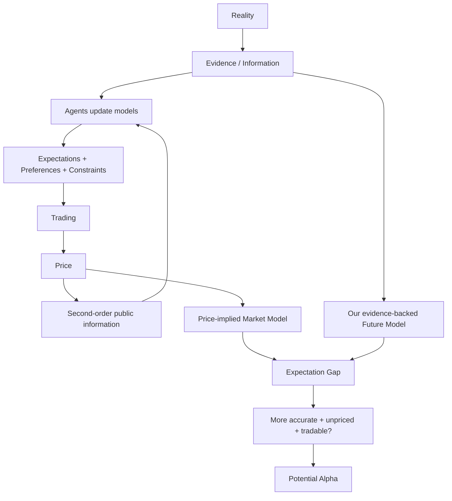

# ***Value、Information、Price、Expectations 与 Alpha 世界观图谱***

> **性质声明：** 本图不是一份标准资产定价教材，而是把成熟的 Information Updating、Price Discovery、Expectations、Discounting 与 Alpha 概念，和 AlphaResearchOS Foundation 已采用的 Value / Information / Price 工作定义连接成一张长期复习图。

> **中心问题：** 现实如何经由信息、认知、预期、约束与交易形成 Price；研究者又如何通过比较 Evidence-backed Future Model 与 Price-implied Market Model，找到 Potential Alpha？

$$
\boxed{
Price\neq Value;
\qquad
Disagreement\neq Alpha;
\qquad
Mispricing\neq Tradable\ Alpha
}
$$

## `（一）Reality—Information—Price—Alpha 双循环主关系图`

```text
┌──────────────────────────────────────────────────────────────────────────────┐
│                               REALITY                                        │
│           企业、消费者、技术、政策、资本结构与真实资源状态不断变化             │
└───────────────────────────────────┬──────────────────────────────────────────┘
                                    │
                                    ▼
                     Evidence / First-order Information
                    “世界发生了什么？哪些证据改变了？”
                                    │
             ┌──────────────────────┴──────────────────────┐
             ▼                                             ▼
┌────────────────────────────┐              ┌──────────────────────────────┐
│ Different Agents           │              │ AlphaResearchOS Researcher   │
│ 不同信息、模型、目标与约束   │              │ Evidence-backed Model        │
└──────────────┬─────────────┘              └──────────────┬───────────────┘
               ▼                                           │
 Expectations / Preferences / Risk /                       │
 Liquidity / Leverage / Positioning /                       │
 Mandates / Forced Flows / Capital                          │
               │                                           │
               ▼                                           │
            Trading                                        │
               │                                           │
               ▼                                           │
┌────────────────────────────────────────────┐              │
│ Price：上一轮信息处理与资本表达的公共输出   │              │
│ Price contains beliefs about Value         │              │
│ but Price is not Value itself              │              │
└──────────────────────┬─────────────────────┘              │
                       │                                    │
          ┌────────────┴────────────┐                       │
          ▼                         ▼                       │
Second-order Information     Resource / Incentive Signal    │
“市场已经如何理解？”          “资本成本和行动激励如何变化？” │
          │                         │                       │
          └────────────┬────────────┘                       │
                       ▼                                    │
           New Cognition / New Trading                      │
                       │                                    │
                       └───────────────反馈到 Reality────────┘

研究比较链：

Evidence-backed Model of Future Reality
                         \ 
                          \ compare
                           ▼
                    Expectation Gap
                           ▲
                          /
Price ──反推──> Price-implied Market Model
                           │
                           ▼
            我的模型是否更准确？差异是否事前可识别？
            是否尚未价格化？风险调整后、成本后可执行？
                           │
                           ▼
                   Potential Investment Alpha
```

> **读图原则：** Price 不是研究的终点，也不是需要被忽略的噪音。它既是上一轮市场认知与资本约束的压缩输出，也是下一轮所有研究者都能观察的新公共信息。

## `（二）Mermaid 一图看懂`



## `（三）理论层级与核心概念速查`

### `1. 哪些属于 Standard Theory，哪些属于 Working Model`

| 层级 | 本图内容 |
|---|---|
| **Standard Theory / Mature Concepts** | Bayesian/Statistical Updating、Market Price、Expectations、Discount Rates、Information Aggregation、Price Discovery、Market Efficiency Questions、Risk-adjusted Alpha、Limits to Arbitrage。 |
| **AlphaResearchOS Working Model** | “Value = 对某主体和情境的状态改善能力”“Information = 更新系统世界模型的可区分差异”“Price = 公共动态压缩模型/信号”等组织表达。它们不是行业唯一标准定义。 |
| **System Implication** | `Reality → Evidence → Enterprise Representation → Price-implied Model → Expectation Gap → Candidate Alpha` 的研究链。 |

### `2. 核心概念`

| 概念 | 本图中的最小解释 | 关键边界 |
|---|---|---|
| **Value（价值）** | 对某个主体、在特定情境和时间中改善某种状态的能力 | 不自动等于 Price，也不必是唯一、永恒、无条件的点估计。 |
| **Reality（现实）** | 不依赖研究者叙事而实际发生的状态与因果过程 | 我们只能通过不完整 Evidence 和模型逼近它。 |
| **Evidence（证据）** | 带来源、时间与语义、可支持或反驳命题的观察 | Evidence 不等于解释；同一证据可进入不同模型。 |
| **Information（信息）** | 能使系统区分可能世界、更新内部模型的差异 | 信息量大不等于决策价值高。 |
| **Expectation（预期）** | 对未来状态、现金流、风险和持续期的概率判断 | 不是一个全市场统一数字，而是经交易聚合的分布。 |
| **Price（价格）** | 买卖双方在资本、约束与市场结构下形成的公开交换信号 | 包含关于 Value 的信念，但不是 Value 本身。 |
| **First-order Information** | 关于企业或世界状态本身的信息 | 例：企业利润同比增长 10%。 |
| **Second-order Information** | 关于其他参与者如何理解、定价和用资本表达的信息 | 例：利润增长 10% 相对市场预期究竟算好还是差。 |
| **Price-implied Expectations** | 支撑当前 Price 所需要的一组未来增长、利润率、风险和持续期假设 | 反推依赖模型，通常不是唯一解。 |
| **Expectation Gap** | Evidence-backed Future Distribution 与 Price-implied Distribution 的差异 | 不同意见只是候选起点，不代表自己更正确。 |
| **Surprise** | 新结果相对事前预期的偏离 | Price 常对 Surprise 反应，而不是对原始好坏标签机械反应。 |
| **Potential Alpha** | 相对 Price-implied Model 的增量准确度有望被资本捕获 | 仍需事前识别、风险调整、验证、成本、容量与可执行性。 |
| **Reflexivity（反身性）** | Price 变化又影响融资、行为与企业 Reality | Reality → Price 并非纯单向链。 |

## `（四）Value：价值有现实基础，但不是无条件的唯一数字`

### `1. AlphaResearchOS 的工作定义`

> **价值 = 使某个主体的状态变得更好的能力。**

这个定义必须同时带上四个限定：

```text
主体相关：对谁有价值？
情境相关：在什么约束与选择集中？
时间相关：何时发生、持续多久？
状态相关：究竟改善哪一种状态？
```

例如，同一笔稳定但缺乏流动性的现金流，对长期负债匹配者和需要即时赎回的投资者，价值可能不同。

### `2. Model-implied Value 的骨架`

```text
Enterprise Reality
+ Future Distribution
+ Cash-flow / State Consequences
+ Discounting
+ Risk
+ Investor Objective / Constraints
→ Model-implied Value / Value Range
```

可写成概念函数：

$$
V^{model}_{a,t}
=
\mathcal V\!\left(
Reality_t,
\mathbb P_t(Future\ States),
Discounting_t,
Risk_t,
Objective_a,
Constraints_a
\right)
$$

| 符号 | 含义 |
|---|---|
| $a$ | 价值判断所相对的主体/目标。 |
| $t$ | 当前时间与信息边界。 |
| $\mathbb P_t(Future\ States)$ | 在 $t$ 时点对未来状态的概率分布。 |
| $\mathcal V$ | 把未来状态、风险和目标映射为价值判断的模型。 |

> 这是 AlphaResearchOS 的概念化表达，不是标准资产定价恒等式。它用于阻止“存在一个无需说明主体、时间、风险和模型的唯一 True Value”这一过度断言。

### `3. 避免两个对称极端`

| 极端 | 问题 |
|---|---|
| **“Value 是客观唯一精确数字”** | 忽略未来不确定性、折现、风险、主体目标与模型误差。 |
| **“Value 完全主观，所以研究无意义”** | 忽略企业现金流、资源、技术、合同和约束等现实基础会限制合理估计范围。 |

更成熟的态度是：Value Research 有现实锚点，但输出应是带假设、情景和不确定性的 Model-implied Distribution / Range。

## `（五）Information：只有更新模型并改善行动，才产生决策价值`

### `1. Information 如何更新世界模型`

```text
Reality changes / New Evidence arrives
        ↓
Possible worlds are reweighted
        ↓
Internal model updates
        ↓
Forecast may change
        ↓
Decision may change
```

一个标准 Bayesian Updating 骨架：

$$
P(\theta\mid e)
\propto
P(e\mid\theta)P(\theta)
$$

| 符号 | 含义 |
|---|---|
| $\theta$ | 关于世界状态或企业未来的假设。 |
| $e$ | 新 Evidence。 |
| $P(\theta)$ | 看到证据前的先验判断。 |
| $P(e\mid\theta)$ | 若该假设为真，观察到这份证据的可能性。 |
| $P(\theta\mid e)$ | 看到证据后的更新判断。 |

公式表达的是“证据按其区分能力重新分配概率”，不是说现实研究必须完整实现一个显式 Bayesian Model。

### `2. Information Value 的工作骨架`

$$
Information\ Value
\approx
\Delta Decision\ Quality
\times Actionability
\times Timeliness
\times Relevant\ Resources
$$

这是 AlphaResearchOS 的系统化启发式，不是标准金融定理。

| 因素 | 为什么重要 |
|---|---|
| **Decision Quality Improvement** | 信息是否真正改变概率分布与选择质量。 |
| **Actionability** | 研究者是否合法、技术上和资本上能够行动。 |
| **Timeliness** | 信息是否在机会消失或被价格化之前到达。 |
| **Relevant Resources** | 决策可影响多少资本、时间或组织能力。 |

因此：

```text
True Information
≠ Automatically Valuable Information

More Information
≠ Better Decision

Public Information
≠ Zero Research Value
```

公开事实可能仍因注意、解释、现金流映射、折现或资本行动不充分而留下研究价值；但这种“不充分”必须被证明。

## `（六）Price：信息聚合的输出，也是下一轮信息的输入`

### `1. Price 压缩的不只是 Fundamentals`

一个概念化价格函数：

$$
P_t
=
\Phi\!\left(
Cash\text{-}flow\ Expectations,
Discount\ Rates,
Risk\ Preferences,
Liquidity,
Leverage,
Positioning,
Forced\ Flows,
Market\ Structure,
Constraints,
Capital
\right)
$$

这不是可直接估计的封闭定价公式，而是一张“Price 由什么共同塑造”的检查表。

Price 的三重角色：

| 角色 | 含义 |
|---|---|
| **Information Aggregator** | 聚合分散认知、预期和部分私人信息。 |
| **Incentive / Opportunity-cost Signal** | 改变融资、消费、生产和资产配置的相对成本。 |
| **Coordination Interface** | 在没有中央大脑的情况下协调买卖与资源流动。 |

### `2. Price ≠ Value，但 Price 与 Value 绝非无关`

```text
Price contains beliefs about Value
+ risk and time discounting
+ preferences and constraints
+ capital and market structure

but

Price is not Value itself
```

所以既不能把 Price 当真理，也不能把 Price 当作可以忽略的随机数字。

### `3. Price is Second-order Information`

```text
First-order：
企业利润下降 10%

Second-order：
市场原来预期下降多少？
Price 已经反映了多少悲观？
其他资本因为什么约束仍在买卖？
```

Price 不只告诉研究者“世界发生了什么”，还压缩了“别人如何理解世界，以及愿意以什么资本条件表达”。

### `4. Price 是循环节点，不是单向终点`

```text
Information
→ Model Update
→ Trading
→ Price
→ New Public Information / Incentives
→ New Model Update
→ New Trading
```

此外：

```text
Price ↑ / ↓
→ Financing Cost / Employee Incentives / M&A Ability / Confidence changes
→ Enterprise Reality may change
```

这就是 Price 的反馈与 Reflexivity 边界。

## `（七）Price-implied Expectations：研究市场已经押了怎样的未来`

### `1. 从 Price 反推未来假设`

最简折现骨架：

$$
P_t
\approx
\sum_{n=1}^{N}
\frac{E_t^{mkt}[CF_{t+n}]}{(1+r_t^{mkt})^n}
+
\frac{TV_t^{mkt}}{(1+r_t^{mkt})^N}
$$

该式提醒研究者：Price 同时隐含未来现金流分布、折现率、风险与持续期。完整 Reverse DCF 和 Business/Investment Alpha 桥梁已在 [business-alpha-investment-alpha-map.md](business-alpha-investment-alpha-map.md) 中说明，本图只保留世界观接口。

### `2. 更成熟的比较对象`

```text
不是只比较：
My single intrinsic value number
vs.
Market Price

而是比较：
My evidence-backed Distribution of Future Reality
vs.
Price-implied Market Distribution
```

逐项问：

- 收入增长和需求持续期差在哪里？
- 利润率、ROIC 和再投资空间差在哪里？
- 风险、折现率与左尾情景差在哪里？
- 市场是否因期限、赎回、杠杆或 mandate 无法充分行动？
- 哪一项 Evidence 能证明自己的分布更准确？

### `3. 同一个 Price 不对应唯一 Market Model`

高现金流配高折现率、低现金流配低折现率，都可能产生相近 Price。Price-implied Analysis 的价值是暴露假设组合和临界条件，而不是宣称读取了一个统一的“市场大脑”。

## `（八）Alpha 位于哪里：从不同意见到可资本化增量准确度`

### `1. Alpha 不从 Disagreement 自动产生`

```text
I disagree with the market
        ↓
只是 Hypothesis

I am more accurate than what Price implies
        ↓
Candidate Edge

The difference is ex ante identifiable,
unpriced, risk-adjusted, cost-surviving and executable
        ↓
Potential Tradable Alpha
```

### `2. Surprise 的最小公式`

$$
Surprise_t
=
Outcome_t
-
Expectation_{t^-}
$$

$Expectation_{t^-}$ 是结果公布前的市场预期。Price 对“结果相对预期的差”通常比对结果的绝对好坏更敏感。

但 Price Reaction 不只由 Surprise 决定，还受：

- 折现率变化；
- 仓位和拥挤；
- 指引与未来分布；
- 流动性和 forced flows；
- 消息可信度与持续性；
- 交易时点和此前 Price path。

### `3. Potential Alpha 的必要条件`

```text
Different Model
+ More Accurate Future Distribution
+ Evidence available at time t
+ Difference not fully priced
+ Risk-adjusted increment
+ Costs and impact survived
+ Executable position
+ Ability to hold / exit
= Potential Tradable Alpha
```

这是治理条件列表，不是可机械相乘的公式。完整的 PIT、Falsification、OOS、Costs 与 Capacity Gate 仍归 [alpha-discovery-validation-map.md](alpha-discovery-validation-map.md)，本图只回答“Candidate Alpha 为什么可能产生”。

### `4. Market Error 与 Profit Opportunity 之间仍有距离`

即使后来证明 Price 判断错误，也可能因为：

- 错误幅度小于交易成本；
- 收敛时间过长或没有 Catalyst；
- 无法做空、借券或融资；
- Price 在收敛前继续偏离导致强平；
- 头寸容量太小；
- 自己无法区分 Market Error 与 Model Error；

而不能转化为可捕获 Alpha。

## `（九）三个具体例子：Price 反应的是相对预期`

### `Example A｜好消息，但股价下跌`

```text
企业利润实际增长：+10%
市场事前预期增长：+25%

Surprise = +10% − +25% = −15 个百分点
```

Reality 的绝对方向是正增长，但相对 Price-implied Expectations 明显更差。若其他条件不变，Price 可能下跌。

**认知锚点：** Price 不机械响应“好消息/坏消息”标签，而响应新信息如何改变未来分布相对既有预期。

### `Example B｜坏公司，但股票上涨`

```text
企业仍亏损：−5 亿元
市场原本预期：−9 亿元，并担心现金流更差
实际结果：亏损较预期少，现金流恶化也较轻
```

Business Quality 仍可能很差，但 Reality 没有 Price 隐含得那么悲观，因此股票可能上涨。

这只桥接 [business-alpha-investment-alpha-map.md](business-alpha-investment-alpha-map.md) 的结论：Business Alpha 与 Investment Alpha 不同，本图不重新展开企业价值链。

### `Example C｜同样利润 +10%，价格反应相反`

| 公司 | 实际利润增长 | 市场预期 | Surprise | 可能的相对反应 |
|---|---:|---:|---:|---|
| **A** | $+10\%$ | $+5\%$ | $+5$ 个百分点 | Positive Surprise |
| **B** | $+10\%$ | $+20\%$ | $-10$ 个百分点 | Negative Surprise |

同样的 First-order Information，放进不同 Price-implied Expectations 后，会形成不同 Second-order Meaning。

> “可能”很重要：折现率、指引、仓位和结果质量仍可改变实际 Price Reaction。

## `（十）今天最重要的认知纠偏`

| 常见误区 | 正确认识 |
|---|---|
| **1. Price = Value** | Price 包含关于 Value 的信念和折现，但也受风险偏好、流动性、仓位、约束与资本影响。 |
| **2. Price 完全与 Value 无关** | 长期现金流、资源与风险会约束合理 Price；二者不同不等于无关。 |
| **3. Price 是市场对未来真实价格的简单预测** | Price 是当前交换与资本协调结果，不是对未来 Price 的单一无偏预言。 |
| **4. Price 只反映基本面** | 它还压缩折现率、流动性、杠杆、仓位、forced flows 和市场结构。 |
| **5. 市场价格永远正确** | 信息、解释与资本行动可能不完整，Price 也会因约束和反馈偏离某些模型估计。 |
| **6. Price 与 Value 不同，所以永远有套利** | 自己的 Value Model 可能错；差异还可能无法交易、无法收敛或不足以覆盖成本。 |
| **7. 我与市场观点不同 = Alpha** | Disagreement 只是 Hypothesis；必须证明自己的模型更准确且差异可捕获。 |
| **8. 我的估值高于 Price = Alpha** | 单点估值忽略分布、风险和假设；还需 Price-implied Comparison 与系统验证。 |
| **9. Value 是唯一客观固定数字** | Value 有现实基础，但依赖未来分布、时间、风险、主体目标与模型。 |
| **10. Information 越多越有价值** | 冗余、过时、不可行动的信息可能只增加噪声与处理成本。 |
| **11. AI 能读更多信息 = 自动拥有 Alpha** | AI 扩大覆盖和表示能力；信息是否增量、正确、及时且未价格化仍需验证。 |
| **12. 市场无效 = 很容易赚钱** | 识别错误、执行、融资、容量、竞争和生存约束会隔开“市场可能错”与“我能盈利”。 |
| **13. 好消息必然涨、坏消息必然跌** | Price Reaction 取决于结果相对事前 Expectations 的 Surprise，以及折现与仓位变化。 |
| **14. Price 是研究者需要战胜的敌人** | Price 是最重要的公共输入之一，告诉研究者市场已在押什么。 |

## `（十一）进阶但必要的现实边界`

### `1. Price Aggregation 不等于所有信息都被正确吸收`

市场可以快速反映易见事实，却缓慢吸收复杂会计语义、长期竞争结构或制度约束；也可能反过来，对热门叙事过度反应。效率是关于信息、市场、期限与成本的条件命题。

### `2. Price-implied Model 存在不可识别性`

一个 Price 可以对应多组现金流、折现率与终值假设。研究者应报告假设区间、Sensitivity 和 Break-even Conditions，而不是假装读取唯一市场预期。

### `3. Price 可能先于 Fundamentals，也可能反过来改变 Fundamentals`

市场常提前交易未来变化；Price 又会影响企业融资和行为。因此“Price 偏离当前报表”既可能是错价，也可能是市场提前看见了研究者尚未建模的 Reality。

### `4. Constraints 会制造与维持价差`

| 约束 | 可能的影响 |
|---|---|
| Mandate / Benchmark | 即使管理人看见错价，也可能无权持有。 |
| Leverage / Margin | Price path 可迫使正确头寸提前退出。 |
| Shorting / Borrow | 高估资产未必能被低成本卖空。 |
| Liquidity / Capacity | Edge 只容纳很小资金，或退出代价过高。 |
| Career / Redemption Horizon | 长期正确可能无法承受短期相对落后。 |

### `5. Information 本身也有质量与合规边界`

来源错误、重复转载、时间戳混乱、修订数据和语义误读会制造虚假更新；非公开重大信息还涉及法律与合规边界。AlphaResearchOS 的 Evidence-first 与 Point-in-Time 纪律不能被“信息更快”取代。

### `6. AI 会同时扩大 Signal Search 与 False Discovery`

AI 可以读取更多文本、形成 Enterprise Representation、生成假设；也可以放大叙事一致性、重复共识和 Multiple Testing。AI 越强，越需要明确：

```text
What was known at t?
What did Price already imply?
What is genuinely incremental?
What evidence would falsify it?
```

## `（十二）与前 6 张 Map 的连接`

| 前置 Map | 它负责什么 | Map 07 只承担什么 |
|---|---|---|
| [Map 01：Alpha / Beta / Factor / Residual](alpha-beta-factor-residual-map.md) | 风险解释空间与 Expected Alpha 基础 | 将 Expected Alpha 放回 Reality / Information / Price 世界观。 |
| [Map 02：Alpha Discovery / Validation](alpha-discovery-validation-map.md) | Candidate Feature 到 Capital 的完整 Gate | 解释 Candidate Alpha 为什么会从 Expectation Gap 产生，不重复 Gate。 |
| [Map 03：Correlation / Beta / R² / Alpha](correlation-beta-r2-alpha-map.md) | 四个量的辨析 | 不重新讨论统计量。 |
| [Map 04：Neutralization / Benchmark / Alpha](neutralization-benchmark-alpha-map.md) | Alpha 的风险匹配参照 | 只保留“风险调整后才有 Alpha”的边界，不展开 Benchmark。 |
| [Map 05：Business / Investment Alpha](business-alpha-investment-alpha-map.md) | 企业现实穿过 Market Cognition 与 Price | 上升到 Value / Information / Price 的总循环，不重复企业分析。 |
| [Map 06：Factor Space / Hierarchy](factor-space-hierarchy-map.md) | 当前模型解释边界如何构成 | 提醒 Price-implied Gap 也需相对当前 Risk / Factor Space 评价。 |

## `（十三）与 AlphaResearchOS 的连接`

```text
REALITY
  ↓
Evidence Layer
  ↓
Point-in-Time Data
  ↓
Enterprise Representation
  ↓
Research Features / Hypotheses
  ↓
Forecast of Future Reality
  │
  ├────────────── compare ──────────────┐
  │                                     │
  ▼                                     ▼
Our Evidence-backed Model       Price-implied Market Model
  └─────────────────┬───────────────────┘
                    ▼
          Candidate Expectation Gap
                    ↓
       Factor Control / Quant Validation
                    ↓
        Expected Alpha + Uncertainty
                    ↓
       Portfolio / Risk / Execution
                    ↓
        Outcome / Attribution / Learning
```

### `1. AI Fundamental Engine 的正确位置`

```text
AI Fundamental Engine
= Reality / Evidence
→ Better Enterprise State Representation
→ Candidate Features / Hypotheses

不等于：
Raw Information
→ BUY / SELL
```

AI 帮助系统更好理解世界，但 Price Comparison、PIT、Risk Model、Validation 与 Capital Gates 仍不可跳过。

### `2. Price 是系统输入，而不是敌人`

AlphaResearchOS 需要持续问：

```text
市场已经知道什么？
Price 隐含了怎样的未来？
当前 Price 还压缩了哪些风险、流动性与强制交易？
我的 Evidence 真正新增了什么？
为什么我的模型更可能接近未来 Reality？
```

### `3. 一条信息进入系统的完整身份`

```text
source / publication_time / effective_time
→ evidence claim
→ model update
→ expectation impact
→ price-implied comparison
→ candidate feature
→ validation result
→ portfolio relevance
```

这使“读到更多消息”转化为可审计的认知生产，而不是直接把文本情绪变成订单。

## `（十四）面试怎么解释`

### `面试 30 秒版本：怎么看 Price、Value 与 Alpha？`

Price 不等于 Value，但也不是与 Value 无关的噪音。它是市场对未来现金流、折现率和风险的 Expectations，与流动性、仓位和资本约束共同形成的公共输出。研究者应比较 Evidence-backed Future Distribution 与 Price-implied Distribution；只有自己的差异判断事前可识别、后来更接近 Reality，并在风险与成本后可执行，才可能形成 Alpha，单纯不同意市场不算 Alpha。

### `典型追问与答题锚点`

| 追问 | 一句话答题锚点 |
|---|---|
| **Price 是否有效反映信息？** | 它会聚合大量信息，但吸收程度取决于信息类型、期限、成本、约束和市场结构。 |
| **Price 和 Intrinsic Value 有何区别？** | Price 是当前可交易交换信号；Intrinsic Value 是基于未来分布、折现和风险的模型估计。 |
| **为什么好消息发布后股价会跌？** | 结果虽绝对为正，却可能低于 Price 已隐含的更高预期，形成 Negative Surprise。 |
| **为什么市场错了也不一定能赚钱？** | 价差可能太小、难以建仓、收敛太慢，或在成本、融资和 Price path 中无法存活。 |
| **什么是 Price-implied Expectations？** | 支撑当前 Price 所需的一组增长、利润率、风险、折现率和持续期假设。 |
| **AI 能读更多新闻为何不自动等于 Alpha？** | 更多信息只有在增量、正确、及时、未价格化且可执行时才产生交易价值。 |
| **Value 是客观的吗？** | 有现实锚点，但估计依赖主体、目标、时间、未来分布、风险和模型，通常应表达为区间/分布。 |

## `（十五）最小记忆框架`

| 关键词 | 最小锚点 |
|---|---|
| Value | 相对主体、情境、时间与状态的改善能力 |
| Information | 能更新世界模型的可区分差异 |
| Expectations | 对未来分布与风险的概率判断 |
| Price | Expectations + Preferences + Constraints + Capital 的公共输出 |
| Second-order Information | 市场已经如何理解并表达 First-order Facts |
| Price-implied Model | 当前 Price 需要怎样的未来假设 |
| Alpha | 相对 Price-implied Model 的可资本化增量准确度 |

### `复习时只保留五句话`

1. **Value 有现实基础，但相对主体、情境、时间和目标，不应被假定为无条件唯一数字。**
2. **Information 的作用是更新系统对可能世界的模型；信息越多不等于决策越好。**
3. **Price 聚合 Expectations、折现、偏好、流动性、仓位、约束与资本，因此 Price 包含 Value 信念但不等于 Value。**
4. **Price 是二阶公共信息：它既是上一轮信息处理的输出，也是下一轮认知、交易和 Reality 反馈的输入。**
5. **Alpha 不是不同意市场，而是相对 Price-implied Expectations 拥有事前可识别、更准确、风险与成本后可执行的增量认知。**

## `（十六）是否继续扩张本图谱？`

当前主图暂时停止扩张。

本图只负责 Value / Information / Price / Expectations / Alpha 的世界观闭环。以下内容应拆为专题：

- `reverse-dcf-expectations-map.md`；
- `market-efficiency-map.md`；
- `information-economics-map.md`；
- `behavioral-finance-map.md`；
- `valuation-uncertainty-map.md`；
- `price-discovery-market-microstructure-map.md`。

---

> **最终锚点：Reality 通过 Evidence 改变人们的模型，模型与约束通过 Trading 形成 Price，Price 又成为新的公共信息和现实激励；AlphaResearchOS 的任务不是宣称自己拥有唯一 True Value，而是证明自己的 Evidence-backed Future Model 相对 Price-implied Model 具有可事前识别、风险与成本后仍可资本化的增量准确度。**
