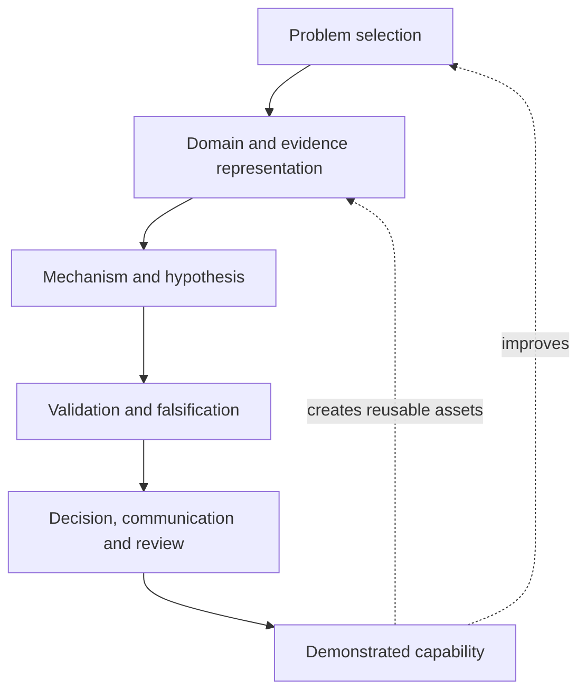

# Researcher Capability、稀缺性与可复利能力图谱

> **Map ID:** 14  
> **性质声明：** 本图讨论研究者如何形成可迁移、可证明、可复利的长期能力。它不是对 Evan 当前能力的评价，也不是 AlphaResearchOS 当前 `Learning State` 的更新。`Research Capability` 是能力框架；只有被人的实际表现、复现结果与持续证据支持，才可成为 capability evidence。  
> **中心问题：** 在单个 Alpha、单个市场或单个工具都会衰减的前提下，研究者怎样构建能够持续生产高质量问题、表示、验证与资本判断的稀缺性？

$$
\boxed{
Knowledge\neq Capability;
\quad Skill\neq Evidence;
\quad AI\ Output\neq Human\ Mastery;
\quad Scarcity\neq Permanent\ Moat
}
$$

## （一）主关系图：从好奇心到可证明的研究能力

```text
Curiosity / Problem Selection
↓
Domain Understanding
↓
Reality and Evidence Representation
↓
Mechanism / Hypothesis Formation
↓
Quantitative and Causal Validation
↓
Risk / Cost / Capacity / Execution Judgment
↓
Decision and Communication
↓
Feedback, Falsification and Updating
↓
Demonstrated Capability
↓
Reusable Research Assets and Better Problem Selection
```

这不是一次性线性课程，而是一个反馈环：

```text
Better questions
→ better representations
→ better tests
→ better decisions
→ better evidence of capability
→ better future questions
```

## （二）Mermaid：能力如何产生复利



## （三）理论层级与核心概念速查

| 层级 | 本图内容 |
|---|---|
| **Standard Theory / Mature Concepts** | Deliberate Practice、Transfer、Expertise、Tacit Knowledge、Metacognition、Scientific Falsification、Decision Quality、Organizational Learning、Path Dependence。 |
| **AlphaResearchOS Working Model** | 研究能力由问题选择、现实表示、机制推理、验证、资本边界判断与复盘组成；AI 扩大探索，人的责任集中在目标、边界、判断和授权。 |
| **Candidate Concept** | `Capability Stack`、`Mastery Evidence`、`Research Capability as Productive Asset` 是组织研究与学习的候选框架，不是已经写入 Foundation 的新架构。 |
| **Learning-State Boundary** | 读懂一份解释、获得 AI 帮助或拥有知识文件，都不能自动证明人已经掌握；需要独立复现、迁移、解释或调试的可观察证据。 |

### 核心概念

| 概念 | 最小解释 | 关键边界 |
|---|---|---|
| **Capability** | 在相似但不完全相同的问题上稳定地产出合格结果的能力 | 不是一次成功，也不是自我感觉。 |
| **Skill** | 可训练、可重复的操作或判断单元 | 熟悉术语不等于拥有 skill。 |
| **Knowledge** | 可被检索和解释的概念、事实、方法与关系 | 知道“是什么”不等于能在新问题中使用。 |
| **Transfer** | 把方法迁移到新市场、新对象或新约束下 | 迁移失败本身也是重要诊断。 |
| **Mastery Evidence** | 支持“已掌握”的可复核行为证据 | AI 生成的漂亮文本不是充分证据。 |
| **Research Asset** | 可复用的定义、数据协议、测试、模板、案例或判断规则 | 资产必须有 provenance、版本和适用边界。 |
| **Selective Depth** | 在少数关键能力上形成深度，同时保持足够的跨域接口理解 | 不等于同时精通所有领域。 |
| **Scarcity** | 在特定环境下较少见且有用的能力组合 | 会随工具普及、竞争和制度变化而衰减。 |

## （四）Capability Stack：研究者究竟需要组合什么

研究稀缺性通常不来自一个孤立技能，而来自几个普通技能的高质量组合。可用以下栈作为学习和复盘框架：

```text
L0  Language / Numeracy / Tool Fluency
L1  Domain and Market Structure Understanding
L2  Evidence, Provenance and Point-in-time Discipline
L3  Economic Object and State Representation
L4  Mechanism, Causal and Counterfactual Reasoning
L5  Quantitative Validation, Risk and Execution Judgment
L6  Research Productization and Communication
L7  Objective Setting, Governance and Consequential Judgment
```

层级不是严格的学校课程顺序。一个人可以在 L5 有很强统计能力，却因 L2 的时间语义错误而得出不可用结论；也可以有很深领域知识，却缺少 L5 的可证伪验证。

### 四个最难替代的组合接口

| 接口 | 组合能力 | 为什么重要 |
|---|---|---|
| **Reality → Representation** | 领域知识 + 证据治理 + 语义建模 | 防止把方便获取的字段误当成经济现实。 |
| **Mechanism → Test** | 因果直觉 + 统计设计 + 反证意识 | 把故事压缩成能失败的命题。 |
| **Signal → Capital** | 预测判断 + 风险、成本、容量与执行 | 把“看对了”与“能捕获”区分开。 |
| **AI → Accountability** | AI 协作 + 人的目标、边界、审查与授权 | 让速度提升不牺牲可追溯性和责任边界。 |

## （五）Selective Depth：不是学得越多越稀缺

### 1. 三层知识结构

```text
Breadth
：知道相邻领域的问题、语言和约束

Depth
：能够独立表示、推理、验证一个核心领域

Interfaces
：能够把核心领域连接到数据、市场、资本与系统边界
```

有效的深度选择通常满足：

```text
高频真实问题
×
长期反馈机会
×
与其他能力存在接口
×
个人能持续投入
```

### 2. 深度的错误替代品

| 表面现象 | 为什么不够 |
|---|---|
| 读过大量 AI 新闻 | 新闻消费不等于能解释、复现和迁移。 |
| 会调用很多模型 | 工具数量不等于问题选择与验证能力。 |
| 保存大量笔记 | 笔记只有在检索、重建和应用时才成为能力资产。 |
| 能写出复杂框架 | 复杂度可能只是未识别的假设和边界缺失。 |
| 在一个案例中讲通故事 | 单案例缺少反事实、比较样本和失败条件。 |

## （六）Mastery Evidence：如何证明“我会了”

本图采用行为证据而非情绪或熟悉感作为掌握标准。对某个能力，至少应尽量形成以下证据组合：

| 证据类型 | 观察问题 | 示例 |
|---|---|---|
| **Retrieval** | 不看原文能否说出核心结构？ | 独立画出 Reality → Evidence → Hypothesis → Validation。 |
| **Reconstruction** | 能否从空白重新搭建方法？ | 自己定义字段、时间边界、基准与反证条件。 |
| **Explanation** | 能否向不同背景的人解释边界？ | 说明 `Residual != Alpha` 为什么成立。 |
| **Application** | 能否在真实问题中使用？ | 将某个 commodity 的供需对象正确拆分。 |
| **Transfer** | 换市场或资产后能否识别哪些需重做？ | 不把 equity 的指标直接复制到 crypto。 |
| **Debugging** | 结果异常时能否定位原因？ | 区分数据泄漏、语义错、执行约束与机制失效。 |
| **Falsification** | 能否主动设计让自己失败的测试？ | 写出不支持假设时应出现的观察。 |
| **Communication** | 能否留下可审计、可复用的研究记录？ | 记录来源、版本、假设、限制和决策。 |

最低标准不是每项都一次完成，而是能力判断不能只依赖其中最容易的一项。

## （七）AI 协作：速度杠杆，不是能力转移

### 1. 分工原则

```text
AI：扩大搜索、比较、草拟、编码、模拟、结构化和反驳空间
人：定义目标、选择问题、批准边界、判断重要性、承担后果
确定性系统：保存 provenance、执行测试、约束风险、复现结果
```

AI 协作的真正收益，不是让人永远绕过困难，而是把更多时间移向高价值判断：

```text
从“记住每个细节”
转向“知道该问什么、如何验、何时不信、如何迁移”。
```

### 2. 三个常见幻觉

| 幻觉 | 纠偏 |
|---|---|
| **生成即掌握** | 让人独立复述、重建或解释关键部分。 |
| **流畅即正确** | 要求来源、时间边界、反例与可失败条件。 |
| **自动化即免除责任** | consequential decision 仍需人的授权与审查。 |

### 3. 适用于本项目的学习闭环

```text
AI 提供解释 / 对比 / 草稿
↓
Human retrieval or reconstruction
↓
Small transfer problem
↓
Review errors and uncertainty
↓
Record demonstrated evidence only when warranted
```

这条闭环与本项目的 `ENGLISH-FIRST + CN-CHECK` 兼容：语言困难应与概念困难分开诊断，不能把读得慢直接等同于不会。

## （八）从能力到长期稀缺性：一个工作模型

可以把长期能力价值写成概念函数：

$$
Capability\ Value
\approx
Problem\ Selection
\times
Representation\ Quality
\times
Validation\ Discipline
\times
Transfer\ Ability
\times
Decision\ Responsibility
$$

这不是收益定价公式，也不是个人价值的精确测量。它强调乘法结构：任一关键环节接近零，最终研究质量都可能显著下降。

进一步地：

$$
Research\ Asset_{t+1}
=
Research\ Asset_t
+ Reusable\ Learning_t
- Decay_t
- Unverified\ Complexity_t
$$

其中 `Decay` 包括市场变化、工具普及、知识过时和能力遗忘；`Unverified Complexity` 指没有带来可证明收益、反而增加维护和误解成本的结构。

## （九）与前面 Maps 的连接

| 前置 Map | Map 14 接收什么 | Map 14 输出什么 |
|---|---|---|
| **08 Market Structure / Portability** | 市场依赖性与研究方法迁移问题 | 把 portability 作为人的研究能力而非策略复制问题。 |
| **09 Research Entry Points** | 不同 sensors 与 latency | 训练研究者选择合适观测入口，而非追求单一“最早”信息。 |
| **10 Evidence / Representation** | provenance、PIT、语义和 representation edge | 把表示质量纳入能力证据。 |
| **11 Fundamental Beyond Equities** | 不同 economic objects | 形成跨资产但有边界的 domain literacy。 |
| **12 Causal Transmission / Expression** | 机制、传导、反证与 asset mapping | 训练从事实到可证伪表达的转换。 |
| **13 Opportunity / Capital Allocation** | 机会与资本载体的区分 | 训练“看见机会”与“选择捕获结构”的双重判断。 |

整体链条为：

```text
Market
→ Information Entry
→ Evidence Representation
→ Economic Objects
→ Causal Transmission
→ Value Capture / Capital
→ Human Research Capability
```

## （十）与 AlphaResearchOS 的连接

### 1. Research OS 的长期产物不应只有信号

```text
Research OS
→ better questions
→ better evidence objects
→ better hypotheses
→ better tests
→ better decisions
→ reusable research assets
→ stronger human capability
```

这解释了为什么系统可以同时服务于：

- 研究问题的生成与边界化；
- evidence / provenance 记录；
- candidate feature 与 hypothesis 管理；
- validation 与 falsification；
- 学习复现与能力检查；
- 决策记录和后验复盘。

但这只是目标性知识工作流表达，不是当前实现证据。当前 `Current System Architecture` 明确没有足够代码、测试和运行证据证明这些组件已经实现。

### 2. 能力证据不能静默晋升为 canonical state

任何关于“已掌握”“已实现”“已验证”的说法，都应分别回到：

```text
Human capability → demonstrated performance / Learning State
Research conclusion → reproducible evidence / Research State
Software implementation → code, tests and runtime evidence / Architecture
```

学习图只能提供框架和练习，不应替代这些证据。

## （十一）常见认知误区与纠偏

| 误区 | 纠偏 |
|---|---|
| **稀缺性就是知道别人不知道的术语** | 稀缺性更可能来自可迁移的能力组合与责任边界。 |
| **越早接触最新 AI 越有优势** | 只有能转化为问题选择、表示、验证或交付，才形成能力增量。 |
| **跨学科学得越广越好** | 无深度和接口能力的广度容易变成词汇收藏。 |
| **一个成功项目证明长期能力** | 需要跨问题、跨时间和失败后的稳定表现。 |
| **AI 做得越多，人学得越少** | 是否学习取决于是否安排 retrieval、reconstruction、transfer 和 review。 |
| **研究能力可以保证 Alpha** | 能力提高研究生产率，但不保证任何策略、机会或交易结果。 |
| **高收入或高回报等于高稀缺性** | 结果还受运气、周期、杠杆、制度与不可持续因素影响。 |

## （十二）现实边界、证伪与限制

### 本工作模型可能失败的地方

1. 能力组合可能被更好的工具快速商品化；
2. 表示质量很高，但现实机制本身没有预测性；
3. 研究者在一个领域的深度无法转移到另一个领域；
4. 复盘记录可能产生选择性记忆和事后归因；
5. “能力证据”本身可能被设计成容易通过的考试；
6. 研究生产率提高，却因资本、执行或治理约束无法产生结果。

### 反证问题

```text
能否在没有 AI 草稿的情况下重建关键方法？
能否在新资产 / 新市场中识别哪些假设失效？
能否主动报告不支持自己的证据？
能否把正确判断转化为成本、容量和风险可接受的行动？
能否在失败后降低复杂度，而不是只添加补丁？
```

## （十三）口头解释模板

> 我不把自己的长期竞争力定义为记住某个 Alpha 或追逐每条 AI 新闻，而是定义为一套可复用的研究能力：选择重要问题，正确表示现实，形成可证伪机制，完成风险和成本约束下的验证，并能把结果转化为可审计的判断。AI 可以放大搜索、编码和比较，但不能替我决定目标、证据边界和后果责任。真正的能力证据不是我能让系统写出什么，而是我能否在新问题中重建、迁移、质疑并解释它。

## （十四）最小记忆框架

```text
Capability
=
Select
→ Represent
→ Explain
→ Test
→ Falsify
→ Transfer
→ Decide
→ Review
```

或者记成三句话：

1. **先选择值得研究的问题。**
2. **再把现实表示成可失败、可复核的命题。**
3. **最后用跨情境表现和复盘证明能力，而不是用流畅输出证明自己。**

## （十五）Scope Stop

本图到此停止，不承担：

- 对 Evan 当前能力作个人诊断或心理评价；
- 修改 `Learning State`、`Research State`、Foundation 或 Current Architecture；
- 宣称已经形成稀缺性、护城河或可交易 Alpha；
- 规定唯一职业路线、唯一学习顺序或唯一资产类别；
- 把 `Research Capability as Productive Asset` 晋升为 canonical 架构；
- 用学习图替代真实研究、复现、代码测试、运行证据或人的最终责任。

## （十六）与 Map 08–13 的交叉链接

- Map 08：`market-structure-research-portability-map.md`
- Map 09：`reality-price-transmission-research-entry-points-map.md`
- Map 10：`alternative-evidence-domain-knowledge-representation-map.md`
- Map 11：`fundamental-research-beyond-equities-map.md`
- Map 12：`causal-transmission-asset-expression-map.md`
- Map 13：`alpha-economic-opportunity-capital-allocation-map.md`

> **Final reminder:** Candidate Concept、Working Model、Learning Asset 与 canonical system truth 必须保持分层。Map 14 讨论的是如何形成证明能力的路径，不是对当前能力或当前系统状态的证明。
